<center></center>

# Trafic cycliste à Paris de septembre 2024 à octobre 2025

- [I. Découverte des données et du projet ](#i-découverte-des-données-et-du-projet-)
  - [I.A. Objectifs du projet et enjeux ](#ia-objectifs-du-projet-et-enjeux-)
  - [I.B. Structure du projet et organisation du groupe ](#ib-structure-du-projet-et-organisation-du-groupe-)
  - [I.C. Mise en contexte ](#ic-mise-en-contexte-)
    - [I.C.1. Contexte politique ](#ic1-contexte-politique-)
    - [I.C.2. Contexte technique ](#ic2-contexte-technique-)
    - [I.C.3. Intérêt personnel au projet ](#ic3-intérêt-personnel-au-projet-)
  - [I.D. Découverte du jeu de données ](#id-découverte-du-jeu-de-données-)
    - [I.D.1 Biais et difficultés potentielles *a priori* ](#id1-biais-et-difficultés-potentielles-a-priori-)
    - [I.D.2 Exploration du jeu sur l'OpenData de la ville de Paris. ](#id2-exploration-du-jeu-sur-lopendata-de-la-ville-de-paris-)
  - [I.E. Bilan de l'étape de découverte des données](#ie-bilan-de-létape-de-découverte-des-données)
- [II. Pré-processing](#ii-pré-processing)
  - [II.A. Préprocessing du jeu principal avec Python ](#iia-préprocessing-du-jeu-principal-avec-python-)
    - [II.A.1. Exploration détaillée des jeux de données 'comptage \& compteurs' ](#iia1-exploration-détaillée-des-jeux-de-données-comptage--compteurs-)
    - [II.A.2. Préparation du jeu principal ](#iia2-préparation-du-jeu-principal-)
      - [II.A.2.a. Préparation du jeu principal](#iia2a-préparation-du-jeu-principal)
      - [II.A.2.c. Extraction du jeu de comptage](#iia2c-extraction-du-jeu-de-comptage)
      - [II.A.2.b. Extraction du jeu de compteur](#iia2b-extraction-du-jeu-de-compteur)
    - [II.A.3. Géolocalisation des compteurs  ](#iia3-géolocalisation-des-compteurs--)
    - [II.B. Exploration et Préprocessing des jeux d'enrichissement avec Python  ](#iib-exploration-et-préprocessing-des-jeux-denrichissement-avec-python--)
      - [II.B.1 Jeu de données météorologique ](#iib1-jeu-de-données-météorologique-)
      - [II.B.2. Jeu de données de l'enquête de la FUB ](#iib2-jeu-de-données-de-lenquête-de-la-fub-)
        - [II.B.2.a. Exploration des clusters du baromètre FUB ](#iib2a-exploration-des-clusters-du-baromètre-fub-)
        - [II.B.2.b. 2ème phase de l'exploration géographique du baromètre FUB ](#iib2b-2ème-phase-de-lexploration-géographique-du-baromètre-fub-)
      - [II.B.3. Préparation des avis pour l'analyse textuelle ](#iib3-préparation-des-avis-pour-lanalyse-textuelle-)
        - [II.B.3.a. Normalisation et lemmatisation du texte en français ](#iib3a-normalisation-et-lemmatisation-du-texte-en-français-)
        - [II.B.3.b. Création d'un nuage de mot suivant 2 algorithmes différents ](#iib3b-création-dun-nuage-de-mot-suivant-2-algorithmes-différents-)
        - [II.B.3.c. Choix de l'algorithme le plus pertinent ](#iib3c-choix-de-lalgorithme-le-plus-pertinent-)
      - [II.B.4. Jointure géospatiale des avis ](#iib4-jointure-géospatiale-des-avis-)
      - [II.B.5. Fichiers obtenus à l'issu de cette étape ](#iib5-fichiers-obtenus-à-lissu-de-cette-étape-)
    - [II.C. Préprocessing dans Power Query ](#iic-préprocessing-dans-power-query-)
      - [II.C.1. Collecte des données ](#iic1-collecte-des-données-)
      - [II.C.2. Transformations sur la table des compteurs ](#iic2-transformations-sur-la-table-des-compteurs-)
      - [II.C.3. Création d'un score météo ](#iic3-création-dun-score-météo-)
    - [II.D. Préprocessing dans Power BI ](#iid-préprocessing-dans-power-bi-)
      - [II.D.1. Création des tables de date ](#iid1-création-des-tables-de-date-)
      - [II.D.2. Modélisation en étoile ](#iid2-modélisation-en-étoile-)
      - [II.D.3. Création des hiérarchies ](#iid3-création-des-hiérarchies-)
      - [II.D.4. Création des mesures de sensibilité à la météo ](#iid4-création-des-mesures-de-sensibilité-à-la-météo-)
      - [II.D.5. Création des mesures de saturation des aménagements ](#iid5-création-des-mesures-de-saturation-des-aménagements-)
- [III. Visualisations dans Power BI ](#iii-visualisations-dans-power-bi-)
  - [III.A. Thème et organisations visuelles des pages](#iiia-thème-et-organisations-visuelles-des-pages)
  - [III.B. La page d'accueil du rapport](#iiib-la-page-daccueil-du-rapport)
  - [III.C. La page de Focus Site](#iiic-la-page-de-focus-site)
- [IV. Analyse des données ](#iv-analyse-des-données-)
- [Conclusion](#conclusion)
  - [Bilan](#bilan)
  - [Perspectives :](#perspectives-)
  - [Les difficultés qu'il a fallu relever](#les-difficultés-quil-a-fallu-relever)
- [Bibliographie](#bibliographie)
  - [1. Plans vélo et qualité de l'air](#1-plans-vélo-et-qualité-de-lair)
  - [2. Déplacements à Paris](#2-déplacements-à-paris)
  - [3. Qualité des aménagements cyclables (Guides officiels )](#3-qualité-des-aménagements-cyclables-guides-officiels-)
  - [4. Paris en Selle ](#4-paris-en-selle-)
  - [5. Compréhension des fonctionnement des capteurs et des méthodes de suivi du trafic](#5-compréhension-des-fonctionnement-des-capteurs-et-des-méthodes-de-suivi-du-trafic)
  - [6. Documentation technique complémentaire](#6-documentation-technique-complémentaire)
- [Annexes et extrait de code](#annexes-et-extrait-de-code)
  - [Annexe 1 : 🗂️ Structure du projet et du fichier zip](#annexe-1--️-structure-du-projet-et-du-fichier-zip)
  - [Annexes 2 : Struture des jeux de donnéees initiaux](#annexes-2--struture-des-jeux-de-donnéees-initiaux)
    - [Annexe 2a : Structure du jeu de données initial brut](#annexe-2a--structure-du-jeu-de-données-initial-brut)
    - [Annexe 2b : Structure du jeu de données météo](#annexe-2b--structure-du-jeu-de-données-météo)
    - [Annexe 2c : Notice du jeu de données du baromètre FUB](#annexe-2c--notice-du-jeu-de-données-du-baromètre-fub)
  - [Annexe 3 : Script : superposition des compteurs et clusters du baromètre FUB"](#annexe-3--script--superposition-des-compteurs-et-clusters-du-baromètre-fub)
  - [Annexes 4 : Analyses textuelles](#annexes-4--analyses-textuelles)
    - [Annexe 4a : Normalisation et lemmatisation des avis](#annexe-4a--normalisation-et-lemmatisation-des-avis)
    - [Annexe 4b : Comparaison de 2 algorithmes de création de nuage de mot](#annexe-4b--comparaison-de-2-algorithmes-de-création-de-nuage-de-mot)
  - [Annexes 5 : Jointure géospatiale des commentaires et compteurs](#annexes-5--jointure-géospatiale-des-commentaires-et-compteurs)
    - [Annexe 5b : Script de détermination du rayon seuil de proximité](#annexe-5b--script-de-détermination-du-rayon-seuil-de-proximité)
    - [Annexe 5b : Script de Jointure géospatiale](#annexe-5b--script-de-jointure-géospatiale)
  - [Annexe 6 : Transformation des adresses et gestion de l'encodage](#annexe-6--transformation-des-adresses-et-gestion-de-lencodage)
  - [Annexe 7 : Colonnes calculées de score météo](#annexe-7--colonnes-calculées-de-score-météo)
  - [Annexe 8 : Exemple de mesure DAX de calcul des sensibilités météo](#annexe-8--exemple-de-mesure-dax-de-calcul-des-sensibilités-météo)
    - [Mesures intermédiaires pour le calcul de la sensibilité à la pluie](#mesures-intermédiaires-pour-le-calcul-de-la-sensibilité-à-la-pluie)
    - [Mesure de la sensibilité à la pluie](#mesure-de-la-sensibilité-à-la-pluie)
    - [Mesures pour le choix dynamique de l'effet](#mesures-pour-le-choix-dynamique-de-leffet)
  - [Annexe 9 : Mesure DAX de calcul des jours dépassant un seuil journalier](#annexe-9--mesure-dax-de-calcul-des-jours-dépassant-un-seuil-journalier)
  - [Annexe 10 : Script "nuage de mot" dans Power BI](#annexe-10--script-nuage-de-mot-dans-power-bi)

<hr class="page-break">

## I. Découverte des données et du projet <a id="I"></a>

### I.A. Objectifs du projet et enjeux <a id="IA"></a>

Le jeu de donnée sur lequel nous avons travaillé est celui des [comptages Vélo de la Ville de Paris](https://opendata.paris.fr/explore/dataset/comptage-velo-donnees-compteurs/information/?disjunctive.id_compteur&disjunctive.nom_compteur&disjunctive.id&disjunctive.name).
C'est un jeu relativement lourd de 1,44Go, mis à jour quotidiennement sur une période de 13 mois glissants.<br><br>

La fiche projet mentionne explicitement les attendus suivants :

* **livrable :** doit permettre de visualiser les *horaires* et les *zones d'affluences*;
* **public concerné :** Mairie de Paris (public de décideur jugeant des décisions d'améliorations à apporter sur les aménagements).

Notre objectif était donc de préaprer un rapport destiné aider ces décideurs à programmer les futurs aménagements cyclables.<br>
S'agissant d'un public de décideur, nous aurons pour objectif de limiter le nombre d'écran sur notre rapport et de données des clefs de priorisation des actions.

Le présent rapport à quant à lui pour objectif de vous présenter notre démarche et comment nous avons mis en place cette exploitation de données.<br>

### I.B. Structure du projet et organisation du groupe <a id="IB"></a>

Le projet est stocké sur un [dépôt GitHub privé de Marie](https://github.com/marieberthiau/trafic_cycliste_a_Paris), les autres membres de l'équipe y étant collaborateurs.
Chaque membre du projet travaille localement avec VS Code, sur une branche <u>distincte</u> et des fusions sont faites ponctuellement après demande de tirage.
L'architecture générale du projet est détaillée en <a href="#ann1">Annexe 1</a>.
Je reviendrai dans le bilan sur la découverte de Git qui a été en soi un <a href="#defi1">défi à relever</a>.

### I.C. Mise en contexte <a id="IC"></a>

#### I.C.1. Contexte politique <a id="IC1"></a>

Le [Plan National Vélo et Marche 2023-2027](https://www.ecologie.gouv.fr/politiques-publiques/velo-marche-modes-deplacement-vertueux-avantageux) prévoit le financement d’infrastructures cyclables.

La Ville de Paris, comme de nombreuses autre ville, déploie depuis plusieurs années des compteurs à vélo permanents pour évaluer le développement de la pratique cycliste.
En particulier, l'équipe municipale actuelle à déployé un [Plan vélo 2021-2026](https://www.paris.fr/pages/un-nouveau-plan-velo-pour-une-ville-100-cyclable-19554) qui met en avant :
* le recensement des “points noirs”;
* la sécurisation des carrefours, le jalonnement et le nettoiement des aménagements cyclables.

Ceci correspond à un objectif de favoriser la transition vers des mobilités douces et/ou actives.<br><br>

La mise en place de ces compteurs a donc généralement pour objectif :
* de promouvoir la mobilité durable en suivant la progression du vélo dans les trajets urbains;
* d'identifier les axes de transits principaux afin de hierarchiser un réseau cyclable en développement en fonction des débits <b>souhaités</b> (postulat de trafic induit : l'aménagement va être le déclencheur de l'augmentation du trafic<a href="#bib101" class="ref">[1a]</a>. Ce n'est pas l'augmentation de trafic qui doit être le déclencheur de l'aménagement d'une voirie.)
* de mesurer l'efficacité des aménagements mis en place (effet avant/après) ainsi que de faciliter l'estimation de la part modale du vélo à Paris.<br>

Si cette part modale a en effet connu un doublement entre 2015 et entre 2020, elle tourne aujourd’hui autour de 10% <a href="#bib201" class="ref">[2a]</a>, ce qui reste relativement faible par rapport à d'autres capitales européenne. L'objectif est donc d'augmenter cette part et un flux faible dans une rue sur laquelle un compteur est installé sera donc un flux sur lequel on recherche une tendance haussière à moyen-long terme.<br><br>

<div style="display: table; width: 100%;">
  <div style="display: table-cell; width: 65%; vertical-align: top; padding-right: 12px;">
      Il est intéressant de noter que la ville de Paris a mis en place un suivi d'indicateur sur la base de ces relevés de compteurs qui est publié annuellement <a href="#bib202" class="ref">[2b]</a>.
      Nous pouvons ainsi consulter le bilan 2024 des déplacements à vélo à Paris et remarquer par exemple que le premier indicateur est basé sur l'identification des sites de comptage dépassant les 3000 cyclistes / jour ouvré.<br>
      Nous reviendrons sur la prise en compte de ce seuil issu des recommandations du Cerema (Centre d'études et d'expertise sur les risques, l'environnement, la mobilité et l'aménagement, établissement public relevant du ministère de la Transition écologique et de la Cohésion des territoires) lors de la <a id="#IIC4">préparation de notre rapport Power Bi</a>.
  </div>
  <div style="display: table-cell; width: 30%; vertical-align: top;">
    <figure style="margin:0;">
        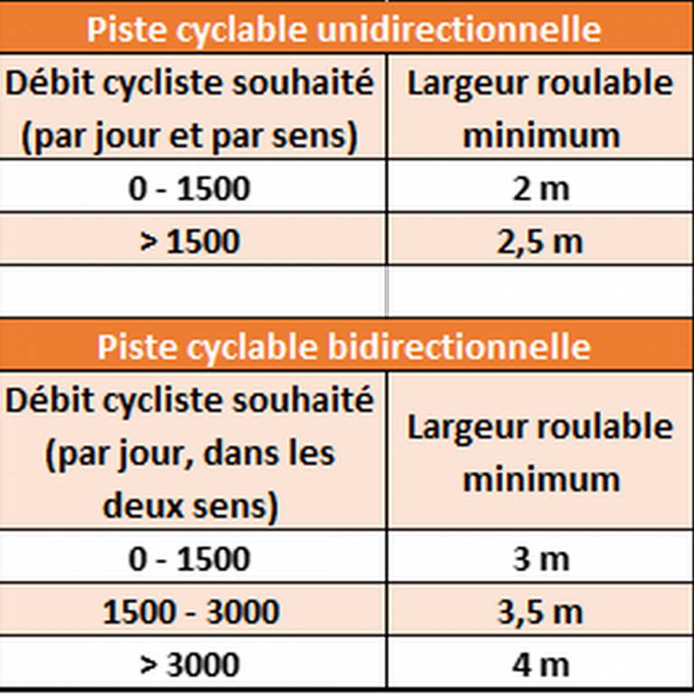
        <figcaption>
        Figure 1 — Recommandations du Cerema
        </figcaption>
    </figure>
   </div>
</div>

#### I.C.2. Contexte technique <a id="IC2"></a>

[EcoCompteur](https://www.eco-compteur.com/expertise/?gclid=EAIaIQobChMI1e_cneec6QIV1PhRCh0XbQAyEAAYASAAEgL9gvD_BwE) qui gère les compteurs vélo met à disposition les données à la Ville de Paris via une API basée sur REST et utilisant JSON.
EcoCompteur est également partenaire d'autres agglomérations (Lyon, Toulouse, Rennes, Tours, Saint-Nazaire...), le type d'analyse que nous allons réaliser devrait théoriquement pouvoir être transposés à ces localités... sous réserve de prise en compte des retraitements.

Il faut noter que le jeu de données ne concerne que les compteurs de type "permanents", à l'exclusion des compteurs de "caméras thermique".<br>
La technologie <a href="#bib501" class="ref">[5a]</a> utilisée est majoritairement celle du magnétomètre noyé dans le revêtement de la bande ou piste cyclable (détection de la signature magnétique des roues de vélo). Les compteurs mis en place à Paris sont en mesure de distinguer les véhicules motorisés et les trotinettes des vélos <a href="#bib502" class="ref">[5b]</a>.
Cela signifie qu'un vélo est décompté lorsqu'il passe sur le compteur... mais pas à côté (en cas de circulation déviée ou de véhicule stationné sur l'aménagement par exemple).

La Ville de Paris charge quotidiennement le jeu de donnée sur la base de cette API et effectue des retraitements pour au moins 2 raisons :

 - palier au fait que l'API Eco Compteur ne fournit pas nativement le comptage par sens de circulation,
 - effectuer une jointure avec un autre jeu de donnée, correspondant à la description des compteurs, leurs localisations et dates d'installation.

Il faut noter que  ce jeu conserve uniquement les données sur 13 mois glissants à J-1 mais qu'elle met également à jour des jeux de données sur d'autres plages temporelles (par exemple depuis 2019).

#### I.C.3. Intérêt personnel au projet <a id="IC3"></a>

D'un point de vue individuel, le sujet m'intéressait particulièrement.<br>

Je fais en effet partie d'une association de promotion du vélo (La Ville à Vélo Lyon Métropole) membre de la FUB et soeur de l'association Paris en Selle. Nos associations interviennent régulièrement auprès des décideurs pour favoriser la transition modale et l'usage du vélo en ville en analysant d'un point de vue de l'usager les aménagements, en proposant des idées à l'origine d'évolution (Vélopolitain à Paris ou Voies Lyonnaises à Lyon par exemple) et en participant aux concertations et études publiques.<br>

Comme Paris, la métropole de Lyon dispose de compteurs Eco-Compteur et mon association a mis en place un site de suivi en temps quasi réel de ces compteurs, tout comme peut d'ailleurs le faire Paris en Selle.

J'ai donc convaincu mes collègues de ne pas refaire ce qui était déjà très bien fait par Paris en Selle <a href="#bib402" class="ref">[4b]</a>et donc de ne pas "cloner" ces visualisations et de travailler sur une approche d'analyse allant au delà du simple "je constate une hausse à tel endroit" mais d'aider à analyser les besoins.

### I.D. Découverte du jeu de données <a id="ID"></a>

#### I.D.1 Biais et difficultés potentielles *a priori* <a id="ID1"></a>

La fiche descriptive du jeu de donnée mentionne les informations suivantes :

* **Un** site de comptage peut être équipé d'**un** compteur dans le cas d'un aménagement cyclable *unidirectionnel* ou de **deux** compteurs dans le cas d'un aménagement cyclable *bi-directionnel*.

* **Le nombre de compteurs évolue** au fur et à mesure des aménagements cyclables:

 - Certains compteurs peuvent être désactivés pour travaux ou même définitivement... nous verrons dans le <a href="#IIA2">pré-processing Power Query</a> que nous avons du effectuer des retraitements pour cette raison ;
 - ou subir ponctuellement une panne;
 - ou tout simplement avoir une date d'installation au cours de la période.

* Les compteurs sont situés sur des aménagements soient mixtes (couloirs bus-vélo) soient dédiés aux cyclistes (bandes et/ou pistes cyclables).
 **L'hypothèse est faite que l'algorithme de traitement des données réalisé par les compteurs retire correctement les autres véhicules** qui pourraient emprunter ces voies, qu'ils y soient autorisés (trotinettes) ou non (deux-roues motorisés).

* Le jeu de donnée étant **mis à jour quotidiennement**, il n'est pas figé.
Pour l'exploration ce n'est pas grave.
 Dans le contexte de notre projet, nous n'avons pas le temps de rendre le rapport dynamique sur la base du dernier jeu publié, nous avons donc choisi de figer la période d'analyse, du 1er septembre 2024 au 30 septembre 2025. Le choix de cette période nous permet en effet de :
  - travailler sur des mois complets;
  - ne pas être pénalisé par les anomalies de l'été 2024 liées aux restrictions de circulation dans Paris pendant les JO et qui ont fortement impactés les déplacements à vélo dans Paris<a href="#bib202" class="ref">[2b]</a>.

#### I.D.2 Exploration du jeu sur l'OpenData de la ville de Paris. <a id="ID2"></a>

Le jeu de données est disponible sur l'OpenData de la Ville de Paris [ici](https://opendata.paris.fr/explore/dataset/comptage-velo-donnees-compteurs/information/?disjunctive.id_compteur&disjunctive.nom_compteur&disjunctive.id&disjunctive.name).

Il est possible de naviguer dans les données directement sur le site et ainsi de se faire une première idée des éléments.<br>

<div style="text-align:center; margin: 20px 0;">  
  <figure style="display:inline-block; width:100%; margin:0 1%;">
    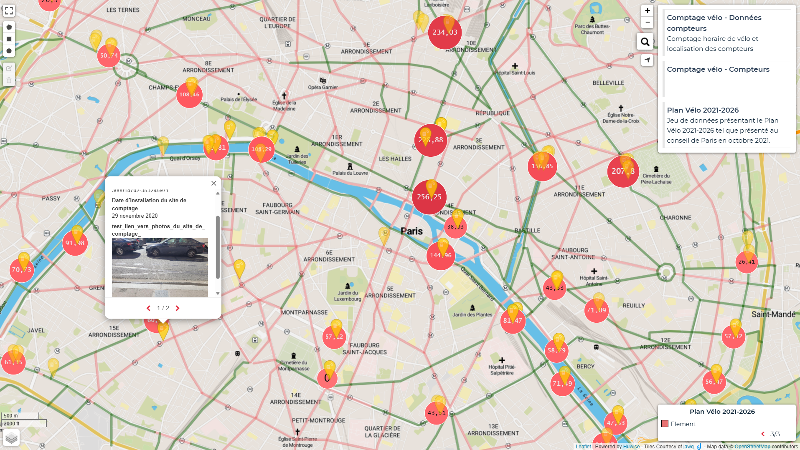
    <figcaption style="font-size:0.66em; margin-top:6px;">
      Figure 2 — Emplacement des compteurs dans le Plan Vélo 2021-2026
    </figcaption>
  </figure>
</div>

En première approche, nous pouvons ainsi observer la localisation des compteurs et visualiser les photos intégrées au jeu de données.<br><br>
Ainsi, nous notons que ces photos, avec un cadrage resséré sur la boucle de comptage, ne sont pas très intéressantes car elles ne nous apportent rien sur la qualité de l'aménagement en lui-même, nous ne les conserverons pas, *cf.* <a href="#IIA1">pré-processing python</a>.<br>
Géographiquement, les compteurs sont principalement situés aux portes (notamment sud) de Paris, sur les ponts (emplacement stratégique car difficilement contournables) et sur les grands axes identifiés dans le Plan Vélo 2021-2026.<br>
Nous remarquons que le croisement avec ce jeu de données est intéressant à étudier car il nous informe de la qualité de l'aménagement en place (vélopolitain, réseau secondaire... correspondent à des qualités bien précises et définies <a href="#bib304" class="ref">[3d], </a><a href="#bib401" class="ref">[4a]</a>) mais que l'analyse avec ce jeu est complexe, nous en rediscuterons dans les <a href="#persp1" >perspectives</a>.

La donnée principale étant une notion de comptage, on peut en deuxième approche regarder si des variations temporelles sont à prévoir.

<div style="display: table; width: 100%; margin-bottom: 1em;">
  <div style="display: table-cell; width: 45%; vertical-align: top;">
    <figure style="margin:0;">
        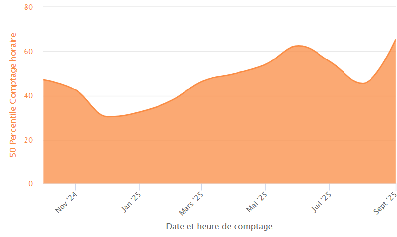
        <figcaption>
         Figure 3 — Effet des saisons sur le trafic median mensuel
        </figcaption>
    </figure>
    </div>
    <div style="display: table-cell; width: 55%; padding-left: 12px; vertical-align: top;">
        Il semble y avoir un effet des <b>saisons</b> avec :
        <ul>
            <li> un creux l'hiver : effet du froid ou des fêtes de fin d'années ?
            <li> des pics au printemps et à l'automne;
            <li> et une légère diminution en août : effet vacances ou chaleur ?
        </ul>
    </div>
</div>

<div style="display: table; width: 100%; margin-top: -40px; margin-bottom: 1em;">
  <div style="display: table-cell; width: 55%; vertical-align: top; padding-right: 12px;">
    Il semble aussi y avoir un effet du <b>jour de la semaine</b> (ou du caractère ouvré ou non de ce jour).<br>
    On voit par exemple ci-contre sur le Pont de la Concorde un effet qui semble correspondre aux week-ends.
  </div>
  <div style="display: table-cell; width: 45%; vertical-align: top;">
    <figure style="margin:0;">
        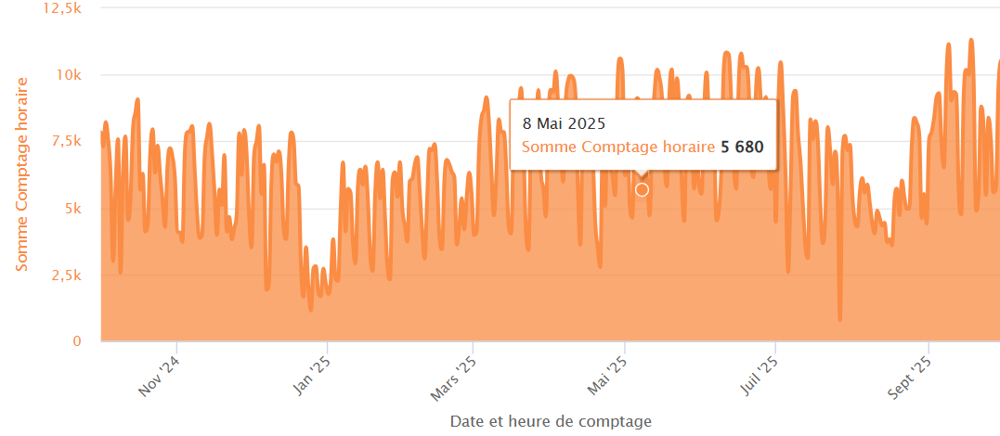
        <figcaption>
         Figure 4 — Effet des jours ouvrés sur le trafic journalier
        </figcaption>
    </figure>
   </div>
</div>

Un des objectif donné est également d'analyser les <b>périodes et horaires</b> d'affluence.
Ainsi on observe en semaine (ci-dessous le mardi 17 septembre 2025) un pic autour de 8h le matin et un autre autour de 18h.<br>
*A contrario*, les week-ends (ici les samedi 20 et dimanche 21 septembre 2025), le trafic tend à former une cloche centrée sur la fin d'après-midi.<br>
On remarque au passage que le cycliste est relativement noctambule et que les déplacements se poursuivent toute la nuit (avec un pic à la fermeture des bars).

<div style="text-align:center; margin: 20px 0;">  
  <figure style="display:inline-block; width:40%; margin:0 1%;">
    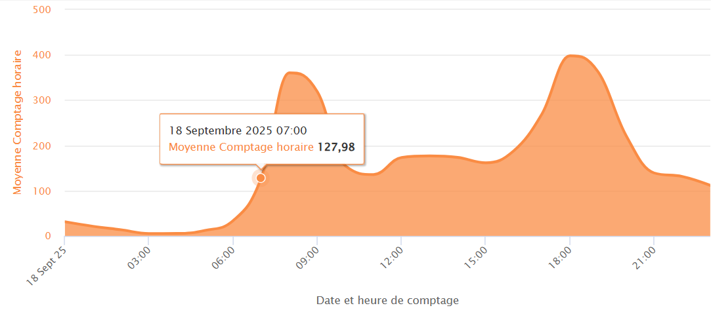
    <figcaption style="font-size:0.66em; margin-top:6px;">
      Figure 5 — Pics d'affluence un jour ouvré
    </figcaption>
  </figure>
  <figure style="display:inline-block; width:50%; margin:0 1%;">
    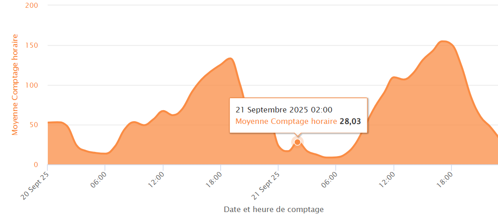
    <figcaption style="font-size:0.66em; margin-top:6px;">
      Figure 6 — Pics d'affluence les week-ends
    </figcaption>
  </figure>
</div>

La difficulté d'interprétation d'une variation dans les comptages et du niveau de fréquentation des compteurs nous semble problématique par rapport à notre objectif de fournir de quoi décider d'un aménagement en effet, avoir un trafic faible ou au contraire, qu'est-ce que cela veut vraiment dire ?<br>

Compte-tenu de notre objectif d'analyser également les **zones** d'affluence, il pourra être intéressant de comparer les compteurs entre-eux :

* les compteurs **sur-performant** pouvant être interprétés comme :
  - des zones où les aménagements fonctionnent pour favoriser la transition modale sans nécessiter d'action à prévoir pour la Mairie de Paris si ce n'est de continuer de suivre leur fréquentation ?
  - ou bien des zones où les aménagements saturent et sont peut-être sous-dimensionnés et qu'il est tempts de revoir l'aménagement cyclable ?

* les compteurs **sous-performant** pouvant également être interprétés comme situés dans des zones où des aménagements cyclables sont nécessaires pour encourager le développement du trafic cycliste... ou peut être que l'aménagement existant est mal adapté, inutile....<br>

Les variations de trafic ne sont pas non plus faciles à interpréeter : traduisent-elles un effet de la qualité de l'aménagement ou d'un autre facteur ?<br>

Pour répondre à ces questions, il nous faut des variables explicatives... mais notre jeu de donnée n'en dispose que d'une seule : l'heure et la date du comptage.<br><br>

L'exploration nous a permis de voir des variations horaires mais aussi saisionnières... cela nous pousse à regarder du côté de la météo : si les conditions climatiques sont plus clémentes, la mobilité à vélo augmente-t-elle ? et si oui, est-ce partout la même chose ou des lieux y sont-ils plus sensibles ?<br>
Il faut noter d'ailleurs que dans son rapport d’analyse de fréquentation<a href="#bib201" class="ref">[2a]</a>, la Ville de Paris met sur le compte de la forte pluviométrie de 2024 (900 mm sur l’année) la stagnation de la fréquentation par rapport à 2023, mais cela touche-t-il tous les sites de la même manière et la pluie est-elle toujours le facteur le plus explicatif ?<br><br>

Pour expliquer les variations qui seraient liés à la **qualité** de l'aménagement cyclable, nous avons besoin d'une variables explicative, l'opportunité de la sortie, le 1er octobre, du jeu de donnéesdes [résultats du Baromètre Parlons Vélo 2025](https://opendata.parlons-velo.fr/) qui identfie notamment la position GPS des points à améliorer en priorité selon les cyclistes interrogés au printemps 2025 (données explorables en direct [ici](https://www.barometre-velo.fr/2025/carte/#12.27/48.85887/2.34703).)<br><br>

Cette première analyse nous conduit donc à la décision d'enrichir notre jeu de données avec 2 jeux de données complémentaires issus des sources suivantes :

* le jeu de donnée des [résultats du Baromètre vélo 2025](https://opendata.parlons-velo.fr/) de la Fédération des Usagers de la Bicyclette (FUB), paru ce 1er octobre 2025 et qui recense les résultats de la dernière enquête d'usage (réalisé au printemps 2025), avec notamment les identifications, par les usagers de zones d'aménagements à améliorer ("points rouges") et de zones sur lesquels les aménagements ont été améliorés depuis 2021 (date de l'enquête précédente, "points verts") ainsi que de points sur lesquels il existe des attentes en matière d'équipement (notamment stationnement ("points bleus")).<br>
Chacun de ces points ayant été éventuellement regroupés en "clusters" lorsque 14 points sont identifiés par les répondants dans une zone de 50m sur une même rue, un même carrefour, une zone a été tracée. Les données textuelles (commentaire individuels des sondés) associés à chaque point géographique pourront éventuellement être utilisé pour affiner l'analyse.<br>
Ces jeux permettront d'enrichier la table des sites de comptage afin de croiser les analyses avec une cartographie précise.<br><br>

* les données météo quotidiennes (on a vu lors du rapport de découverte que certaines semaines semblent plus faibles que d'autres en période hivernale) : on pourra utiliser le [jeu de donnée météo des 6 capteurs météo de la capitale](https://www.data.gouv.fr/api/1/datasets/r/aba837dc-fc7c-4010-ab5e-0eb02feb0010) pour référence.

<hr class="page-break">

### I.E. Bilan de l'étape de découverte des données

À l'issue de cette étape, nous décidons de centrer notre analyse sur une visualisation graphique : 
* **temporelle** centrée sur l'heure de la journée, le jour de la semaine ainsi que la météo
* **géographique** avec une cartographie des zones les plus fréquentées, à croiser avec le ressenti des cyclistes en matière de qualité d'aménagement (nuage de mot).<br><br>

Nous compléterons d'une analyse de l'effet de la météo et ses différentes composantes (température, pluviométrie, vent) et de son effet sur le flux de cycliste.<br>
Nous essaierons de mesurer son effet sur les zones de comptage : les cyclistes évitent-ils certains secteurs les jours de pluie (effet de qualité du revêtement (pavé...)) ou au contraire en période de forte chaleur (revêtement à fort albedo, absence d'ombre ?)<br><br>

## II. Pré-processing

### II.A. Préprocessing du jeu principal avec Python <a id="IIA"></a>

#### II.A.1. Exploration détaillée des jeux de données 'comptage & compteurs' <a id="IIA1"></a>

Pour explorer le jeu de données, il faut d'abord y accéder... Pandas montre ici ses limites sur un jeu de données de 1,44 Go : en fonction de la configuration de nos ordinateurs, nous ne sommes que 2 sur 3 à pouvoir charger un dataframe avec la méthode `pandas.read_csv()`.<br>
Nous aurions pu basculer sur une autre librairie mais nous avons simplement opté pour un chargement "par morceaux" du jeu de données via une boucle de découpe par lot de 200 000 lignes puis un regroupement des données.<br><br>

Une fois le dataframe créé, nous avons étudié ses différentes colonnes en créant une fonction d'analyse de ces dernières et en écrivant le résultat de cette analyse dans un fichier de métadonnées. La fonction est présentée en <a href="#ann2">Annexe 2</a> et son résultat sur le jeu de donnée principal en <a href="#ann2a">Annexe 2a</a>.<br><br>

Il est utile de remaquer à ce stade le fait que la dénomination des colonnes, quoique parfois un peu longue, est explicite, avec des identifiants clairement identifiables ce qui simplifie l'utilisation du jeu.<br><br>

Ces informations nous permettent de voir que les données brutes issues des capteurs sont relativement complètes, mais pas immédiatement exploitables.  <br>
Certaines colonnes contiennent plusieurs informations (comme la date et l’heure combinées ou les coordonnées géographiques sous forme de texte), tandis que d’autres sont purement illustratives (notamment la partie photo que nous avions déjà décidé d'écarter).<br><br>

Un travail de pré-traitement est donc nécessaire pour rendre les variables :
- plus **claires**,
- plus **structurées**,
- et plus **pertinentes** pour l’analyse métier.<br><br>

La présence de quelques données manquantes (moins de 4% des lignes étant concernée) nécessitait une analyse complémentaire pour savoir ce que nous allions faire, nous avons donc réalisé une visualisation de ces données manquantes afin de mieux cerner leur origine:

<div style="text-align:center; margin: 20px 0;">
  <figure style="display:inline-block; width:100%; margin:0 1%;">
    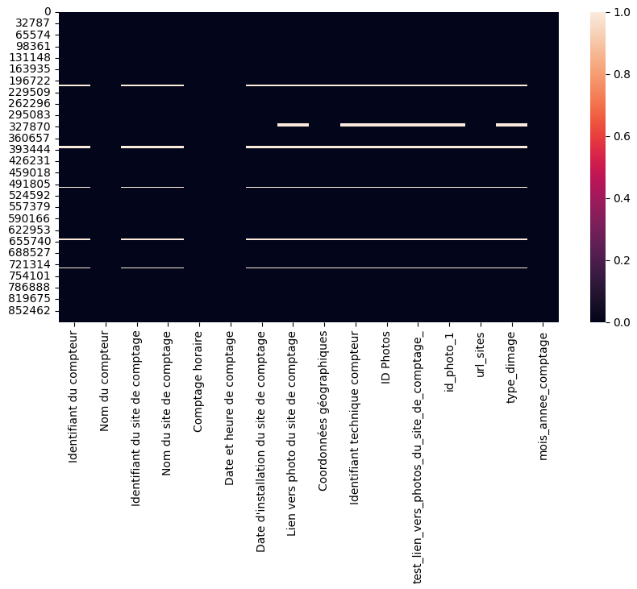
    <figcaption style="font-size:0.66em; margin-top:6px;">
      Figure 7 — Visualisation des données manquantes par lignes et colonnes dans le jeu de donnée principal
    </figcaption>
  </figure>
</div>

On constate que les données manquantes sont concentrées sur certaines lignes mais concernent la majorité des colonnes d'informations.
2 types de profils de manquants apparaissent :

1. Lorsque l'identifiant du compteur est absent, il manque toutes les données d'informations du compteur et les comptages correspondants (qui par ailleurs sont vides) ne seront pas exploitables : nous pourrons donc supprimer ces lignes.
2. Lorsque l'identifiant du compteur est présent MAIS que l'ID Photos est absent, alors on a malgré tout les informations principales de disponibles, et notamment celles de comptage et de géolocalistion des compteurs => il sera donc possible de conserver ces lignes de comptages.<br>

Compte-tenu de ces constatations, il est conclu qu'il sera judicieux de nettoyer les données APRES avoir séparé les données en 2 jeux distincts (comptage et compteurs) et supprimer les colonnes inutiles de photos.<br><br>

Il faut note que le jeu ne présente aucune ligne en doublon.<br>
La structure du jeu, issue d'une jointure entre les données de comptage fournies par Eco-Compteur et les données d'identification et localisation des compteurs, conduit par contre à une multiplication d'information liées à ces compteurs : on s'attend à avoir les informations relatives à chaque compteurs pour les 24h de chacune des 395 jours de comptage soit 9480 lignes potentielles lorsque le compteur n'a pas subi d'interruption.<br><br>

Cela alourdit le dataframe et justifie d'autant plus la scission avec un jeu "données de faits" pour les données de comptage et "données dimensionnelles" pour les données des compteurs.<br>
Nous en profiterons pour scinder la colonne de coordonnées géographique afin de récupérer la latitude et la longitude, format plus pratique pour le visualisation dans Power BI et basculerons les données temporelles au format datetime.<br>

#### II.A.2. Préparation du jeu principal <a id="IIA2"></a>

##### II.A.2.a. Préparation du jeu principal

Cette préparation s'est déroulée en plusieurs étapes, principalement dans le Jupyter Notebook nommé `rapport_d_exploration.ipynb`.

1. **Séparation des colonnes composites, conversion des types de données et extraction des coordonnées géographiques**  

* Conversion des dates en format `datetime`, des coordonnées en `float`, et que les nombres de comptages sont bien de type `int`.

* Conversion du champ `Date et heure de comptage` du format 'object' en format `datetime` en prenant en compte le fuseau horaire parisien et création des champs de `Date` et `Heure`pour faciliter les regroupements temporels :
  - `Date` (pour l’analyse par jour, mois, saison)
  - et `Heure` (pour les pics horaires)
Après tergiversations, nous avons finalement choisi de conserver néanmoins la colonne au format 'datetime' initial car elle sera utile dans l'utilisation ultérieure sur PowerBi (création de hiérarchie temporelle jusqu'à l'heure).

* Transformation de la colonne `Coordonnées géographiques` du jeu de données des compteurs en deux variables numériques distinctes `latitude` et `longitude` format plus pratique pour les visualisations cartographiques dans Power BI.

2. **Simplification de certains noms de colonnes** pour faciliter les manipulations car certains noms étaient très longs.

<table class="table-compact">
  <thead>
    <tr><th>Nom de colonne initial</th><th>Nouveau nom</th></tr>
  </thead>
  <tbody>
    <tr><td>`Comptage horaire`</td><td>`comptage_horaire`</td></tr>
    <tr><td>`Date et heure de comptage`</td><td>`date_heure`</td></tr>
    <tr><td>`Identifiant du compteur`</td><td> id_compteur`</td></tr>
    <tr><td>`Nom du compteur`</td><td>`nom_compteur`</td></tr>
    <tr><td>`Identifiant du site de comptage`</td><td> `id_site`</td></tr>
    <tr><td>`Nom du site de comptage`</td><td>`nom_site`</td></tr>
    <tr><td>`Identifiant technique compteur`</td><td>`id_technique_compteur`</td></tr>
    <tr><td>`Date d\'installation du site de comptage`</td><td>`date_installation`</td></tr>
    <tr><td>`Lien vers photo du site de comptage`</td><td>`photo_site`</td></tr>
    <tr><td>`Coordonnées géographiques`</td><td>`coordonnees`</td></tr>
  </tbody>
</table>

3. **Correction du format de l'identifiant du site de comptage :** sur certaines lignes, le site de comptage présentait une altération du format avec présence de virgule. Nous avons donc supprimé ces dernières et converti en entier pour avoir un format cohérent avec la nature d'identifiant de la colonne.

##### II.A.2.c. Extraction du jeu de comptage

Sur le jeu de donnée de comptage, nous avons conservé les colonnes suivantes:
   * `id_compteur`
   * `id_site`
   * `comptage_horaire`
   * `date_heure`
   * `mois_annne_comptage`
   * `date`
   * `heure`

Il faut noter que bien que nous ayons une relation de type *One to Many* entre l'identifiant du site de comptage et l'identifiant du compteur (un compteur n'appartient jamais qu'à un seul site de comptage, et il y a fréquemment 2 compteurs (1 dans chaque direction) pour un même site), nous avons sciemment choisi de conserver l'identifiant du site de comptage dans notre jeu de données alors que nous aurions pu l'éliminer.<br>
Cependant, à ce stade de notre étude, nous ne savions pas si nous allions nous focaliser sur les sites de comptage ou les compteurs dans notre analyse : nous avons donc décider de conserver cette colonne.<br><br>

Le jeu ainsi créé ne contenait ni doublon ni manquant et ne nécessitait donc pas de nettoyage supplémentaire.<br><br>

A l'issu de cette étape, nous avons donc créé un fichier `comptage-velo-donnees-compteurs-allege.csv` dans notre répertoire \data\processed et un fichier de métadonnées `metadatas-donnees-comptage.txt` dans note répertoire \references.

##### II.A.2.b. Extraction du jeu de compteur

Bien que certaines colonnes (photos notamment) aient été identifiés comme inutiles lors de l'étape de découverte, certains membres du groupe n'ont pas voulu les éliminer à ce stade "au cas où elles seraient utiles plus tard", nous avons donc repris l'ensemble des colonnes et simplement écarté la colonne de comptage et celle de date-heure même si seules les informations géographiques et les couples id_compteur et id_site associés à leurs noms nous aient finalement été utiles.<br><br>

Une fois les nombreux doublons supprimés, il restait quelque valeurs manquantes mais uniquement sur des colonnes qui ne nous intéressait pas (photos) et nous n'avons donc pas cherché à les remplacer.

#### II.A.3. Géolocalisation des compteurs  <a id="IIA3"></a>

Nous avons cherché à situer nos compteurs sur une carte, ceci afin de pouvoir valider ultérieurement l'intérêt de croiser ou non ces positions avec celles des commentaires du baromètre FUB.<br>
Pour cela, si nous avions effectivement créé une colonne de `latitude` et `longitude` pour faciliter l'usage dans Power BI, nous avons préféré opter pour la création d'une colonne de type GEOMETRY pour une visualisation Python avec `geopandas`. Nous avons donc créé un point géographique à partir des coordonnées pour créé un GeoDataFrame.<br>
Pour cette visualisation, nous avons utilisé le système de référence de coordonnées (CRS) du système GPS en latitude/longitude en WGS84. Nous avons donc utilisé la projet "EPSG:4326" et nous avons stocké ce point dans un champ nommé `geometry`.<br><br>

A l'issu de cette étape, nous avons créé un fichier `compteurs_velo.csv` dans notre répertoire \data\processed et un fichier de métadonnées `metadatas-donnees-compteur.txt` dans note répertoire \references.<br><br>

La création de ce point géographique m'a permis ensuite de positionner chaque compteur sur une carte de Paris dynamique avec la librairie folium (cf. rapport d'exploration), carte que nous avons mise de côté pour superposer plus tard avec les avis des cyclistes.<br>
<div style="text-align:center; margin: 20px 0;">
  <figure style="display:inline-block; width:100%; margin:0 1%;">
    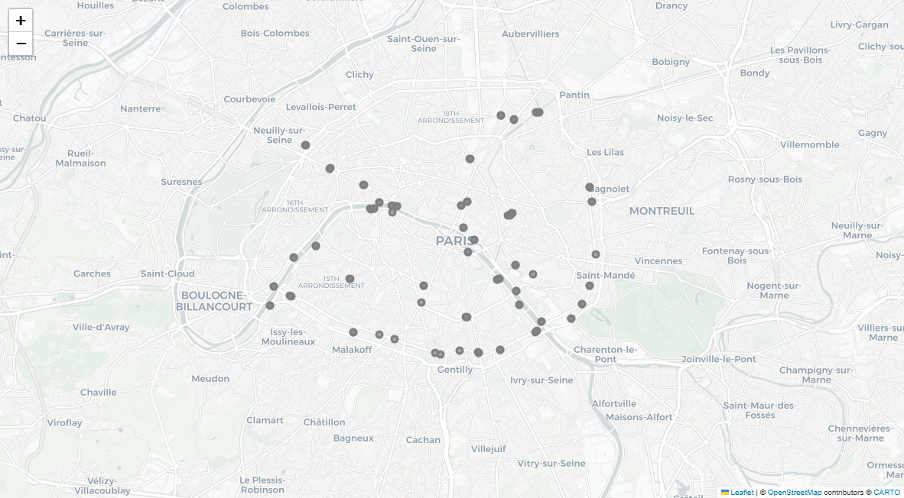
    <figcaption style="font-size:0.66em; margin-top:6px;">
      Figure 8 — Emplacement des compteurs
    </figcaption>
  </figure>
</div>

#### II.B. Exploration et Préprocessing des jeux d'enrichissement avec Python  <a id="IIB"></a>

##### II.B.1 Jeu de données météorologique <a id="IIB1"></a>

L'exploration et la préparation du jeu de donnée météo a été faite dans un Jupyter Notebook nommé `méteo.ipynb`.<br><br>

Le jeu de données téléchargé `Q_75_latest-2024-2025_RR-T-Vent.csv` contenait l'intégralité des données de 2024 et 2025, soit 3875 lignes et 57 colonnes. nous avons donc commencé par le **restreindre à la même plage de date** que notre jeu de comptage soit du 01/09/2024 au 30/09/2025.<br><br>

D'autre part, le jeu de donnée correspondait aux résultats de **6 capteurs** météo de la capitale.<br>
Nous avons considèré ces 6 stations météo comme complémentaires : s'il y a quelque différence d'altitude entre la Tour Eiffel et les jardins du Luxembourg, il n'y a cependant pas de différences climatiques significatives par rapport à notre analyse. Nous avons donc agrégé les données en prenant la **moyenne** des non nuls pour chaque paramètre n'identifiant pas le capteur.<br><br>

Nous avons ensuite cherché à **supprimer les colonnes** ne nous intéressant pas.<br>
Pour cela nous avons consulté la notice en ligne du jeu de donnée afin de comprendre les intitulés peu explicites pour les non météorologues : il s'est avéré que toutes les colonnes commençant par la lettre 'Q' étaient des colonnes techniques qualifiant le niveau de qualité de la mesure et non la mesure elle-même, nous pouvions donc les éliminer.<br>
L'analyse des **manquants** nous a par ailleurs permis de supprimer d'autres colonnes, intégralement vides car ne correspondant tout simplement pas au climat parisien sur notre période.<br>
Il nous restait alors une série de colonne que nous avons pu renommer avec leur définition respectives plutôt que leurs abbreviations anglosaxonnes:

<table class="table-compact">
  <thead>
    <tr><th>Nom de colonne initial</th><th>Nouveau nom</th></tr>
  </thead>
  <tbody>
    <tr><td>RR</td><td>RR précipitations (mm)</td></tr>
    <tr><td>DRR</td><td>DRR durée de précipitations (mn)</td></tr>
    <tr><td>TN</td><td>TN temp. mini (°C)</td></tr>
    <tr><td>HTN</td><td>HTN heure la + froide (hhmn)</td></tr>
    <tr><td>TX</td><td>TX temp. max (°C)</td></tr>
    <tr><td>HTX</td><td>HTX heure la + chaude (hhmn)</td></tr>
    <tr><td>TNTXM</td><td>TNTXM temp. moyenne quotidienne (°C)</td></tr>
    <tr><td>TAMPLI</td><td>TAMPLI amplitude thermique (°C)</td></tr>
    <tr><td>TNSOL</td><td>TNSOL temp. mini à 10cm du sol (°C)</td></tr>
    <tr><td>TN50</td><td>TNSOL temp. mini à 50cm du sol (°C)</td></tr>
    <tr><td>DG</td><td>DG durée de gel sous abri (mn)</td></tr>
    <tr><td>FFM</td><td>FFM force moyenne sur 10mn du vent à 10m (m/s)</td></tr>
    <tr><td>FF2M</td><td>FF2M force moyenne sur 10mn du vent à 2m (m/s)</td></tr>
    <tr><td>FXY</td><td>FXY force max du vent moyen sur 10mn à 10m (m/s)</td></tr>
    <tr><td>DXY</td><td>DXY direction du vent moyen à 10m (rose de 360)</td></tr>
    <tr><td>FXI</td><td>FXI force max instantanée du vent à 10m (m/s)</td></tr>
    <tr><td>HXI</td><td>HXI heure du vent max instantanée à 10m (hhmm)</td></tr>
    <tr><td>DXI</td><td>DXY direction du vent max instantanée à 10m (rose de 360)</td></tr>
    <tr><td>FXI2</td><td>FXI force max instantanée du vent à 2m (m/s)</td></tr>
    <tr><td>HXI2</td><td>HXI heure du vent max instantanée à 2m (hhmm)</td></tr>
    <tr><td>DXI2</td><td>DXY direction du vent max instantanée à 2m (rose de 360)</td></tr>
    <tr><td>FXI3S</td><td>FXI3S force max quotidienne sur 3sec du vent à 10m (m/s)</td></tr>
    <tr><td>HXI3S</td><td>HXI3S heure du vent max sur 3 sec à 10m (m/s)</td></tr>
  </tbody>
</table>

Cela fait encore beaucoup de colonnes. Nous avons décidé malgré tout de nous arrêter là pour le nettoyage avec Python, l'idée étant de réfléchir à un indicateur simplifié et de finaliser le retraitement <a href="#IIB4">avec Power Query</a> et <a href="#IIC4">DAX</a> afin de bénéficier des outils de visualisations de Power BI pour identifier les éventuelles colonnes calculées ou mesures susceptibles de faciliter l'analyse visuelle.<br><br>

A l'issu de cette étape, nous avons donc créé un fichier `meteo.csv` dans notre répertoire \data\processed et un fichier de métadonnées `metadatas-donnees-meteo.txt` dans notre répertoire \references.

##### II.B.2. Jeu de données de l'enquête de la FUB <a id="IIB2"></a>

Après en avoir fait la demande auprès de la FUB, nous avons pu télécharger les jeux de données du baromètre 2025 pour la ville de Paris. La notice du jeu de données est présentée en <a href="#ann2c">Annexe 2c</a>. <br>
Dans le cadre de notre projet, nous avons uniquement utilisé les fichiers `.geojson` contenant les descriptions données par les répondant pour chacun des points (max 9) qu'ils avaient pu identfier.<br><br>

Deux types de fichiers .geojson étaient disponibles :

* les 3 fichiers **de clusters**, issu du prétraitement de la FUB et correspondant à un regroupement de points identifiés par les répondants, ces clusters formant des "zones prioritaires". À noter que les fichiers de cluster pour la ville de Paris étant vide (erreur de création ?), nous nous sommes rabattus sur les fichiers de clustering du département 75.
* les 3 fichiers correspondants à chacune des catégories **de points** (vert, rouge, bleu). Ces fichiers étant naturellement plus complets que les fichiers de clusters puisque exhaustif.<br><br>

Dans un premier temps, nous avons commencé notre exploration par les données de clustering, pour voir si les zones identifiés (méthode expliquée dans la notice de la FUB et script en libre accès sur [GitHub](https://github.com/dataforgoodfr/offseason_fub)) étaient ou non à proximité de nos compteurs afin de nous assurer de la pertinence du croisement des jeux de données.<br>

L'exploration et la préparation du jeu de donnée a été faite dans un Jupyter Notebook nommé `barometre2025.ipynb` ainsi que dans `rapport_d_exploration.ipynb`.

###### II.B.2.a. Exploration des clusters du baromètre FUB <a id="IIB2a"></a>

Dans un premier temps, nous avons regroupé les 3 fichiers de clusters .geojson en un unique GeoDataFrame, avec l'ajout d'un champ `catégorie` permettant d'identifier le type de cluster (rouge, vert ou stationnement).
Nous avons également supprimé les colonnes qui ne nous intéressait pas : `commune`,`epci`,`departement`,`region`... en effet, 3 de ces colonnes n'avaient qu'une seule modalité et même si nous aurions pu chercher à intégrer une dimension de numéro d'arrondissement (*via* le numéro insee de la commune) dans notre hiérarchie géographique "site de comptage > compteur", cela ne nous a pas paru utile à notre analyse, celle-ci étant destinée à la mairie "centrale" de Paris en tant que décisionnaire et non aux mairies d'arrondissement.<br><br>

<div style="display: table; width: 100%;">
  <div style="display: table-cell; width: 55%; vertical-align: top; padding-right: 12px;">
  Sur ce GeoDataFrame, nous étions confronté au format spécifique des polygones des clusters (avec une liste des points définissant la zone), comme par exemple :<code>MULTIPOLYGON (((2.285062579 48.880798105, 2.284173146 48.880794376, 2.283934653 48.881017294, 2.284509497 48.881230919, 2.285062579 48.880798105)))</code> que nous cherchions à superposer sur notre <a href="#IIA3">carte des compteurs</a>.<br>
  Avec la librairie <code>shapely</code>, j'ai pu travailler sur la création de cette superposition dont une partie du script est en <a href="#ann3">Annexe 3</a>.
  </div>
  <div style="display: table-cell; width: 45%; vertical-align: top;">
    <figure style="margin:0;">
        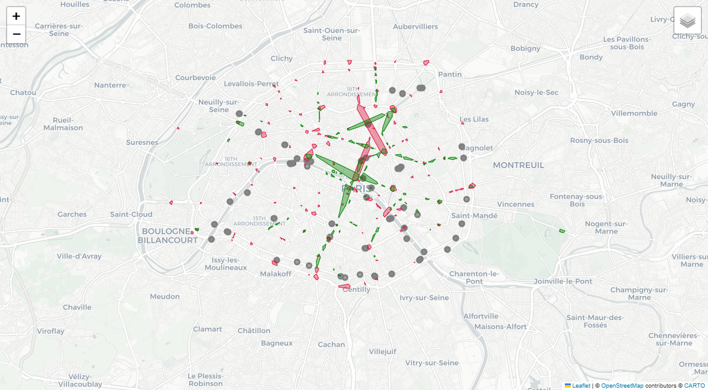
        <figcaption>
         Figure 9 — Superposition des compteurs et clusters baromètre FUB 2025
        </figcaption>
    </figure>
   </div>
</div>

###### II.B.2.b. 2ème phase de l'exploration géographique du baromètre FUB <a id="IIB2b"></a>

Cette superposition des données compteurs et clusters de commentaires nous semblait assez faible.Mohammed et Ghizlane ont donc affiné le script pour déterminer combien de compteurs se trouvaient dans un polygone identifiés par le baromètre en travaillant sur le notebook `jointure_spacialeV1.ipynb`.<br>
Pour cela, ils ont utilisés la méthode `geopandas.sjoin()` avec l'argument `predicate='within'` qui a permis de créer une carte des sites se trouvant dans un cluster vert, une autre pour ceux (éventuellement les mêmes) se trouvant dans un cluster rouge en encore dans un bleu.<br>
Ceci a permis d'aboutir à la carte suivante ci-dessous.

<div style="text-align:center; margin: 20px 0;">  
  <figure style="display:inline-block; width:45%; margin:0 1%;">
    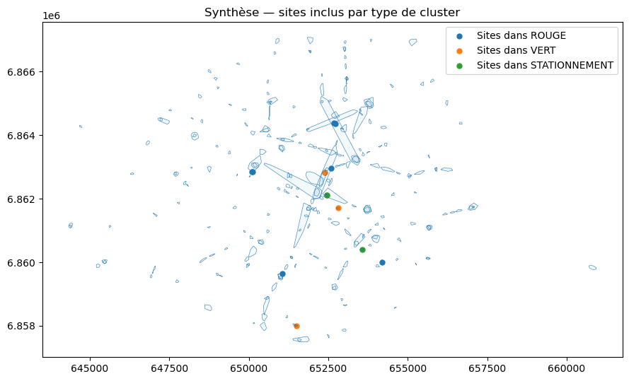
    <figcaption style="font-size:0.66em; margin-top:6px;">
      Figure 10 — Sites de comptage à l'intérieur d'un cluster du baromètre FUB 2025
    </figcaption>
  </figure>
  <figure style="display:inline-block; width:45%; margin:0 1%;">
    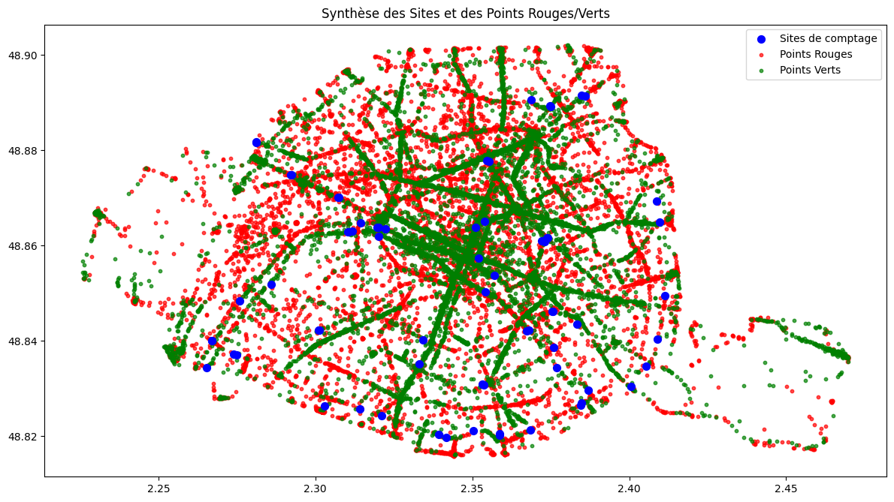
    <figcaption style="font-size:0.66em; margin-top:6px;">
      Figure 11 — Emplacement des compteurs et commentaires verts ou rouges du baromètre FUB 2025
    </figcaption>
  </figure>
</div>

La confirmation du faible nombre de compteur à l'intérieur d'un cluster étant faite, nous avons donc décidé d'utiliser directement les données détaillées du baromètres (fichiers "points") car ceux-ci étaient nettement plus nombreux (> 23 000) et dispersés, y compris à proximité des compteurs comme on peut le voir sur la carte ci-dessus.

Néanmoins, le fait de basculer sur le jeu complet de commentaire impliquait que nous allions traiter nettement plus de données et donc devoir développer notre propre script de clustering afin de rapprocher les commentaires des sites de comptage. Nous le verrons <a href="#IIB4">plus loin</a>.

##### II.B.3. Préparation des avis pour l'analyse textuelle <a id="IIB3"></a>

A l'issue de l'étape précédente, nous avons donc décidé de retenir les 3 fichiers de points .geojson comme source de commentaires.
Comme pour les clusters, nous avons donc retraité ces fichiers afin de ne conserver que la colonne de `description` et celle de `geometry` et nous avons concaténer les 3 fichiers en un unique dataframe muni d'une colonne `categorie`pour identifier la source de données.<br>
Mais les descriptions fournies par les répondants à l'enquête ne sont pas exploitables directement en l'état : la longueur du texte et le nombre de lignes obligent à traiter ces données pour en extraire les idées principales.<br><br>
Nous avons donc décidé de mettre en place une visualisation de ces idées par nuages de mots, l'objectif étant de définir un script réutilisable dans Power BI pour associer un nuage de mot à chaque compteur et en identifier la tonalité principale (plutôt des avis positifs ou négatifs ?).

###### II.B.3.a. Normalisation et lemmatisation du texte en français <a id="IIB3a"></a>

Le détail du script utilisé à cette étape est disponible en <a href="#ann4a">Annexe 4a</a>.<br>

L'objectif premier consiste à conserver les idées, la notion de leurs fréquences et se débarasser de l'inutile.

Pour cela nous avons défini une fonction nous permettant de :

* tokéniser nos commentaires pour les analyser à la maille du "mot" et non de la phrase complète. C'est la fréquence des mots dans les commentaires qui nous donnera une information.

* utiliser une liste de "stop words" pour alléger ces commentaires
  - supprimer les mots "vides" n'apportant pas d'information (déterminants, prépositions...)
  - supprimer les mots de 2 caractères et moins (certains mots de 3 lettres étant pertinents dans notre contexte, par exemple le mot "bus")
  - supprimer des mots, fréquents dans notre jeux de donnée mais trop imprécis pour être pertinent pour notre analyse ("vélo","rue"...)

* effectuer une lemmatisation morphologique et syntaxique des chaînes de caractères afin d'aller "à l'essentiel"

Et nous avons ensuite appliquer cette fonction à la colonne `description`de notre dataframe pour stocker la chaîne lemmatisée ainsi obtenue dans une nouvelle colonne `commentaire` de notre dataframe.

Lorsque j'ai travaillé sur cette étape, j'ai été rapidement confronté à un détail : la biliothèque utilisée dans le cours (wordnet.lemmatizer) était totalement inadaptée au français et je n'obtenais pas les résultats attendus. Après recherches sur StackOverflow, mon choix s'est portée sur la bibliothèque `spaCy`.
Cette dernière dispose de plusieurs modèles de lemmatisation existent, nous avons retenu le pipeline pré-entraîné de taille moyenne (md=medium) `fr_core_news_md` qui a l'avantage d'être léger à installer.<br><br>

Après quelques tests, nous avons cependant constaté que spaCy ne suffirait pas car il n'y avait notamment pas de distinction entre les formes masculin et féminin des adjectifs. Après analyse de la [documentation](https://spacy.io/models/fr), c'est parce que spaCy une lemmatisation **morphologique** (sur les règles de la langue) et non **sémantique** (sur le sens) : il va remplacer les verbes conjuger par leur infinitif et supprimer la plupart des pluriels pour les mettre au singulier mais conserver les distinctions de genres des noms et adjectifs.<br> Pour corriger cette limite, nous avons utilisé un module complémentaire de spaCy, `spaCy-lefff`(pour Lefff = **Le**xique des **f**ormes **f**léchies du **f**rançais)
A noter qu'on aurait aussi pu choisir d'utiliser une méthode de regroupement par proximité sématique mais que nous n'avons pas juger utile de se lancer dans quelque chaose d'aussi détaillé pour nos commentaires.<br><br>

Une fois les descriptions ainsi lemmatisée, nous avons stocké notre dataframe dans un fichier `commentaires.csv` dans notre répertoire \data\processed et un fichier de métadonnées `metadatas-donnees-meteo.txt` dans notre répertoire \references.

###### II.B.3.b. Création d'un nuage de mot suivant 2 algorithmes différents <a id="IIB3b"></a>

À ce stade, nous disposions donc d'un jeu de commentaire et notre objectif était de définir un script permettant de faire ressortir un nuage de mot créé avec la librairie `WordCloud` à partir d'un échantillon de plusieurs avis, l'objectif *in fine* étant de pouvoir découper notre jeu de commentaire selon proximité avec un compteur.

Deux visualisations ont été testées :

1. utilisation d'un wordcloud simple directement à partir des chaînes lemmatisées

2. utilisation d'un wordcloud après application d'un algorithme de bag of word basé sur un score de TF_IDF pour voir si les mots mis en avant sont plus pertinents.

Le rapprochement des commentaires avec le site de comptage le plus proche n'étant pas prêt au moment où nous faisions ces tests, ceux-ci ont été effectués sur la base de la catégorisation "rouge"/"vert" du commentaire. La création d'un corpus de commentaires (en listant ces derniers) plutôt qu'en les concaténant permet d'exploiter les variations de fréquence de commentaire d'un cycliste à un autre.

Le détail du script utilisé à cette étape est disponible en <a href="#ann4b">Annexe 4b</a>.<br>

Il convient de noter que l'utilisation de l'algorithme TF_IDF nécessite l'utilisation de modules supplémentaires et surtout la suppression des accents dans le texte

###### II.B.3.c. Choix de l'algorithme le plus pertinent <a id="IIB3c"></a>

Nos essais nous ont permis d'obtenir, avec le même jeu de donné lemmatisée, les 2 séries de nuages de mots ci-dessous.

<div style="text-align:center; margin: 20px 0;">
  <figure style="display:inline-block; width:100%; margin:0 1%;">
    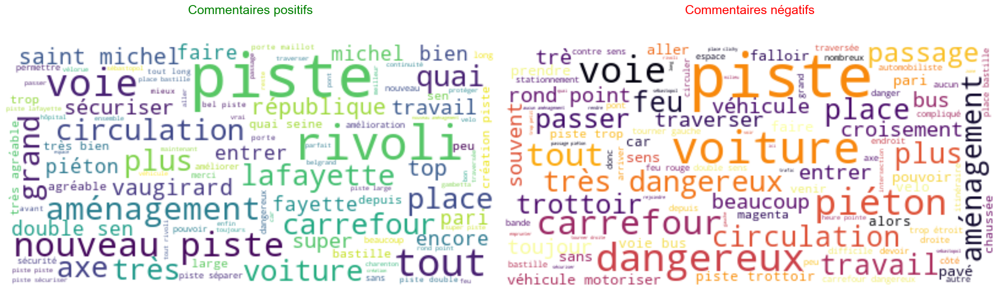
    <figcaption style="font-size:0.66em; margin-top:6px;">
      Figure 12 — Nuages de mots basé sur les répétitions
    </figcaption>
  </figure>
</div>

<div style="text-align:center; margin: 20px 0;">
  <figure style="display:inline-block; width:100%; margin:0 1%;">
    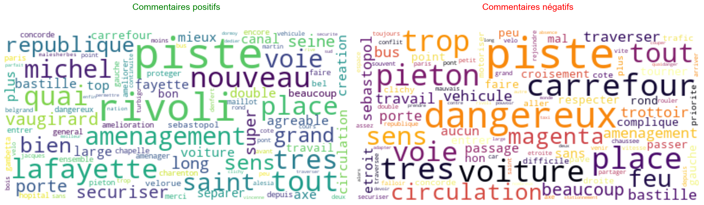
    <figcaption style="font-size:0.66em; margin-top:6px;">
      Figure 13 — Nuages de mots après application de l'algorithme TF_IDF
    </figcaption>
  </figure>
</div>

On peut noter la disparition des accents dans la 2ème série de nuages, effet collatéral de l'application de la fonction de suppression des accents qui étaient rendus nécessaires si nous ne voulions pas maximiser les scores des mots accentués. Mais visuellement, cela n'est finalement pas très dérangeant.<br>
On remarque également que les mots "piste" et "aménagement" remontent beaucoup et seront probablement à ajouter à notre liste de mot vide dans notre script final  (s'appliquant au corpus des avis par proximité avec nos sites de comptage).<br><br>

La différence entre les deux séries de nuage de mot n'est pas flagrante. Cependant, l'algorithme TF_IDF semble remonter des mots un peu plus précis et nous décidons donc de conserver ce dernier pour la suite du projet.<br>

##### II.B.4. Jointure géospatiale des avis <a id="IIB4"></a>

L’objectif de cette étape était de lier spatialement les ressentis exprimés par les usagers (commentaires du baromètre FUB) aux sites physiques de mesure des flux cyclistes.
Mais un commentaire à 300m d'un compteur est-il pertinent pour notre analyse ?
Probablement pas, c'est pourquoi, il était nécessaire de déterminer le rayon maximal garantissant que seul les relations spatialement cohérentes seraient conservées pour l’analyse.

<div style="display: table; width: 100%;">
  <div style="display: table-cell; width: 55%; vertical-align: top; padding-right: 12px;">
  Pour définir ce seuil, nous avons procédé par étapes, l'idée étant de tracer différents cercles concentriques autour de nos sites de comptages et de comptabiliser combien de commentaires se trouvaient dans le disque ainsi tracé. Nous avons donc réutilisé la méthode geopandas.sjoin() avec predicate='within' comme lors de la <a href="#IIB2b">phase d'exploration des clusters</a>.
  Le détail du code affiné par Mohammed est proposé en <a href="#ann5a">Annexe 5a</a>.
  Ceci nous a permis d'obtenir la courbe ci-contre et de fixer le seuil à 125m.
  </div>
  <div style="display: table-cell; width: 45%; vertical-align: top;">
    <figure style="margin:0;">
        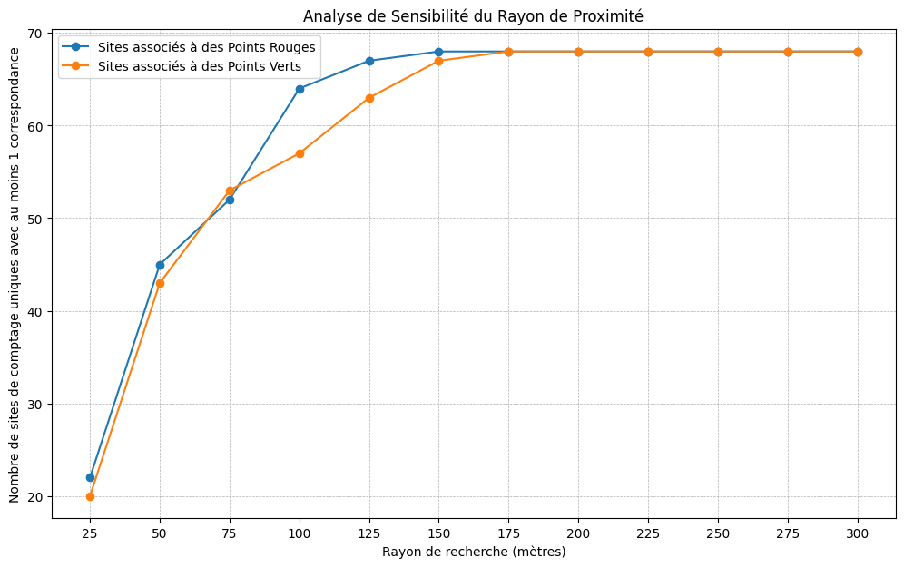
        <figcaption>
         Figure 14 — Détermination du rayon de proximité à retenir.
        </figcaption>
    </figure>
   </div>
</div>

Dans un second temps, nous avons identifié systématiquement le **compteur** le plus proche pour chaque commentaire et mesuré sa distance.
Une colonne `statut_proximite`a ensuite permis de distinguer les correspondances géographiquement pertinentes (retenu - soit environ 10% des commentaires du jeu) de celles jugées trop éloignées (non retenu) en fonction de notre seuil de 125m.
Le détail de cette 2ème partie du script est proposé en <a href="#ann5b">Annexe 5b</a>.

À l'issue de cette étape, nous disposions donc d'un fichier `commentaires_enrichis_sites.csv` dans notre répertoire \data\processed qui se présentait de la manière suivante :

<table class="table-compact">
  <thead>
    <tr><th>description</th><th>categorie</th><th>commentaire</th><th>site_plus_proche_id</th><th>site_plus_proche_nom</th><th>distance_au_site_m</th><th>compteur_plus_proche_id</th><th>statut_proximite</th></tr>
  </thead>
  <tbody>
  <tr><td>dangereux car les taxis sont en double file sur la piste cyclable</td><td>rouge</td><td>dangereux car taxi double file piste</td><td>100041488</td><td>27 boulevard Diderot</td><td>259.0915002039714</td><td>100041488-101041488</td><td>non retenu</td></tr>
  <tr><td>Voitures coupent la priorité aux cyclistes</td><td>rouge</td><td>voiture couper priorité</td><td>100007049</td><td>28 boulevard Diderot</td><td>86.91463944122768</td><td>100007049-102007049</td><td>retenu</td></tr>
  <tr><td>Passer au feu vert piéton avec son vélo à cet endroit reste une aventure périlleuse. C'est moins pire qu'il y a deux ans mais, entre la circulation dense et les nombreux chauffards, ce croisement reste vraiment dangereux pour les vélos.</td><td>rouge</td><td>passer feu vert piéton endroit reste aventure périlleux moins pire deux an entrer circulation dense nombreux chauffard croisement reste dangereux</td><td>100047547</td><td>6 rue Julia Bartet</td><td>98.90265675845514</td><td>100047547-104047547</td><td>retenu</td></tr>
  </tbody>
</table>

On remarque que certaines colonnes ne seraient pas nécessairement indispensables à la suite du projet : l'identifiant du compteur est suffisant pour faire la jointure dans le modèle de donnée Power BI. <br>
Les 2 colonnes liées au site de comptage (identifiant et nom) sont en effet là uniquement parce que crées lors la phase de calcul : en décidant de rapprocher les commentaires de nos zones de comptage, nous nous étions en effet d'abord focaliser sur le site de comptage, considérant le sens comme n'étant pas renseigné dans le commentaire. Mais cela induisait la création d'une relation Many to Many dans le modèle Power BI et c'est pourquoi nous sommes finalement revenu sur notre script pour rattacher le commentaire à un compteur.

##### II.B.5. Fichiers obtenus à l'issu de cette étape <a id="IIB5"></a>

À la fin de cette étape, nous disposons de plusieurs fichiers csv retraités qui vont nous servir de source dans Power BI :

   - `comptage-velo-donnees-compteurs-allege.csv`;
   - `compteurs_velo.csv`;
   - `meteo.csv`;
   - `commentaires_enrichis_sites.csv`.

#### II.C. Préprocessing dans Power Query <a id="IIC"></a>

##### II.C.1. Collecte des données <a id="IIC1"></a>

La première étape de notre création de rapport dans Power BI à consister à se connecter à nos données source et donc à se confronter à la difficulté de leur accès.
Si nous étions sûr d'avoir besoin d'une connexion en Import comment gérer l'emplacement du fichier pour que le rapport fonctionne pour chacun d'entre-nous ? <br>
D'autant qu'au moment où nous crééions le rapport, les fichiers sources étaient encore en cours de création avec python et donc instables.<br><br>
Pour solutionner ce problème d'accès à une version stable des fichiers sources, nous avons décidé d'utiliser GitHub comme un dépôt pour nos fichiers csv et de nous connecter à ces fichiers via l'API GitHub.<br>
Pour cela, il a fallu créér un token (car le dépôt est privé) et placer ce token dans un paramètre du rapport (pour ne pas le faire apparaître en clair dans les différentes requêtes Power Query sourcant les données), *cf.* un exemple dans l'<a href="ann6">Annexe 6</a>.

Malheureusement, à l'issue de la préparation du jeu de données de comptage, ce fichier restait trop grand pour être partagé sur GitHub ou sur nos Google Drive respectifs. Pour ce fichier source là, la solution ne fonctionnait donc pas. <br>
Nous avons donc créé un deuxième paramètre, correspondant à l'emplacement, sur chacun de nos pc, du fichier dans notre dépôt local.<br>
Ainsi, à l'ouverture du rapport, et sous réserve que notre branche locale soit à jour, il suffit de sélectionner le paramètre correspondant à notre chemin local pour actualiser le rapport.

<div style="text-align:center; margin: 20px 0;">
  <figure style="display:inline-block; width:100%; margin:0 1%;">
    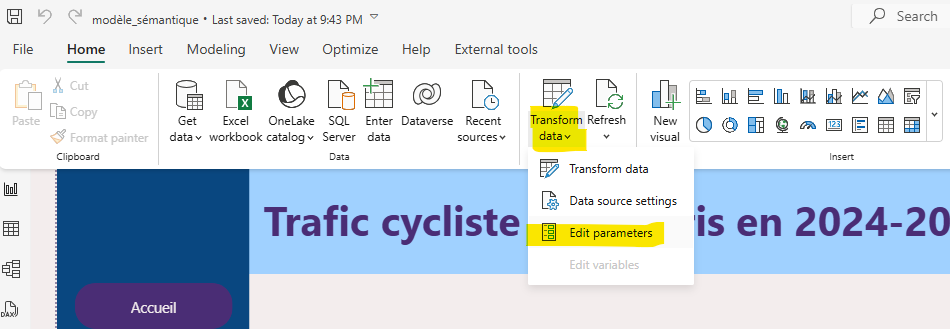
    <figcaption style="font-size:0.66em; margin-top:6px;">
      Figure 15 — Application d'un paramètre au rapport
    </figcaption>
  </figure>
</div>

<div style="text-align:center; margin: 20px 0;">
  <figure style="display:inline-block; width:100%; margin:0 1%;">
    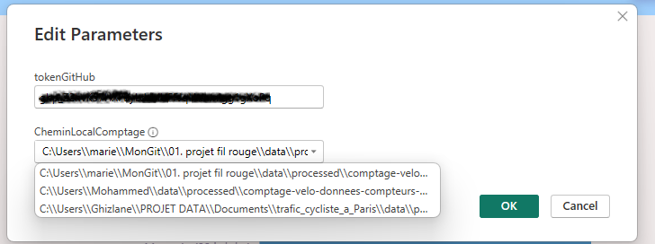
    <figcaption style="font-size:0.66em; margin-top:6px;">
      Figure 16 — Sélection du chemin utilisateur
    </figcaption>
  </figure>
</div>

##### II.C.2. Transformations sur la table des compteurs <a id="IIB2"></a>

Nous <a href="IIA3">'avons vu</a>l'avons vu, le fichier des compteurs préparé avec Python contenait encore un certain nombre de **colonnes inutiles** pouvant pénaliser fortement les performances de notre rapport Power BI, et donc l'expérience utilisateur.<br>

Nous utilisons donc Power Query (*cf.* <a href="ann6">Annexe 6</a>) pour élminer les champs purement descriptifs (notamment liés aux photos qui n'apportaient rien) ou redondantes :

   - `Identifiant technique compteur`,
   - `Date d\'installation du site de comptage`,
   - `Lien vers photo du site de comptage`,
   - `ID Photos`,
   - `test_lien_vers_photos_du_site_de_comptage_`,
   - `id_photo_1`,
   - `url_sites`.

Nous en profitons pour améliorer la convivialité des noms de colonnes qui avaient été abrégées et simplifiées pour être manipulable confortablement dans Python : l'objectif cette fois est que les noms de colonnes soient le plus explicites possible pour l'utlisateur final du rapport.<br><br>

Envin, nous avons revu le contenu des champs nommant les sites de comptage et les comptages par leur adresse.<br>
En effet, nous disposons parfois de plusieurs compteurs dans la même rue mais à des adresses différentes, par exemple nous avons un site au 44 avenue des Champs Elysées SE-NO et un autre au 33 avenue des Champs Elysées NO-SE.<br>

Si nous laissions les compteurs nommés de cette manière, alors nous aurions eu dans nos menus déroulants une liste triée par numéro de rue, ce qui aurait par exemple placés les 2 compteurs du 36 rue de Grenelle ENTRE nos 2 compteurs des Champs Elysées et cela aurait été peu confortable pour l'utilisateur du rapport Power BI.<br>

Pour résoudre ce souci, nous avons donc mis en place un renommage des adresses en prenant le contenu à droite de la première majuscule situé dans la chaîne de caractère, puis le numéro et le type de voie entre parenthèse. De nombreux compteurs étant situé sur des ponts, donc sans numéro, nous avons du traiter cette exception.

##### II.C.3. Création d'un score météo <a id="IIC4"></a>

La préparation du fichier de donnée météo nous avait permis de réduire le nombre de colonnes mais celle-ci <a href="IIB1">restaient nombreuses</a>.
L'exploration viseulle de notre table météo initiale avec la fréquentation cycliste ne nous permettait pas a priori de dégager un modèle simple d'analyse : de nombreux paramètres influe en effet sur notre perception de la météo : une température de 12°C peut-être considérée comme agréable pour faire du vélo au printemps sous le soleil mais s'il pleut et qu'il y a du vent, on pourra trouver cela froid.
Pour représenter cette perception multivariée, Ghizalne s'est attelée à la création d'un score de Météo basée sur les critères:
- de température moyenne (avec un idéal fixé autour de 22°C);
- de quantité et de durée des épisodes pluvieux
- du vent moyen.
Cette première approche nous a permis d'établir un premier barême de score météo journalier, notant la cyclabilité des conditions météorologiques sur 100, avec 40% de la note basée sur la température, 40% sur la pluviométrie et 20% sur le vent. Nous avons pu mettre en évidence une corrélation positive entre un score élévé de météo et la fréquentation des cyclistes mais il restait quelques points extrêmes qui n'étaient pas pris en compte.

En discutant de nos expériences de cyclistes, nous avons décidé d'affiner ce premier modèle en complétant le calcul du score avec la prise en compte :
* pour la température :
  - d'une pénalité de grand froid basée sur la température minimale enregistrée
  - d'une pénalité de forte chaleur (risque de déshydratation ou de coup de chaleur du cycliste) basée sur la température maximale;
  - et d'une pénalité de forte amplitude thermique (perte de confort du cycliste pendulaire qui doit s'équiper pour le froid matinal et la chaleur de fin de journée et faute de pouvoir se changer, renonce à prendre son vélo);
* pour le vent avec la prise en compte du vent moyen sur 15 points et la résevation de 5 points pour prendre en compte la force des rafales.

Enfin, afin de rendre ces calculs de scores intemédiaires, nous avons étabi un barême de classement en catégorie de chacune des notes et créé des colonne de tri de ces catégories (non visible de l'utilisateur de Power BI) pour que nos visuels soient cohérents.
Les différentes transformations évoquées peuvent être consultées en <a href="#ann7">Annexe 7</a>.

#### II.D. Préprocessing dans Power BI <a id="IID"></a>

##### II.D.1. Création des tables de date <a id="IID1"></a>

La création d'une table de date était indispensable pour l'analyse temporelle de notre jeu de données.

Néanmoins, elle n'était suffisante pour pouvoir analyser la répartition horaire des comptages. Nous avons donc créé 2 tables de dates

Si les visuels de création des indicateurs de fréquentation nécessitait simplement la création des mesures appropriées.
Il était néanmoins nécessaire de faire attention au fait que notre jeu étant restreint en terme de date, certaines dates de notre table de calendrier n'avaient pas de comptage : le calendrier va du 1er janvier 2024 au 31 décembre 2025 mais nous n'avons des données que sur la période du 1er septembre 2024 au 30 septembre 2025. Il convenait donc d'être prudent dans le calcul de nos mesures, notamment de fréquentation.

##### II.D.2. Modélisation en étoile <a id="IID2"></a>

Les tables préparées ont fait l'objet de la modélisation en étoile ci-dessous :

<div style="text-align:center; margin: 20px 0;">
  <figure style="display:inline-block; width:100%; margin:0 1%;">
    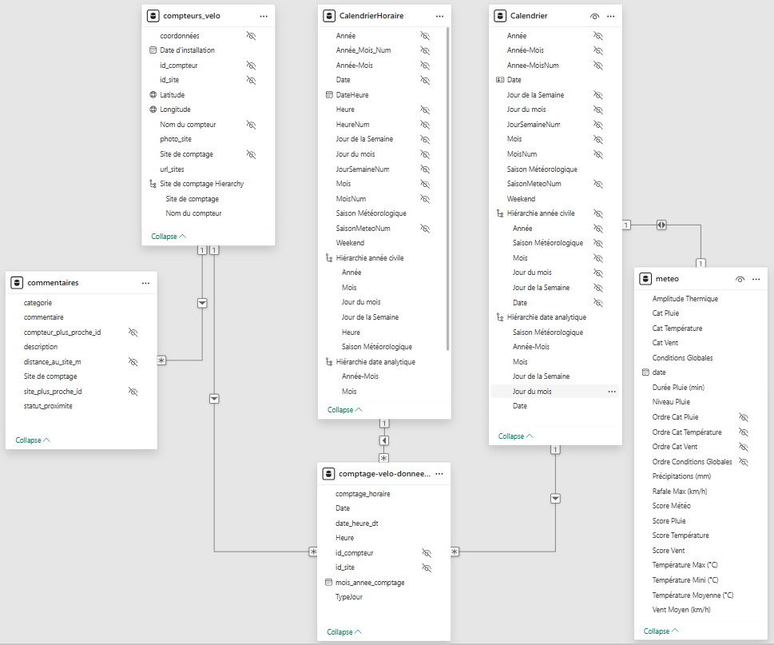
    <figcaption style="font-size:0.66em; margin-top:6px;">
      Figure 17 — Modèle de donnée en étoile
    </figcaption>
  </figure>
</div>

Il peut être utile de mentionner la présence d'une relation One to One entre la table de Date et la table de météo.
Bien qu'il ne soit normalement pas recommandé d'avoir une telle relation dans le modèle, celle-ci se justifie par l'origine différente des tables, la table Calendrier étant une table calculée, contrairement à la table météo.<br>

Nous aurions pu résoudre ce problème en transformant dans PowerQuery notre table de météo en table de calendrier, en s'assurant de l'absence de date manquante (ce qui était bien le cas) mais nous y avons pensé trop tard (après avoir déjà créé la table en DAX) et nous avons préféré conservé la simplicité d'une table de Calendrier explicite distincte d'une table stockant non seulement des dimensions temporelles mais également des faits météorologiques.

##### II.D.3. Création des hiérarchies <a id="IID"></a>

Nous avons créé 2 types de hiérarchies dans notre modèle sémantique :

* d'une part des hiérarchies temporelles :
  - avec une hiérarchie "analytique" pour prendre en compte une année 2024-2025 démarrant en septembre
  - avec une hiérarchie "année civile" pour prendre en compte la recherche éventuelle d'un indicateur correspondant par exemple au début de l'année 2025, la Mairie de Paris faisant habituellement ses études sur une plage de donnée annuelle<a href="bib201" class="ref">[2a]</a>.

* d'autre part une hiérarchie géographique simplement basée sur le rattachement d'un ou plusieurs compteurs à un même identifiant de site de comptage.
  Nous n'avons volontairement pas réalisé d'analyse basée sur l'adresse (on distingue ainsi les sites de comptage du 27 bd Diderot et du 28 bd Diderot) ou sur l'arrondissement.<br>
  Cette dernière distinction pourrait cependant avoir un intérêt si la Mairie de Paris souhaitait établir par exemple une liste de priorité par arrondissement ou si le rapport était à destination de plusieurs décideurs, chacun dans leurs mairies d'arrondissement. Mais les points de comptages étant situés sur des axes structurants des déplacements parisiens et non sur le réseau secondaire, la compétence est plutôt centralisée et nous ne voyions pas l'intérêt de compliquer plus l'analyse.<br><br>
  En cas de besoin, on pourrait néanmoins envisager la création d'une application séparée pour l'audiance de décideurs en mairie centrale de celle de l'audience en mairie d'arrondissement.

##### II.D.4. Création des mesures de sensibilité à la météo <a id="IID4"></a>

En explorant les résultats de trafic cycliste en fonction des résultats de la météo, nous nous sommes aperçus que tous les sites n'avaient pas le même comportement :

<div style="text-align:center; margin: 20px 0;">  
  <figure style="display:inline-block; width:45%; margin:0 1%;">
    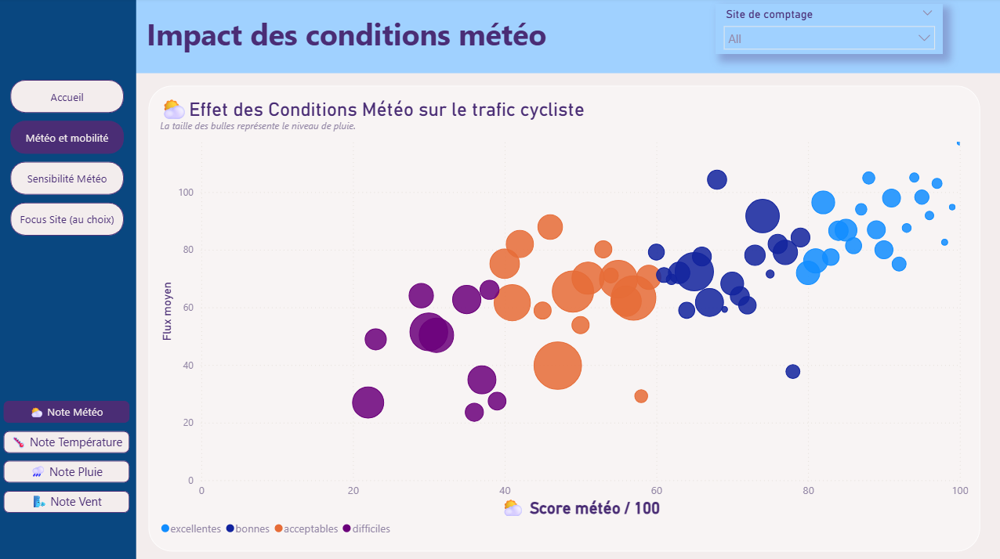
    <figcaption style="font-size:0.66em; margin-top:6px;">
      Figure 18 — Effet des conditions météo sur le trafic cycliste à Paris
    </figcaption>
  </figure>
  <figure style="display:inline-block; width:45%; margin:0 1%;">
    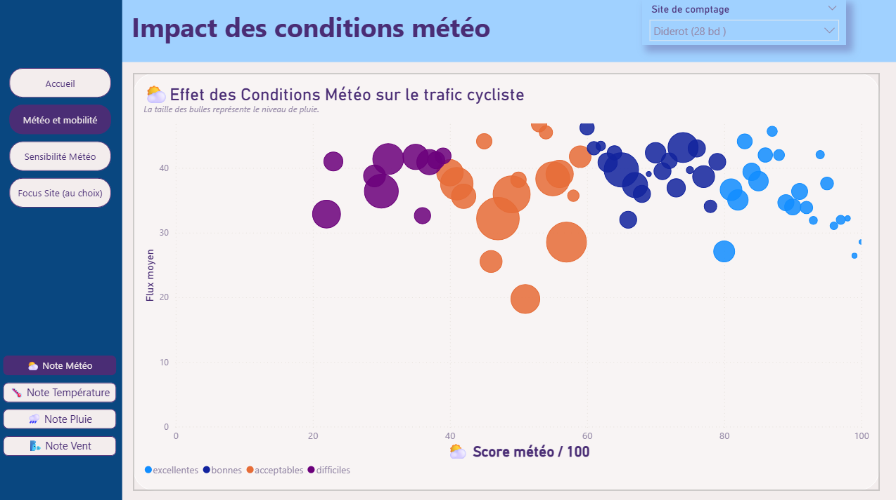
    <figcaption style="font-size:0.66em; margin-top:6px;">
      Figure 19 — Effet des conditions météo sur le trafic cycliste au 28 bd Diderot
    </figcaption>
  </figure>
</div>

Il nous a donc semblé utile d'étudier la sensibilité des différents sites aux conditions météorologiques par rapport à la moyenne des sites afin de pouvoir identifier des sites qui y seraient plus ou moins sensibles, ce qui nous renseignerait sur d'éventuels actions à apporter sur les aménagements.

Pour cela, nous avons pour chacun de nos 3 composantes du score météo (température, vent et pluviométrie), séparé notre jeu de données en 2 :
* d'une part notre jeu de référence, correspondant aux données pour lesquelles la météo était considéré comme excellente pour le paramètre étudié
* d'autre part le reste des données, correspondant aux données pour lesquelles la météo était moins clémente voire carrément dégradée.
Nous avons ainsi pu calculer la différence de fréquentation observée sur la période "temps moins agréable" par rapport à la période "conditions excellentes" et cet écart (directement lié à la variance de nos données), nous a permis de mesurer l'effet de référence du paramètre.

Dans un second temps, nous avons créé ue mesure définissant pour chaque compteur l'effet observé c'est à dire l'écart de fréquentation entre jours excellents et jours moins agréables.

La différence entre cet effet observé et l'effet de référence a consistué notre indicateur de sensibilité à la météo, dont vous pouvez trouver un exemple en <a href="#ann8">Annexe 8</a> et qui nous a permis d'établir un classement des sites plus ou moins sensibles à la météo.

##### II.D.5. Création des mesures de saturation des aménagements <a id="IID5"></a>

Constatant des fréquentations exceptionnellement élevée pour certains compteurs, nous avons décidé de compléter notre rapport d'un indicateur de saturation des aménagements cyclables, afin de pouvoir alerter les aménageurs lorsque la fréquentation d'un site devient si élevée que cela peut générer des problèmes, alors mêmes que l'objectif du Plan Vélo 2021-2026 est bel et bien la croissance de la part modale du vélo.


<a href="#ann9">Annexe 9</a>

## III. Visualisations dans Power BI <a id="III"></a>

### III.A. Thème et organisations visuelles des pages

Nous avons choisi de préparer notre rapport "comme si nous allions aller jusqu'à l'étape de publication".
Dans ces conditions, nous avons donc prévu un cadre classique avec un bandeau latéral pour la navigation entre les pages de rapport et un bandeau horizontal pour le titre.

Nous avons sélectionné un thème neutre en terme de couleur pour ne pas influencer nos utilisateurs dans leur perception des résultats affichés et avons choisi d'appliquer un jeu de couleur accessible à notre rapport.

L'objectif du rapport est d'aider l'utilisateur du rapport à prendre des décisions nécessitant :
* d'identifier des sites prioritaires,
* d'identifier pour ces sites les axes d'améliorations possibles.

Nous avons donc décidé de créer 2 pages principales à notre rapport : une page macro permettant de visualiser l'ensemble des sites de comptage et une page de focus à la maille du site de comptage.
Nous compléterons éventuellement de page détaillant des analyses de sensibilité météo mais souhaitons conserver la simplicité d'un nombre réduit de page et de visualisation car notre public de décideur a rarement du temps à consacrer à la navigation au sein d'un rapport.

### III.B. La page d'accueil du rapport

Nous avons donc décidé d'organiser notre rapport avec une première page présentant une vision macro de l'ensemble de nos données : indicateurs de fréquentation, de saturation, localisation des compteurs, sensibilité à la météo.<br>
Deux critères de filtre sont retenus : 
* les sites de comptage (avec la possibilité d'en sélectionner plusieurs, par exemple le 27 et le 28 bd Diderot ou tous les ponts) 
* et la période calendaire, avec une premier niveau de sélection fixé sur la saison météorologique, ce qui nous a semblé le plus simple pour comparer facilement les moyennes été vs hiver par exemple.<br><br>

Si les visuels de création des indicateurs de fréquentation nécessitaient simplement la création des mesures appropriées (moyenne, maximum). Il était néanmoins nécessaire de faire attention au fait que notre jeu étant restreint en terme de date, certaines dates de notre table de calendrier n'avaient pas de comptage : le calendrier va du 1er janvier 2024 au 31 décembre 2025 mais nous n'avons des données que sur la période du 1er septembre 2024 au 30 septembre 2025. Il convenait donc d'être prudent dans le calcul de nos mesures, notamment de fréquentation.<br>

Carte de situation des compteurs

Intégration du visuel Python de nuage de mot
<a href="#bib101" class="ref">[6a]</a>
<a href="#ann10">Annexe 10</a>

Ceci nous fourni les éléments nécessaire à la réalisation de notre page, organisée "en Z": nos indicateurs de fréquentation en haut à gauche, puis ceux de saturation, à droite une carte de Paris avec les avis des cyclistes en survol. En partie basse, une liste des sites les plus sensibles à la météo et à droite la liste des sites les plus fréquentés.

<div style="text-align:center; margin: 20px 0;">
  <figure style="display:inline-block; width:100%; margin:0 1%;">
    
    <figcaption style="font-size:0.66em; margin-top:6px;">
      Figure 20 — Page d'accueil du rapport Power BI
    </figcaption>
  </figure>
</div>

### III.C. La page de Focus Site

Ayant constaté que la Mairie de Paris suit un indicateur au seuil de 3000 cyclistes/jour<a href="bib201" class="ref">[2a]</a>, nous sommes resté sur un indicateur journalier pour la visualisation de la saturation au cours de l'année avec un bandeau horizontal permettant d'un simple glissement de repérer les fréquences de dépassement des seuils.<br>
Deux seuils ont été tracés sur le graphe :
* un premier seuil à 1 500 cyclistes/jour correspond aux trafic maximum souhaité sur une bande cyclable non protégé suivant les recommandations du Cerema <a href="bib301" class="ref">[3a]</a>.
* un second seuil à 3 000 cyclistes/jour correspond à un seuil habituellement tolérable sur des pistes cyclables de taille confortable type "haut niveau de service" telle qu'on peut les trouver dans les aménagements de type vélopolitain <a href="bib302" class="ref">[3b]</a><a href="bib303" class="ref">[3c]</a><a href="bib401" class="ref">[4a]</a>.
Il faut noter qu'en l'absence de liaison avec lun jeu de données des aménagements cyclables, nous n'avons pas pu déterminer dynamiquement quel seuil était le plus adapté à chaque site mais nous considérons que les aménageurs connaissent leurs sites et sinon, un simple clic dans la carte permet d'accéder à une photo sommaire de l'emplacement pour se le remettre en tête.

<div style="text-align:center; margin: 20px 0;">
  <figure style="display:inline-block; width:100%; margin:0 1%;">
    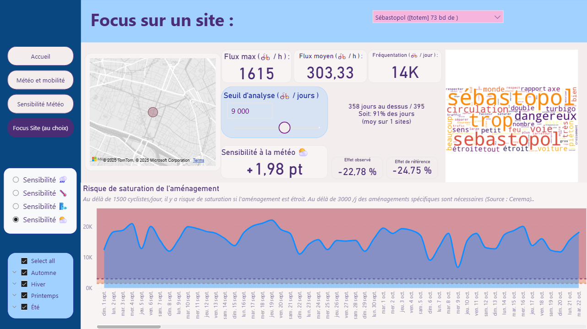
    <figcaption style="font-size:0.66em; margin-top:6px;">
      Figure 20 — Page Focus site du rapport Power BI
    </figcaption>
  </figure>
</div>

Mais si le cycliste parisien est relativement noctambule, nous avons vu dans nos explorations que des pics horaires sont bien visibles, tant en semaine que nous le week-end et nous compléterons donc nos visualisations d'un indicateur de flux maximum horaire. ainsi que d'un histogramme permettant de visualiser les pics maximums par rapport à un seuil horaire maximal correspondant.

<div style="display: table; width: 100%;">
  <div style="display: table-cell; width: 55%; vertical-align: top; padding-right: 12px;">
  Bien que la journée dure 24h, il est généralement admis par les aménageurs qu'un seuil de 1500 cyclistes/jour est à peu près équivalent à un seuil de 125 cyclistes/heure (250 cyclistes/heure pour le seuil à 3000 cyclistes/jour) : en effet, ce qui nous intéresse c'est d'identifier les dépassements de seuil et non de faire des moyennes précises, hors la majeure partie du trafic cycliste a lieu sur un une douzaine d'heure par jour.
  Nous traçons donc notre constantes sur ces bases.
  </div>
  <div style="display: table-cell; width: 45%; vertical-align: top;">
    <figure style="margin:0;">
        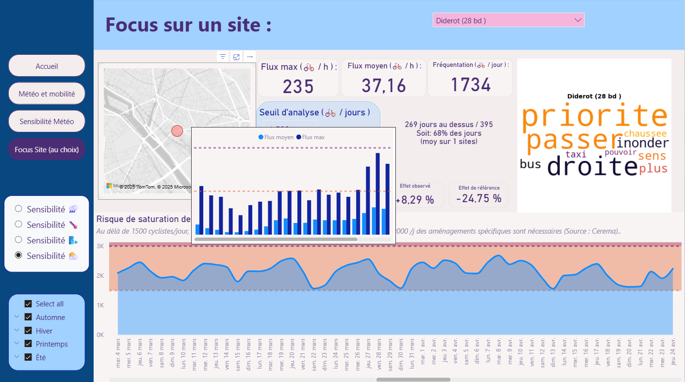
        <figcaption>
         Figure 21 — Seuils de fréquentations horaire
        </figcaption>
    </figure>
   </div>
</div>

<hr class="page-break">

## IV. Analyse des données <a id="IV"></a>

<hr class="page-break">

## Conclusion

### Bilan

### Perspectives :

1. **Enrichir le jeu de données avec celui des aménagements cyclables.**<a id="persp1"></a>

Ceci nous aurait permis d'analyser séparément les compteurs sur bande cyclables de ceux sur pistes cyclables par exemple ou de prendre en compte pour ces dernières la largeur de l'aménagement afin de préciser les risques de saturation.
Un tel jeu existe et est disponible [ici](https://www.openstreetmap.org/search?query=Paris&zoom=5&minlon=-34.40917968750001&minlat=38.03078569382294&maxlon=34.23339843750001&maxlat=61.897577621605016#map=13/48.85890/2.33116&layers=C) grace au travail des contributeurs d'OpenStreeMap.<br>

La Ville de Paris ne produit pas sa propre carte mais retraite cette carte collaborative en qualifiant la qualité de la donnée et en la mettant à disposition sur son propre OpenData  [ici](https://opendata.paris.fr/explore/dataset/amenagements-cyclables/information/?disjunctive.arrondissement&disjunctive.position_amenagement&disjunctive.vitesse_maximale_autorisee&disjunctive.source&disjunctive.amenagement).<br>

Mais son traitement pour intégration dans le jeu de donnée nous aurait pris trop de temps et nous nous sommes donc contenté d'une analyse visuelle de l'aménagement au travers de la photo du site. En effet, le jeu est plus complexe qu'il n'y paraît : 

* plusieurs traces GPS peuvent être superposées sur une même voie lorsque l'aménagement est bidirectionnel ou être unique lorsqu'il est unidirectionnel, le nombre de catégorie d'aménagement listé est bien plus important que celui à proximité des compteurs (du double sens cyclable à la piste bidirectionnelle en passant par la voie verte, la vélorue où la voie partagée avec les bus pour n'en citer que quelques uns.)
* les aménagements se gèrent comme des dimensions à évolution lente (une fois tous les x mois, un aménagement va être mis à jour pour indiquer par exemple la fin des travaux de création d'une voie de vélopolitain) tandis que notre jeu de donnée à une temporalité courte avec des données horaires.

1. **Identifier l’ordre d’importance des facteurs responsables des variations de flux :** <a id="persp2"></a>

Que ces variations soient horaires (effet de journée de travail), hebdomadaires (semaine de travail vs weekend), saisonnières (effet des vacances d'étét ou des fêtes de fin d'années) ou météorogoliques, nous avons en effet pu voir que de nombreux éléments étaient à l'origine des variations.<br>
Si nous avions eu le temps d'aborder les cours de machine learning un peu plus tôt.<br>
Ainsi, nous aurions par exemple pu utiliser un arbre de régression pour ajuster notre calcul de scoring météo, qui est actuellement basé avant tout sur une approche "mon vécu de cycliste" que sur une démarche statistique.<br>
Nous aurions par ailleurs pu tenter d'identifier l'ordre d'importance de ces facteurs pour affiner l'identification des sites nécessitant des modifications d'aménagements.

1. **Rendre dynamique le rapport en le raccordant directement via API.**<a id="persp3"></a>

Ceci nous aurait permis d'élargir la période de donnée utilisée plutôt que de se restreindre à 13 mois (donc d'avoir plusieurs étés, plusieurs vacances d'hiver...).<br>

Le jeu étant actualisé quotidiennement avec de nombreux compteurs installés depuis plus de 6 ans, nous aurions ainsi pu étudier des tendances et les données supplémentaires nous auraient permis de commencer à faires des prédictions de trafic pour affiner l'identification des sites :

  * pour lesquels un aménagement permettrait d'éviter une future saturation,
  * ou pour lesquels un aménagement favoriserait le développement de la part modale cycliste.

4. **Enrichir le jeu de données avec les jeux de données sur l'accidentologie.**<a id="persp4"></a>

Le jeu dit "fichier BAAC" (Base de données Annuelles des Accidents Corporels de la circulation routière de l'Observatoire National Interministériel de la Sécurité Routiers (ONISR) est librement accessible [ici](https://www.data.gouv.fr/datasets/bases-de-donnees-annuelles-des-accidents-corporels-de-la-circulation-routiere-annees-de-2005-a-2024), inclue une localisation des accidents et permetttrait d'améliorer l'identification et la quantification les zones dangereuses afin de prioriser les travaux sur ces zones.

### Les difficultés qu'il a fallu relever

1. **Les contraintes du travail d'équipe en mode projet :** <a id="defi1"></a>

Nous avons découvert GitHub tous ensemble en collaborant sur un repository privé hébergé sur mon GitHub personnel. L'idée était d'avoir chacun sa branche pour travailler et de consolider nos avancées dans la branche *main*.<br>
Mais les débuts ont été compliqué et j'ai du à plusieurs reprises utiliser les fonctions de revert ou reset suite à des *merge* "à l'envers" de certains de mes collègues… l’absence de formation à l'utilisation d'un outil de versionning dans le cadre de la formation a été un réel manque même si nous avons pu nous appuyer sur ls modules Microsoft Learn.<br>

D'autre part, les contraintes de travail sur PowerBI SANS accès à Power BI ont été assez contraignantes car une seule personne pouvait travailler à la fois sur le rapport, faute de pouvoir publier un modèle sémantique commun et d'avancer séparémment sur différentes visualisation. Il a fallu jouer sur les calendriers des accès et les contraintes de chacun ce qui n'a pas toujours été simple.<br>
Si nous avions eu le temps de nous former aux nouvelles fonctions Power BI, nous aurion spu essayre d'utiliser le format d'enregistrement pbip et les fichiers TMDL pour travailler en parralèle sur différents éléments de notre rapport (par exemple une personne travaillant sur les transformations power query de score météo pendant qu'un autre travaillait sur les renommage de compteurs) en parallème en utilisant Git pour tracer les modifications de chacun, ces fonctions semblant vraiment très intéressantes pour le travail collaboratif et la gestion de version.<br><br>

2. **La compréhension des notions d’environnements python et de gestion de version des librairies Python :** <a id="defi2"></a>

Nous avons été confronté à des erreurs liés à ce type de problème car nous avions tous les 3 des versions différentes de Python (3.13.5 pour moi et Ghizlane sur oc, 3.14 pour Mohammed sur mac).<br>
J'ai également eu des conflits de versions de librairies Python et il aurait été judicieux de mettre en place un environnement partageable pour stabiliser notre travail, d'autant que sans Power BI Service, chaque utilisateur doit pour l'instant déclarer son propre environnement python pour faire fonctionner le rapport.<br>
Un module de formation sur les bonnes pratiques d’utilisation d’un EDI comme VS Code aurait été apprécié, ainsi que sur les modalités de création d'un environnement Python et son partage.<br><br>

3. **L’analyse de texte en français :** <a id="defi3"></a>

Il a fallu rechercher une bibliothèque python adaptée (celle vu en cours, wordnet étant plutôt anglophone) et qui puisse prendre en compte les formes complexes du français.<br>
La transformation du script testé sur l’ensemble du jeu en un script intégrable dans Power BI et fonctionnant avec des clusters d’avis de taille nettement plus réduite pour chaque compteur a ensuite nécessité des ajustements  pour ne pas avoir d’erreur lorsque le cluster était petit.<br>
D'autre part, le rendu de l'affichage du nuage de mot dans Power BI était légèrement différent application arbitraire de marge en haut et en base) que celui obtenu dans Python et j'ai donc du adapter ces paramètres.<br>
Enfin (et surtout), pour des raisons de performance (temps de chargement qui était trop long), j'ai également du mettre directement dans le script python la définition de la totalité du dictionnaire de mots vides à utiliser au lieu de charger dynamiquement les mots vides "classiques" et de me contenter d'y ajouter les mots spécifiques à mon contexte.<br><br>

<hr class="page-break">

## Bibliographie

### 1. Plans vélo et qualité de l'air

<a id="bib101">[1a]-</a>[Mesures pour modifier le trafic routier en ville et qualité de l'air extérieur - Edition Ademe - 2021](https://librairie.ademe.fr/urbanisme-territoires-et-sols/4927-mesures-pour-modifier-le-trafic-routier-en-ville-et-qualite-de-l-air-exterieur.html)

### 2. Déplacements à Paris

<a id="bib201">[2a]-</a>[Bilan des déplacements à Paris en 2024 - page web Ville de Paris - oct 2025](https://www.paris.fr/pages/le-bilan-des-deplacement-a-paris-en-2024-31371)

<a id="bib202">[2b]-</a>[Les déplacements en vélo à Paris en 2024 - Edition Ville de Paris - 2025](https://cdn.paris.fr/paris/2025/06/02/paris_ra2024-deplacements-en-velo-8-pages-26-05-copie-3dZs.pdf)

### 3. Qualité des aménagements cyclables (Guides officiels )

<a id="bib301">[3a]-</a>[Annexe 3 : Note de recommendations techniques du CEREMA](https://www.ecologie.gouv.fr/sites/default/files/documents/Annexe%203%20%20Recommandations%20techniques%20du%20CEREMA.pdf)

<a id="bib302">[3b]-</a>[8 recommandation pou réussir votre piste cyclable - Actualités du Cerema - 24/02/2021](https://www.cerema.fr/fr/actualites/8-recommandations-reussir-votre-piste-cyclable) 

<a id="bib303">[3c]-</a>[Guide des aménagements cyclables - Direction de la Voirie des tdes Déplacements de la Ville de Paris - 16/06/2023](https://cdn.paris.fr/paris/2024/09/30/guide-amenagements-cyclables-partie-1-generalites-hors-dsc-juin-2024-light-CFZy.pdf)

### 4. Paris en Selle 

Qualité des aménagements cyclables (nombreuses photos et exemples) pour la compréhension des sites de comptage :
<a id="bib401">[4a]-</a>[Guide des aménagements cyclables - Edition : Paris en Selle - mise à jour de 20121](https://parisenselle.fr/telecharger-guide-amenagements-cyclables/)

<a id="bib402">[4b]-</a>[Plateforme dédiée aux compteurs vélo](https://parisenselle.fr/2020/10/06/une-plateforme-pour-recenser-les-compteurs-velo/#:~:text=Nous%20sommes%20heureux%20de%20vous%20pr%C3%A9senter%20https%3A%2F%2Fcompteurs.parisenselle.fr%2C%20qui,grand%20merci%20%C3%A0%20Tristram%20pour%20ce%20gros%20boulot.)


### 5. Compréhension des fonctionnement des capteurs et des méthodes de suivi du trafic

<a id="bib501">[5a]-</a>[Données de mobilité pour la modélisation des déplacements - fiche n°9 : données issues des capteurs routiers - Edition : Cerema - 2025](https://doc.cerema.fr/Default/doc/SYRACUSE/605087/donnees-de-mobilite-pour-la-modelisation-des-deplacements-fiche-n-9-donnees-issues-des-capteurs-rout)

<a id="bib502">[5b]-</a>[Technologies de comptage proposées pour les cyclistes par eco-compteur - page web - 2025]](https://www.eco-compteur.com/solutions/produits/)

<a id="bib503">[5c]-</a>[Etude de simulation dynamique de trafic : guide de réalisation - Edition : Cerema - 2015](https://doc.cerema.fr/Default/doc/SYRACUSE/14114/etudes-de-simulation-dynamique-de-trafic-guide-de-realisation) => perspectives (analyse dynamique des flux)

### 6. Documentation technique complémentaire

<a id="bib601">[6a]-</a>[Créer un script Python pour Power Bi - page Web Microsoft Learn - oct 2025](https://learn.microsoft.com/fr-fr/power-bi/connect-data/desktop-python-scripts)

<hr class="page-break">

## Annexes et extrait de code

### <a id="ann1">Annexe 1</a> : 🗂️ Structure du projet et du fichier zip

_Certains fichiers présents ne sont pas décrits : il s'agit soit de fichier qui ont été écartés du traitement (par exemple les fichiers complémentaires du baromètre FUB, soit de fichiers de travail temporaires.)_

```text
trafic_cycliste_paris/
│
├── data                                    → données brutes et nettoyées
|    |── raw                                → données brutes
|    |    |──meteo
|    |    |    |──Q_75_latest-2024-2025_RR-T-Vent.csv
|    |    |    └──Q_75_latest-2024-2025_RR-T-Vent.csv.gz
|    |    |──barometre2025fub               → données du baromètre FUB pour la ville de Paris
|    |    |    |──points-rouges-75056.geojson
|    |    |    |──points-verts-75056.geojson
|    |    |    └──stationnements-75056.geojson
|    |    |──barometre2025fub-dept75        → données du baromètre FUB pour le département Paris
|    |    |    |──clusters-rouges-75.geojson
|    |    |    |──clusters-stationnements-75.geojson
|    |    |    └──clusters-verts-75.geojson
|    |    |──barometre2025fub-dept75        → données sociologiques du baromètre FUB 2025
|    |    |──comptage-velo-donnees-compteurs.csv        // jeu de donnée principal
|    |    |──comptage-velo-donnees-compteurs.geojson    // même jeu, simple différence de format
|    |    └──comptage-velo-donnees-compteurs.parquet    // même jeu, simple différence de format
|    └── processed  → données retravaillées → données issues du pré-processing
|         |                             -------source pour Power BI-------
|         |──comptage-velo-donnees-compteurs-allege.csv   // ignore pour GitHub car trop gros
|         |──compteurs_velo.csv
|         |──meteo.csv
|         |──commentaires_enrichis_sites.csv
|         |                             -------fichiers de traitement intermédiaire-------
|         |──commentaires.csv                           
|         |──points-rouges-75056.csv                    
|         |──points-verts-75056.csv                     
|         └──stationnements-75056.csv 
|
├── models                                  → stockage éventuels des modélisations et calcul prédictif (non utilisé)
├── notebooks                               → jupyter notebooks utilisés pour l'exploration et l'analyse
|    |── Rapport_de_découverte.ipynb                             //premier rapport
|    |── Rapport_d_exploration.ipynb                             //consolidation et complément des rapports d'exploration
|    |── météo.ipynb                                             // première exploration du jeu météo
|    |── baromètre2025.ipynb                                     // première exploration du jeu de commentaire et nuages de mots
|    |── jointure_spacialeV1.ipynb                               // première version jointure clusters commentaire-site
|    |── rapprochement_commentaires_et_sites_comptage.ipynb      // première intégration jointure dans table commentaire-site  
|    |── jointure_spatiale.ipynb                                 // consolidation jointure commentaire-site et calcul rayon           
|    └── images                             → stockage des images d'illustration (y compris cartes)                             
|
├── reports         → stockage des projets de datavisualisation (PowerBI)
|    └── Rapport_trafic_cycliste.pbix
|
├── references      → metadatas de fichier sources et documents d'informations diverses
|    |── metadatas-donnees-brutes.txt
|    |── colonnes_meteo.csv                                       //extrait notice en ligne du jeu météo
|    |── metadatas-donnees-meteo-brutes.txt
|    |── metadatas-donnees-comptage.txt
|    |── metadatas-donnees-compteur.txt
|    |── metadatas-donnees-commentaires.txt
|    └── metadatas-donnees-meteo.txt           
├── utilitaires     → module python de stockage des scripts python utilisées dans les notebooks notamment
├── .gitignore
└── README.md
```
<hr class="page-break">

### <a id="ann2">Annexes 2</a> : Struture des jeux de donnéees initiaux

Les informations ci-dessous ont été extraites des jeux par l'application de la fonction ci-dessous :

```python
def info_colonnes(df):
    infos = []  # liste qui va contenir les infos de chaque colonne
    
    for col in df.columns:
        # Récupérer le type de la colonne
        dtype = df[col].dtype
        nb_unique=df[col].nunique()
        nb_manquant=df[col].isnull().sum()
        pct_manquant=f"{df[col].isnull().mean() * 100:.2f}%"
        nb_doublon=df[col].duplicated().sum()
        nb_identifiant_non_unique=df[col].duplicated(keep=False).sum()
        ex_unique=f" {df[col].unique()[:5]}"  # Affiche les 5 premières valeurs uniques  
                    
        infos.append(f"</p><p>Nom de la colonne: {col}\n Type : {str(dtype)}\nNombre de valeurs uniques : {str(nb_unique)}\nNombre de valeurs manquantes : {str(nb_manquant)}\nPourcentage de valeurs manquantes : {str(pct_manquant)}\nNb élements utilisés plusieurs fois : {str(nb_doublon)}\nsoit nb lignes avec un élément non unique : {str(nb_identifiant_non_unique)}\nExemples de valeurs uniques : {str(ex_unique)}\n")
        
    # Retourner une seule chaîne composée des descriptions de chaque colonne
    # pour pouvoir l'écrire facilement dans un fichier de métadonnées.
    return "\n\n".join(infos)

# on va venir enregistrer la description des données brutes dans un fichier txt de métadonnées

file_metadonnees=chemin_user+"references/metadatas-donnees-brutes.txt"
   
with open(file_metadonnees,"w") as f:
    f.write("Structure du jeu de données initial brut :\n")

with open(file_metadonnees,"a") as f:
    content=str(info_colonnes(df))
    f.write(content)
    f.close()

```

<hr class="page-break">

#### <a id="ann2a">Annexe 2a</a> : Structure du jeu de données initial brut

<div class="two-columns">
<p>Nom de la colonne: Identifiant du compteur<br>
 Type : object<br>
Nombre de valeurs uniques : 98<br>
Nombre de valeurs manquantes : 24533<br>
Pourcentage de valeurs manquantes : 2.77%<br>
Nb éléments utilisés plusieurs fois : 885145<br>
soit nb lignes avec un élément non unique : 885244<br>
Exemples de valeurs uniques :  ['100003098-101003098' '100006300-101006300' '100007049-102007049'
 '100007049-101007049' '100036718-104036718']<br>
</p>
<p>Nom de la colonne: Nom du compteur<br>
 Type : object<br>
Nombre de valeurs uniques : 109<br>
Nombre de valeurs manquantes : 0<br>
Pourcentage de valeurs manquantes : 0.00%<br>
Nb éléments utilisés plusieurs fois : 885135<br>
soit nb lignes avec un élément non unique : 885243<br>
Exemples de valeurs uniques :  ['106 avenue Denfert Rochereau NE-SO' '135 avenue Daumesnil SE-NO'
 '28 boulevard Diderot E-O' '28 boulevard Diderot O-E'
 '39 quai Fran�ois Mauriac NO-SE']<br>
</p>
<p>Nom de la colonne: Identifiant du site de comptage<br>
 Type : float64<br>
Nombre de valeurs uniques : 69<br>
Nombre de valeurs manquantes : 24533<br>
Pourcentage de valeurs manquantes : 2.77%<br>
Nb éléments utilisés plusieurs fois : 885174<br>
soit nb lignes avec un élément non unique : 885244<br>
Exemples de valeurs uniques :  [1.00003098e+08 1.00006300e+08 1.00007049e+08 1.00036718e+08
 1.00036719e+08]<br>
</p>
<p>Nom de la colonne: Nom du site de comptage<br>
 Type : object<br>
Nombre de valeurs uniques : 66<br>
Nombre de valeurs manquantes : 24533<br>
Pourcentage de valeurs manquantes : 2.77%<br>
Nb éléments utilisés plusieurs fois : 885177<br>
soit nb lignes avec un élément non unique : 885244<br>
Exemples de valeurs uniques :  ['106 avenue Denfert Rochereau' '135 avenue Daumesnil'
 '28 boulevard Diderot' '39 quai François Mauriac'
 "18 quai de l'Hôtel de Ville"]<br>
</p>
<p>Nom de la colonne: Comptage horaire<br>
 Type : int64<br>
Nombre de valeurs uniques : 1384<br>
Nombre de valeurs manquantes : 0<br>
Pourcentage de valeurs manquantes : 0.00%<br>
Nb éléments utilisés plusieurs fois : 883860<br>
soit nb lignes avec un élément non unique : 884963<br>
Exemples de valeurs uniques :  [  0   6  34 165 195]<br>
</p>
<p>Nom de la colonne: Date et heure de comptage<br>
 Type : object<br>
Nombre de valeurs uniques : 9474<br>
Nombre de valeurs manquantes : 0<br>
Pourcentage de valeurs manquantes : 0.00%<br>
Nb éléments utilisés plusieurs fois : 875770<br>
soit nb lignes avec un élément non unique : 885244<br>
Exemples de valeurs uniques :  ['2024-09-01T06:00:00+02:00' '2024-09-01T08:00:00+02:00'
 '2024-09-01T05:00:00+02:00' '2024-09-01T15:00:00+02:00'
 '2024-09-01T09:00:00+02:00']<br>
</p>
<p>Nom de la colonne: Date d'installation du site de comptage<br>
 Type : object<br>
Nombre de valeurs uniques : 39<br>
Nombre de valeurs manquantes : 24533<br>
Pourcentage de valeurs manquantes : 2.77%<br>
Nb éléments utilisés plusieurs fois : 885204<br>
soit nb lignes avec un élément non unique : 885244<br>
Exemples de valeurs uniques :  ['2012-02-22' '2013-01-19' '2013-01-18' '2017-07-12' '2013-01-17']<br>
</p>
<p>Nom de la colonne: Lien vers photo du site de comptage<br>
 Type : object<br>
Nombre de valeurs uniques : 68<br>
Nombre de valeurs manquantes : 33582<br>
Pourcentage de valeurs manquantes : 3.79%<br>
Nb éléments utilisés plusieurs fois : 885175<br>
soit nb lignes avec un élément non unique : 885244<br>
Exemples de valeurs uniques :  ['https://filer.eco-counter-tools.com/file/09/73f38aaf49fa85ee19ee67277787a24af6b31b497e0fbf06bf2970b4449a0409/Y2H16029278_20200818121425.jpg'
 'https://filer.eco-counter-tools.com/file/0f/72fcbc343c96fd864d33966e6ca86ed6454fe348c579812ed9c674cf39d1310f/X2H18086316_20240618155704.jpg'
 'https://filer.eco-counter-tools.com/file/4a/2e6127480864e11e9bd152969a114c01c26ea9434bdd7813bc618f511a21b04a/Y2H21015011_20220407110543.jpg'
 'https://filer.eco-counter-tools.com/file/16/35f6b42be906d8dc8ac074b0bfc2683cec4aa3aa4cff6e964ff4a73697ed8816/Y2H21015068_20240618150003.jpg'
 'https://filer.eco-counter-tools.com/file/31/7a51f8668baa67fe9fbc33f577ca62cffa13fab69148810676d42c23d007dc31/15374519009810.png']<br>
</p>
<p>Nom de la colonne: Coordonnées géographiques<br>
 Type : object<br>
Nombre de valeurs uniques : 69<br>
Nombre de valeurs manquantes : 24533<br>
Pourcentage de valeurs manquantes : 2.77%<br>
Nb éléments utilisés plusieurs fois : 885174<br>
soit nb lignes avec un élément non unique : 885244<br>
Exemples de valeurs uniques :  ['48.83507, 2.33305' '48.843435, 2.383378' '48.84613, 2.37559'
 '48.83436, 2.377' '48.85372, 2.35702']<br>
</p>
<p>Nom de la colonne: Identifiant technique compteur<br>
 Type : object<br>
Nombre de valeurs uniques : 68<br>
Nombre de valeurs manquantes : 33582<br>
Pourcentage de valeurs manquantes : 3.79%<br>
Nb éléments utilisés plusieurs fois : 885175<br>
soit nb lignes avec un élément non unique : 885244<br>
Exemples de valeurs uniques :  ['Y2H20114504' 'X2H18086316' 'Y2H21015011' 'Y2H21015068' 'Y2H21015012']<br>
</p>
<p>Nom de la colonne: ID Photos<br>
 Type : object<br>
Nombre de valeurs uniques : 68<br>
Nombre de valeurs manquantes : 33582<br>
Pourcentage de valeurs manquantes : 3.79%<br>
Nb éléments utilisés plusieurs fois : 885175<br>
soit nb lignes avec un élément non unique : 885244<br>
Exemples de valeurs uniques :  ['https://filer.eco-counter-tools.com/file/09/73f38aaf49fa85ee19ee67277787a24af6b31b497e0fbf06bf2970b4449a0409/Y2H16029278_20200818121425.jpg/https://filer.eco-counter-tools.com/file/1e/766b4ae7bba5ee2e4e87b5ed3990964e393647406bf7169c7b948612c014911e/15977456895210.jpg/https://filer.eco-counter-tools.com/file/96/cf95805b6c2fba4a722174ed6d93acf65a2503bbf41ad417508b20e10ebb6496/Y2H16029278_20220803102622.jpg/https://filer.eco-counter-tools.com/file/9c/21fe20ab12a64990b0db744ec805262d6ac64fca0800e5dc887432307ffab29c/Y2H21110997_20231031090022.jpg/https://filer.eco-counter-tools.com/file/ad/53597f9018bb78ed4018cccaf73e0d792319673f5297297e72b624b221788cad/13305145395420.jpg/https://filer.eco-counter-tools.com/file/ae/9bc3209eb84338645b0dbe0b578336e0e5e9c0103bb2119f6a4694ae5defa0ae/Y2H20114504_20240611133259.jpg/https://filer.eco-counter-tools.com/file/bd/ae1f16033631d0af335022b99f8d2de3e823a970d8b4ae1cc349b2339a6bd2bd/Y2H16029278_20210810113212.jpg'
 'https://filer.eco-counter-tools.com/file/0f/72fcbc343c96fd864d33966e6ca86ed6454fe348c579812ed9c674cf39d1310f/X2H18086316_20240618155704.jpg/https://filer.eco-counter-tools.com/file/33/72900abae7cbd8648f613c39f98f2766804530fc2fd9004fcca1ac282a9b5c33/X2H18086316_20220803114717.jpg/https://filer.eco-counter-tools.com/file/4c/44ca3caef446f2d0daf95d1d603651d16f794169bfb14df76d2afc8daac93b4c/X2H18086316_20211004180732.jpg/https://filer.eco-counter-tools.com/file/97/3f31a803a3d2e6dc1b985b032528ea836d3e53685058af9f542c006a7de4a197/15765762690330.jpg/https://filer.eco-counter-tools.com/file/cb/ea232c18c5891153f2c0b47062b73ecc1310e9c41a33239f7f1a6a5fcf2210cb/X2H18086316_20250729134753.jpg/https://filer.eco-counter-tools.com/file/e1/6ef39ee97d7f723c14b8fe9ec91840266b3f3add70e0a817bafd66adc553c9e1/15809064565060.jpg'
 'https://filer.eco-counter-tools.com/file/4a/2e6127480864e11e9bd152969a114c01c26ea9434bdd7813bc618f511a21b04a/Y2H21015011_20220407110543.jpg/https://filer.eco-counter-tools.com/file/6b/84e46df62589a66a0827954c6c07947e87f1e1d5c80724efc19efaf54a67386b/Y2H21015011_20250729122942.jpg/https://filer.eco-counter-tools.com/file/81/7d5f7058df9d97404fb0067e49039a2a022ea3f5a732b5e54b7d2ed90afab981/Y2H21015011_20240618154402.jpg/https://filer.eco-counter-tools.com/file/9b/531a0daddb4be5433a86cb09dc36f92b25c7bd4ea5c93c7c3146181d9625539b/13585075886520.jpg/https://filer.eco-counter-tools.com/file/d0/5539296cbf2bbb9fb37428bdb5bd6fe499ea5843de9de9605700c783eaa879d0/Y2H21015011_20220407110305.jpg/https://filer.eco-counter-tools.com/file/f7/4f2f37a5b343c214e4cc32c80e8de78de6afb907af12505592b2bd2f190671f7/Y2H21015011_20220725182819.jpg'
 'https://filer.eco-counter-tools.com/file/16/35f6b42be906d8dc8ac074b0bfc2683cec4aa3aa4cff6e964ff4a73697ed8816/Y2H21015068_20240618150003.jpg/https://filer.eco-counter-tools.com/file/1b/6c9013a542a3c751f94c8b9a00db0ad3485054953a37aeddf45830482d5d311b/Y2H17021629_20200818165643.jpg/https://filer.eco-counter-tools.com/file/85/6f1a65ada98e5b9c30af21c28ced81ae2d1a3a91d27f7a5ec23a04f8e64dd185/15374559754710.png/https://filer.eco-counter-tools.com/file/89/a417e0e7a5a6a0be002e6b9f7f43b4db5eb3f1c15aa348294378f2b8d6cfa089/Y2H21015068_20220407102319.jpg/https://filer.eco-counter-tools.com/file/92/8dd0832756788947862701438d96ba9ac1f7524794109c2db14efa91a3e5bc92/Y2H21015068_20220803125012.jpg/https://filer.eco-counter-tools.com/file/9e/f997ab4793874f0832ae24c89ef2cafc87a78e90336527f7e9be38d0f4fec39e/15977626284870.jpg/https://filer.eco-counter-tools.com/file/a3/eb19fabc6ac19ee165b9a3d367b75c23705c0bc2ef3c0b7b4950e921840633a3/15765770808100.jpg/https://filer.eco-counter-tools.com/file/c3/3cc5746fc201948a4f89469db101780cf29dcc2c29e350f53351732871bfa5c3/Y2H17021629_20210810135800.jpg/https://filer.eco-counter-tools.com/file/d4/e8110bccec80e42806d28ea2f102e3cf93875f3e8add5dfa4ea0672af45ee3d4/14997911465211.jpg/https://filer.eco-counter-tools.com/file/d9/e055c4b719c875d6a250c8caf4ed5962c847d9d3b04251f053e86b5d088c2ad9/15767555313320.jpg/https://filer.eco-counter-tools.com/file/f2/1f6decacff618a4b568543f90909d8f562fd951737e6b8f53dbe567d64f87cf2/Y2H21015068_20250729150243.jpg'
 'https://filer.eco-counter-tools.com/file/31/7a51f8668baa67fe9fbc33f577ca62cffa13fab69148810676d42c23d007dc31/15374519009810.png/https://filer.eco-counter-tools.com/file/54/8946a312899f621b1e2c7007e9f490f297cd915b9dfee93b4c96c557d5179c54/Y2H21015012_20240613112601.jpg/https://filer.eco-counter-tools.com/file/6c/7219aac71d6d7c03b90a5eb4b59de532d908084b261509e268a150be6948b76c/Y2H21015012_20250729103525.jpg/https://filer.eco-counter-tools.com/file/9d/176068e8b3503f6b68c846ec1741b3a744b56aede12fa81bfc29fa2c82f96d9d/X2H19027732_20190507110918.jpg/https://filer.eco-counter-tools.com/file/bd/7b7d73a0893fc9813d303fa82a8aec6a2888b910e721b344fe519737bf51e1bd/14997911939232.jpg/https://filer.eco-counter-tools.com/file/cc/7ee37fd33279ac655cb94dac2f5cabe37169064be3d172305eee095aa8eb48cc/Y2H21015012_20220407113640.jpg/https://filer.eco-counter-tools.com/file/cd/d97fc859bef5a19d217f46db0a4ee144cfc19d12fe12a8f8f8d6d837dd05f3cd/Y2H19027732_20210810183209.jpg/https://filer.eco-counter-tools.com/file/d0/1aba92aeca91f0ea6146e062f7994959da2ade84f8c5cded3b9f1e8424ea98d0/15718218590430.jpg/https://filer.eco-counter-tools.com/file/d7/030e39ece3b9677fd4ab1c1de4370b0613ad1c4cafd810f4b06b6489f8304cd7/Y2H21015012_20220803103347.jpg/https://filer.eco-counter-tools.com/file/db/b61f852e0d3afa4b9be0cdcfe0046cb3bb330efa17c3941fae25199cf2134fdb/14997911938171.jpg']<br>
</p>
<p>Nom de la colonne: test_lien_vers_photos_du_site_de_comptage_<br>
 Type : object<br>
Nombre de valeurs uniques : 68<br>
Nombre de valeurs manquantes : 33582<br>
Pourcentage de valeurs manquantes : 3.79%<br>
Nb éléments utilisés plusieurs fois : 885175<br>
soit nb lignes avec un élément non unique : 885244<br>
Exemples de valeurs uniques :  ['https://filer.eco-counter-tools.com/file/09/73f38aaf49fa85ee19ee67277787a24af6b31b497e0fbf06bf2970b4449a0409/Y2H16029278_20200818121425.jpg'
 'https://filer.eco-counter-tools.com/file/0f/72fcbc343c96fd864d33966e6ca86ed6454fe348c579812ed9c674cf39d1310f/X2H18086316_20240618155704.jpg'
 'https://filer.eco-counter-tools.com/file/4a/2e6127480864e11e9bd152969a114c01c26ea9434bdd7813bc618f511a21b04a/Y2H21015011_20220407110543.jpg'
 'https://filer.eco-counter-tools.com/file/16/35f6b42be906d8dc8ac074b0bfc2683cec4aa3aa4cff6e964ff4a73697ed8816/Y2H21015068_20240618150003.jpg'
 'https://filer.eco-counter-tools.com/file/31/7a51f8668baa67fe9fbc33f577ca62cffa13fab69148810676d42c23d007dc31/15374519009810.jpg']<br>
</p>
<p>Nom de la colonne: id_photo_1<br>
 Type : object<br>
Nombre de valeurs uniques : 1<br>
Nombre de valeurs manquantes : 33582<br>
Pourcentage de valeurs manquantes : 3.79%<br>
Nb éléments utilisés plusieurs fois : 885242<br>
soit nb lignes avec un élément non unique : 885244<br>
Exemples de valeurs uniques :  ['https:' nan]<br>
</p>
<p>Nom de la colonne: url_sites<br>
 Type : object<br>
Nombre de valeurs uniques : 69<br>
Nombre de valeurs manquantes : 24533<br>
Pourcentage de valeurs manquantes : 2.77%<br>
Nb éléments utilisés plusieurs fois : 885174<br>
soit nb lignes avec un élément non unique : 885244<br>
Exemples de valeurs uniques :  ['https://www.eco-visio.net/Photos/100003098'
 'https://www.eco-visio.net/Photos/100006300'
 'https://www.eco-visio.net/Photos/100007049'
 'https://www.eco-visio.net/Photos/100036718'
 'https://www.eco-visio.net/Photos/100036719']<br>
</p>
<p>Nom de la colonne: type_dimage<br>
 Type : object<br>
Nombre de valeurs uniques : 1<br>
Nombre de valeurs manquantes : 33582<br>
Pourcentage de valeurs manquantes : 3.79%<br>
Nb éléments utilisés plusieurs fois : 885242<br>
soit nb lignes avec un élément non unique : 885244<br>
Exemples de valeurs uniques :  ['jpg' nan]<br>
</p>
<p>Nom de la colonne: mois_annee_comptage<br>
 Type : object<br>
Nombre de valeurs uniques : 13<br>
Nombre de valeurs manquantes : 0<br>
Pourcentage de valeurs manquantes : 0.00%<br>
Nb éléments utilisés plusieurs fois : 885231<br>
soit nb lignes avec un élément non unique : 885244<br>
Exemples de valeurs uniques :  ['2024-09' '2024-10' '2024-11' '2024-12' '2025-01']</p>
</div>

<hr class="page-break">

#### <a id="ann2b">Annexe 2b</a> : Structure du jeu de données météo

<div class="two-columns">
<p>Nom de la colonne: NUM_POSTE<br>
 Type : int64<br>
Nombre de valeurs uniques : 6<br>
Nombre de valeurs manquantes : 0<br>
Pourcentage de valeurs manquantes : 0.00%<br>
Nb éléments utilisés plusieurs fois : 3870<br>
soit nb lignes avec un élément non unique : 3876<br>
Exemples de valeurs uniques :  [75106001 75107005 75110001 75114001 75114007]<br>
</p>
<p>Nom de la colonne: NOM_USUEL<br>
 Type : object<br>
Nombre de valeurs uniques : 6<br>
Nombre de valeurs manquantes : 0<br>
Pourcentage de valeurs manquantes : 0.00%<br>
Nb éléments utilisés plusieurs fois : 3870<br>
soit nb lignes avec un élément non unique : 3876<br>
Exemples de valeurs uniques :  ['LUXEMBOURG' 'TOUR EIFFEL' 'LARIBOISIERE' 'PARIS-MONTSOURIS'
 'PARIS-MONTSOURIS-DOUBLE']<br>
</p>
<p>Nom de la colonne: LAT<br>
 Type : float64<br>
Nombre de valeurs uniques : 5<br>
Nombre de valeurs manquantes : 0<br>
Pourcentage de valeurs manquantes : 0.00%<br>
Nb éléments utilisés plusieurs fois : 3871<br>
soit nb lignes avec un élément non unique : 3876<br>
Exemples de valeurs uniques :  [48.844667 48.858333 48.882833 48.821667 48.854833]<br>
</p>
<p>Nom de la colonne: LON<br>
 Type : float64<br>
Nombre de valeurs uniques : 5<br>
Nombre de valeurs manquantes : 0<br>
Pourcentage de valeurs manquantes : 0.00%<br>
Nb éléments utilisés plusieurs fois : 3871<br>
soit nb lignes avec un élément non unique : 3876<br>
Exemples de valeurs uniques :  [2.333833 2.2945   2.352    2.337833 2.233667]<br>
</p>
<p>Nom de la colonne: ALTI<br>
 Type : int64<br>
Nombre de valeurs uniques : 5<br>
Nombre de valeurs manquantes : 0<br>
Pourcentage de valeurs manquantes : 0.00%<br>
Nb éléments utilisés plusieurs fois : 3871<br>
soit nb lignes avec un élément non unique : 3876<br>
Exemples de valeurs uniques :  [ 46 330  55  75  27]<br>
</p>
<p>Nom de la colonne: AAAAMMJJ<br>
 Type : int64<br>
Nombre de valeurs uniques : 646<br>
Nombre de valeurs manquantes : 0<br>
Pourcentage de valeurs manquantes : 0.00%<br>
Nb éléments utilisés plusieurs fois : 3230<br>
soit nb lignes avec un élément non unique : 3876<br>
Exemples de valeurs uniques :  [20240101 20240102 20240103 20240104 20240105]<br>
</p>
<p>Nom de la colonne: RR<br>
 Type : float64<br>
Nombre de valeurs uniques : 172<br>
Nombre de valeurs manquantes : 1292<br>
Pourcentage de valeurs manquantes : 33.33%<br>
Nb éléments utilisés plusieurs fois : 3703<br>
soit nb lignes avec un élément non unique : 3799<br>
Exemples de valeurs uniques :  [9.6 7.1 3.2 0.2 1. ]<br>
</p>
<p>Nom de la colonne: QRR<br>
 Type : float64<br>
Nombre de valeurs uniques : 1<br>
Nombre de valeurs manquantes : 1292<br>
Pourcentage de valeurs manquantes : 33.33%<br>
Nb éléments utilisés plusieurs fois : 3874<br>
soit nb lignes avec un élément non unique : 3876<br>
Exemples de valeurs uniques :  [ 1. nan]<br>
</p>
<p>Nom de la colonne: TN<br>
 Type : float64<br>
Nombre de valeurs uniques : 279<br>
Nombre de valeurs manquantes : 9<br>
Pourcentage de valeurs manquantes : 0.23%<br>
Nb éléments utilisés plusieurs fois : 3596<br>
soit nb lignes avec un élément non unique : 3858<br>
Exemples de valeurs uniques :  [ 6.8  9.  10.4  8.3  6.7]<br>
</p>
<p>Nom de la colonne: QTN<br>
 Type : float64<br>
Nombre de valeurs uniques : 2<br>
Nombre de valeurs manquantes : 9<br>
Pourcentage de valeurs manquantes : 0.23%<br>
Nb éléments utilisés plusieurs fois : 3873<br>
soit nb lignes avec un élément non unique : 3875<br>
Exemples de valeurs uniques :  [ 1. nan  0.]<br>
</p>
<p>Nom de la colonne: HTN<br>
 Type : float64<br>
Nombre de valeurs uniques : 902<br>
Nombre de valeurs manquantes : 20<br>
Pourcentage de valeurs manquantes : 0.52%<br>
Nb éléments utilisés plusieurs fois : 2973<br>
soit nb lignes avec un élément non unique : 3532<br>
Exemples de valeurs uniques :  [ 713. 2030. 1750.  801.  807.]<br>
</p>
<p>Nom de la colonne: QHTN<br>
 Type : float64<br>
Nombre de valeurs uniques : 2<br>
Nombre de valeurs manquantes : 20<br>
Pourcentage de valeurs manquantes : 0.52%<br>
Nb éléments utilisés plusieurs fois : 3873<br>
soit nb lignes avec un élément non unique : 3876<br>
Exemples de valeurs uniques :  [ 9. nan  1.]<br>
</p>
<p>Nom de la colonne: TX<br>
 Type : float64<br>
Nombre de valeurs uniques : 375<br>
Nombre de valeurs manquantes : 10<br>
Pourcentage de valeurs manquantes : 0.26%<br>
Nb éléments utilisés plusieurs fois : 3500<br>
soit nb lignes avec un élément non unique : 3833<br>
Exemples de valeurs uniques :  [11.5 12.7 13.  11.6 10.1]<br>
</p>
<p>Nom de la colonne: QTX<br>
 Type : float64<br>
Nombre de valeurs uniques : 1<br>
Nombre de valeurs manquantes : 9<br>
Pourcentage de valeurs manquantes : 0.23%<br>
Nb éléments utilisés plusieurs fois : 3874<br>
soit nb lignes avec un élément non unique : 3876<br>
Exemples de valeurs uniques :  [ 1. nan]<br>
</p>
<p>Nom de la colonne: HTX<br>
 Type : float64<br>
Nombre de valeurs uniques : 755<br>
Nombre de valeurs manquantes : 19<br>
Pourcentage de valeurs manquantes : 0.49%<br>
Nb éléments utilisés plusieurs fois : 3120<br>
soit nb lignes avec un élément non unique : 3613<br>
Exemples de valeurs uniques :  [ 301. 1850. 1137. 1406. 1136.]<br>
</p>
<p>Nom de la colonne: QHTX<br>
 Type : float64<br>
Nombre de valeurs uniques : 2<br>
Nombre de valeurs manquantes : 18<br>
Pourcentage de valeurs manquantes : 0.46%<br>
Nb éléments utilisés plusieurs fois : 3873<br>
soit nb lignes avec un élément non unique : 3876<br>
Exemples de valeurs uniques :  [ 9.  1. nan]<br>
</p>
<p>Nom de la colonne: TM<br>
 Type : float64<br>
Nombre de valeurs uniques : 319<br>
Nombre de valeurs manquantes : 21<br>
Pourcentage de valeurs manquantes : 0.54%<br>
Nb éléments utilisés plusieurs fois : 3556<br>
soit nb lignes avec un élément non unique : 3847<br>
Exemples de valeurs uniques :  [ 8.9 11.4 11.2 10.1  8.1]<br>
</p>
<p>Nom de la colonne: QTM<br>
 Type : float64<br>
Nombre de valeurs uniques : 2<br>
Nombre de valeurs manquantes : 20<br>
Pourcentage de valeurs manquantes : 0.52%<br>
Nb éléments utilisés plusieurs fois : 3873<br>
soit nb lignes avec un élément non unique : 3875<br>
Exemples de valeurs uniques :  [ 1. nan  9.]<br>
</p>
<p>Nom de la colonne: TNTXM<br>
 Type : float64<br>
Nombre de valeurs uniques : 317<br>
Nombre de valeurs manquantes : 10<br>
Pourcentage de valeurs manquantes : 0.26%<br>
Nb éléments utilisés plusieurs fois : 3558<br>
soit nb lignes avec un élément non unique : 3850<br>
Exemples de valeurs uniques :  [ 9.2 10.9 11.7 10.   8.4]<br>
</p>
<p>Nom de la colonne: QTNTXM<br>
 Type : float64<br>
Nombre de valeurs uniques : 1<br>
Nombre de valeurs manquantes : 10<br>
Pourcentage de valeurs manquantes : 0.26%<br>
Nb éléments utilisés plusieurs fois : 3874<br>
soit nb lignes avec un élément non unique : 3876<br>
Exemples de valeurs uniques :  [ 1. nan]<br>
</p>
<p>Nom de la colonne: TAMPLI<br>
 Type : float64<br>
Nombre de valeurs uniques : 199<br>
Nombre de valeurs manquantes : 10<br>
Pourcentage de valeurs manquantes : 0.26%<br>
Nb éléments utilisés plusieurs fois : 3676<br>
soit nb lignes avec un élément non unique : 3857<br>
Exemples de valeurs uniques :  [4.7 3.7 2.6 3.3 3.4]<br>
</p>
<p>Nom de la colonne: QTAMPLI<br>
 Type : float64<br>
Nombre de valeurs uniques : 1<br>
Nombre de valeurs manquantes : 10<br>
Pourcentage de valeurs manquantes : 0.26%<br>
Nb éléments utilisés plusieurs fois : 3874<br>
soit nb lignes avec un élément non unique : 3876<br>
Exemples de valeurs uniques :  [ 1. nan]<br>
</p>
<p>Nom de la colonne: TNSOL<br>
 Type : float64<br>
Nombre de valeurs uniques : 266<br>
Nombre de valeurs manquantes : 2586<br>
Pourcentage de valeurs manquantes : 66.72%<br>
Nb éléments utilisés plusieurs fois : 3609<br>
soit nb lignes avec un élément non unique : 3840<br>
Exemples de valeurs uniques :  [nan 4.  8.  7.8 5. ]<br>
</p>
<p>Nom de la colonne: QTNSOL<br>
 Type : float64<br>
Nombre de valeurs uniques : 2<br>
Nombre de valeurs manquantes : 2586<br>
Pourcentage de valeurs manquantes : 66.72%<br>
Nb éléments utilisés plusieurs fois : 3873<br>
soit nb lignes avec un élément non unique : 3876<br>
Exemples de valeurs uniques :  [nan  9.  1.]<br>
</p>
<p>Nom de la colonne: TN50<br>
 Type : float64<br>
Nombre de valeurs uniques : 219<br>
Nombre de valeurs manquantes : 3232<br>
Pourcentage de valeurs manquantes : 83.38%<br>
Nb éléments utilisés plusieurs fois : 3656<br>
soit nb lignes avec un élément non unique : 3820<br>
Exemples de valeurs uniques :  [nan 5.4 8.  8.6 6.6]<br>
</p>
<p>Nom de la colonne: QTN50<br>
 Type : float64<br>
Nombre de valeurs uniques : 2<br>
Nombre de valeurs manquantes : 3232<br>
Pourcentage de valeurs manquantes : 83.38%<br>
Nb éléments utilisés plusieurs fois : 3873<br>
soit nb lignes avec un élément non unique : 3876<br>
Exemples de valeurs uniques :  [nan  9.  1.]<br>
</p>
<p>Nom de la colonne: DG<br>
 Type : float64<br>
Nombre de valeurs uniques : 193<br>
Nombre de valeurs manquantes : 63<br>
Pourcentage de valeurs manquantes : 1.63%<br>
Nb éléments utilisés plusieurs fois : 3682<br>
soit nb lignes avec un élément non unique : 3707<br>
Exemples de valeurs uniques :  [   0. 1406. 1440. 1099.  987.]<br>
</p>
<p>Nom de la colonne: QDG<br>
 Type : float64<br>
Nombre de valeurs uniques : 2<br>
Nombre de valeurs manquantes : 63<br>
Pourcentage de valeurs manquantes : 1.63%<br>
Nb éléments utilisés plusieurs fois : 3873<br>
soit nb lignes avec un élément non unique : 3876<br>
Exemples de valeurs uniques :  [ 9. nan  1.]<br>
</p>
<p>Nom de la colonne: FFM<br>
 Type : float64<br>
Nombre de valeurs uniques : 137<br>
Nombre de valeurs manquantes : 1939<br>
Pourcentage de valeurs manquantes : 50.03%<br>
Nb éléments utilisés plusieurs fois : 3738<br>
soit nb lignes avec un élément non unique : 3853<br>
Exemples de valeurs uniques :  [ nan 13.  16.5 15.3 12.1]<br></p>
<p>Nom de la colonne: QFFM<br>
 Type : float64<br>
Nombre de valeurs uniques : 1<br>
Nombre de valeurs manquantes : 1939<br>
Pourcentage de valeurs manquantes : 50.03%<br>
Nb éléments utilisés plusieurs fois : 3874<br>
soit nb lignes avec un élément non unique : 3876<br>
Exemples de valeurs uniques :  [nan  1.]<br>
</p>
<p>Nom de la colonne: FF2M<br>
 Type : float64<br>
Nombre de valeurs uniques : 0<br>
Nombre de valeurs manquantes : 3876<br>
Pourcentage de valeurs manquantes : 100.00%<br>
Nb éléments utilisés plusieurs fois : 3875<br>
soit nb lignes avec un élément non unique : 3876<br>
Exemples de valeurs uniques :  [nan]<br>
</p>
<p>Nom de la colonne: QFF2M<br>
 Type : float64<br>
Nombre de valeurs uniques : 0<br>
Nombre de valeurs manquantes : 3876<br>
Pourcentage de valeurs manquantes : 100.00%<br>
Nb éléments utilisés plusieurs fois : 3875<br>
soit nb lignes avec un élément non unique : 3876<br>
Exemples de valeurs uniques :  [nan]<br>
</p>
<p>Nom de la colonne: FXY<br>
 Type : float64<br>
Nombre de valeurs uniques : 182<br>
Nombre de valeurs manquantes : 1988<br>
Pourcentage de valeurs manquantes : 51.29%<br>
Nb éléments utilisés plusieurs fois : 3693<br>
soit nb lignes avec un élément non unique : 3851<br>
Exemples de valeurs uniques :  [ nan 17.9 23.2 20.7 17.7]<br>
</p>
<p>Nom de la colonne: QFXY<br>
 Type : float64<br>
Nombre de valeurs uniques : 1<br>
Nombre de valeurs manquantes : 1988<br>
Pourcentage de valeurs manquantes : 51.29%<br>
Nb éléments utilisés plusieurs fois : 3874<br>
soit nb lignes avec un élément non unique : 3876<br>
Exemples de valeurs uniques :  [nan  1.]<br>
</p>
<p>Nom de la colonne: DXY<br>
 Type : float64<br>
Nombre de valeurs uniques : 36<br>
Nombre de valeurs manquantes : 1988<br>
Pourcentage de valeurs manquantes : 51.29%<br>
Nb éléments utilisés plusieurs fois : 3839<br>
soit nb lignes avec un élément non unique : 3876<br>
Exemples de valeurs uniques :  [ nan 200. 210. 240. 250.]<br>
</p>
<p>Nom de la colonne: QDXY<br>
 Type : float64<br>
Nombre de valeurs uniques : 2<br>
Nombre de valeurs manquantes : 1988<br>
Pourcentage de valeurs manquantes : 51.29%<br>
Nb éléments utilisés plusieurs fois : 3873<br>
soit nb lignes avec un élément non unique : 3876<br>
Exemples de valeurs uniques :  [nan  9.  1.]<br>
</p>
<p>Nom de la colonne: HXY<br>
 Type : float64<br>
Nombre de valeurs uniques : 1003<br>
Nombre de valeurs manquantes : 1988<br>
Pourcentage de valeurs manquantes : 51.29%<br>
Nb éléments utilisés plusieurs fois : 2872<br>
soit nb lignes avec un élément non unique : 3404<br>
Exemples de valeurs uniques :  [  nan 2226. 1403. 1343.   37.]<br>
</p>
<p>Nom de la colonne: QHXY<br>
 Type : float64<br>
Nombre de valeurs uniques : 2<br>
Nombre de valeurs manquantes : 1988<br>
Pourcentage de valeurs manquantes : 51.29%<br>
Nb éléments utilisés plusieurs fois : 3873<br>
soit nb lignes avec un élément non unique : 3876<br>
Exemples de valeurs uniques :  [nan  9.  1.]<br>
</p>
<p>Nom de la colonne: FXI<br>
 Type : float64<br>
Nombre de valeurs uniques : 245<br>
Nombre de valeurs manquantes : 1939<br>
Pourcentage de valeurs manquantes : 50.03%<br>
Nb éléments utilisés plusieurs fois : 3630<br>
soit nb lignes avec un élément non unique : 3823<br>
Exemples de valeurs uniques :  [ nan 31.  36.7 29.2 31.7]<br>
</p>
<p>Nom de la colonne: QFXI<br>
 Type : float64<br>
Nombre de valeurs uniques : 1<br>
Nombre de valeurs manquantes : 1939<br>
Pourcentage de valeurs manquantes : 50.03%<br>
Nb éléments utilisés plusieurs fois : 3874<br>
soit nb lignes avec un élément non unique : 3876<br>
Exemples de valeurs uniques :  [nan  1.]<br>
</p>
<p>Nom de la colonne: DXI<br>
 Type : float64<br>
Nombre de valeurs uniques : 36<br>
Nombre de valeurs manquantes : 1962<br>
Pourcentage de valeurs manquantes : 50.62%<br>
Nb éléments utilisés plusieurs fois : 3839<br>
soit nb lignes avec un élément non unique : 3876<br>
Exemples de valeurs uniques :  [ nan 200. 210. 250. 230.]<br>
</p>
<p>Nom de la colonne: QDXI<br>
 Type : float64<br>
Nombre de valeurs uniques : 2<br>
Nombre de valeurs manquantes : 1962<br>
Pourcentage de valeurs manquantes : 50.62%<br>
Nb éléments utilisés plusieurs fois : 3873<br>
soit nb lignes avec un élément non unique : 3876<br>
Exemples de valeurs uniques :  [nan  9.  1.]<br>
</p>
<p>Nom de la colonne: HXI<br>
 Type : float64<br>
Nombre de valeurs uniques : 990<br>
Nombre de valeurs manquantes : 1963<br>
Pourcentage de valeurs manquantes : 50.64%<br>
Nb éléments utilisés plusieurs fois : 2885<br>
soit nb lignes avec un élément non unique : 3409<br>
Exemples de valeurs uniques :  [  nan 2305. 1435. 1334. 1903.]<br>
</p>
<p>Nom de la colonne: QHXI<br>
 Type : float64<br>
Nombre de valeurs uniques : 2<br>
Nombre de valeurs manquantes : 1963<br>
Pourcentage de valeurs manquantes : 50.64%<br>
Nb éléments utilisés plusieurs fois : 3873<br>
soit nb lignes avec un élément non unique : 3876<br>
Exemples de valeurs uniques :  [nan  9.  1.]<br>
</p>
<p>Nom de la colonne: FXI2<br>
 Type : float64<br>
Nombre de valeurs uniques : 0<br>
Nombre de valeurs manquantes : 3876<br>
Pourcentage de valeurs manquantes : 100.00%<br>
Nb éléments utilisés plusieurs fois : 3875<br>
soit nb lignes avec un élément non unique : 3876<br>
Exemples de valeurs uniques :  [nan]<br>
</p>
<p>Nom de la colonne: QFXI2<br>
 Type : float64<br>
Nombre de valeurs uniques : 0<br>
Nombre de valeurs manquantes : 3876<br>
Pourcentage de valeurs manquantes : 100.00%<br>
Nb éléments utilisés plusieurs fois : 3875<br>
soit nb lignes avec un élément non unique : 3876<br>
Exemples de valeurs uniques :  [nan]<br>
</p>
<p>Nom de la colonne: DXI2<br>
 Type : float64<br>
Nombre de valeurs uniques : 0<br>
Nombre de valeurs manquantes : 3876<br>
Pourcentage de valeurs manquantes : 100.00%<br>
Nb éléments utilisés plusieurs fois : 3875<br>
soit nb lignes avec un élément non unique : 3876<br>
Exemples de valeurs uniques :  [nan]<br>
</p>
<p>Nom de la colonne: QDXI2<br>
 Type : float64<br>
Nombre de valeurs uniques : 0<br>
Nombre de valeurs manquantes : 3876<br>
Pourcentage de valeurs manquantes : 100.00%<br>
Nb éléments utilisés plusieurs fois : 3875<br>
soit nb lignes avec un élément non unique : 3876<br>
Exemples de valeurs uniques :  [nan]<br>
</p>
<p>Nom de la colonne: HXI2<br>
 Type : float64<br>
Nombre de valeurs uniques : 0<br>
Nombre de valeurs manquantes : 3876<br>
Pourcentage de valeurs manquantes : 100.00%<br>
Nb éléments utilisés plusieurs fois : 3875<br>
soit nb lignes avec un élément non unique : 3876<br>
Exemples de valeurs uniques :  [nan]<br>
</p>
<p>Nom de la colonne: QHXI2<br>
 Type : float64<br>
Nombre de valeurs uniques : 0<br>
Nombre de valeurs manquantes : 3876<br>
Pourcentage de valeurs manquantes : 100.00%<br>
Nb éléments utilisés plusieurs fois : 3875<br>
soit nb lignes avec un élément non unique : 3876<br>
Exemples de valeurs uniques :  [nan]<br>
</p>
<p>Nom de la colonne: FXI3S<br>
 Type : float64<br>
Nombre de valeurs uniques : 221<br>
Nombre de valeurs manquantes : 1996<br>
Pourcentage de valeurs manquantes : 51.50%<br>
Nb éléments utilisés plusieurs fois : 3654<br>
soit nb lignes avec un élément non unique : 3833<br>
Exemples de valeurs uniques :  [ nan 29.4 33.2 27.9 30.3]<br>
</p>
<p>Nom de la colonne: QFXI3S<br>
 Type : float64<br>
Nombre de valeurs uniques : 1<br>
Nombre de valeurs manquantes : 1996<br>
Pourcentage de valeurs manquantes : 51.50%<br>
Nb éléments utilisés plusieurs fois : 3874<br>
soit nb lignes avec un élément non unique : 3876<br>
Exemples de valeurs uniques :  [nan  1.]<br>
</p>
<p>Nom de la colonne: DXI3S<br>
 Type : float64<br>
Nombre de valeurs uniques : 0<br>
Nombre de valeurs manquantes : 3876<br>
Pourcentage de valeurs manquantes : 100.00%<br>
Nb éléments utilisés plusieurs fois : 3875<br>
soit nb lignes avec un élément non unique : 3876<br>
Exemples de valeurs uniques :  [nan]<br>
</p>
<p>Nom de la colonne: QDXI3S<br>
 Type : float64<br>
Nombre de valeurs uniques : 0<br>
Nombre de valeurs manquantes : 3876<br>
Pourcentage de valeurs manquantes : 100.00%<br>
Nb éléments utilisés plusieurs fois : 3875<br>
soit nb lignes avec un élément non unique : 3876<br>
Exemples de valeurs uniques :  [nan]<br>
</p>
<p>Nom de la colonne: HXI3S<br>
 Type : float64<br>
Nombre de valeurs uniques : 961<br>
Nombre de valeurs manquantes : 1997<br>
Pourcentage de valeurs manquantes : 51.52%<br>
Nb éléments utilisés plusieurs fois : 2914<br>
soit nb lignes avec un élément non unique : 3414<br>
Exemples de valeurs uniques :  [  nan 2305. 1356. 1334. 1903.]<br>
</p>
<p>Nom de la colonne: QHXI3S<br>
 Type : float64<br>
Nombre de valeurs uniques : 2<br>
Nombre de valeurs manquantes : 1997<br>
Pourcentage de valeurs manquantes : 51.52%<br>
Nb éléments utilisés plusieurs fois : 3873<br>
soit nb lignes avec un élément non unique : 3876<br>
Exemples de valeurs uniques :  [nan  9.  1.]<br>
</p>
<p>Nom de la colonne: DRR<br>
 Type : float64<br>
Nombre de valeurs uniques : 233<br>
Nombre de valeurs manquantes : 3245<br>
Pourcentage de valeurs manquantes : 83.72%<br>
Nb éléments utilisés plusieurs fois : 3642<br>
soit nb lignes avec un élément non unique : 3724<br>
Exemples de valeurs uniques :  [ nan 647. 692. 265.  18.]<br>
</p>
<p>Nom de la colonne: QDRR<br>
 Type : float64<br>
Nombre de valeurs uniques : 2<br>
Nombre de valeurs manquantes : 3235<br>
Pourcentage de valeurs manquantes : 83.46%<br>
Nb éléments utilisés plusieurs fois : 3873<br>
soit nb lignes avec un élément non unique : 3876<br>
Exemples de valeurs uniques :  [nan  1.  9.]</p>
</div>

<hr class="page-break">

#### <a id="ann2c">Annexe 2c</a> : Notice du jeu de données du baromètre FUB

<div style="text-align:center;">  
  <figure style="display:inline-block; width:92%;">
    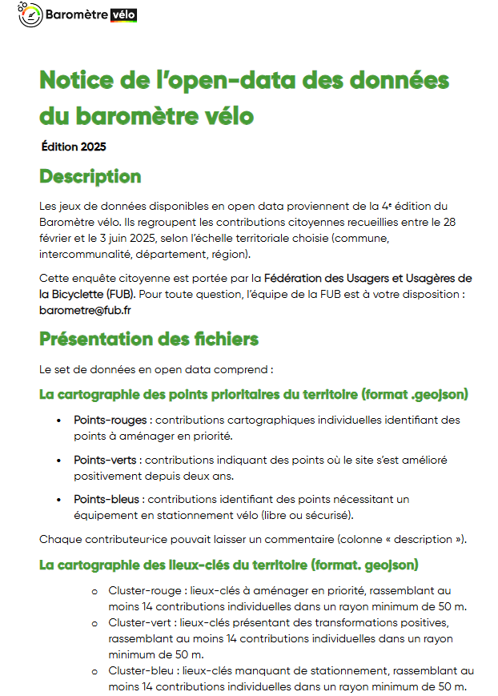
  </figure>
</div>

<div style="text-align:center;">  
  <figure style="display:inline-block; width:85%;">
    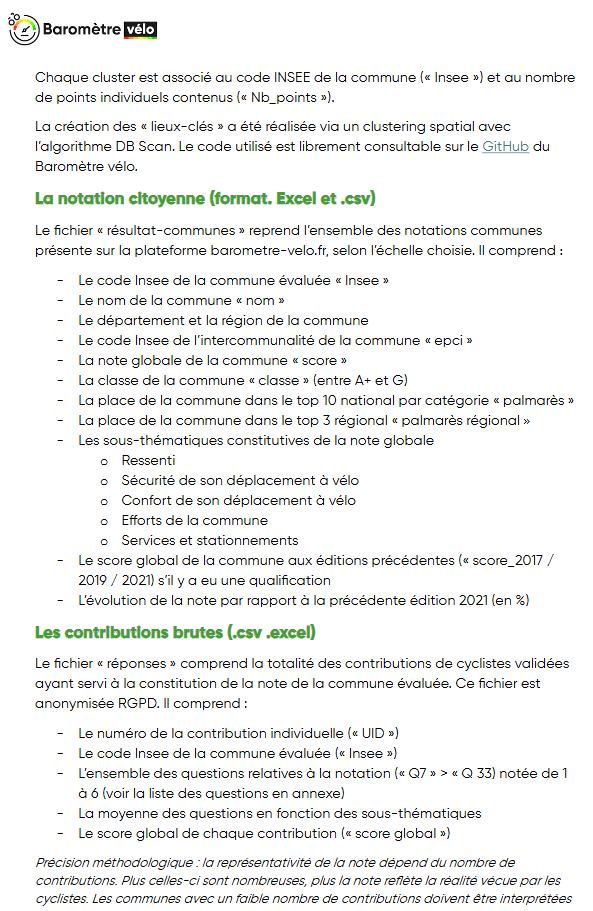
  </figure>
</div>

<div style="text-align:center;">  
  <figure style="display:inline-block; width:85%;">
    
  </figure>
</div>

<div style="text-align:center;">  
  <figure style="display:inline-block; width:100%;">
    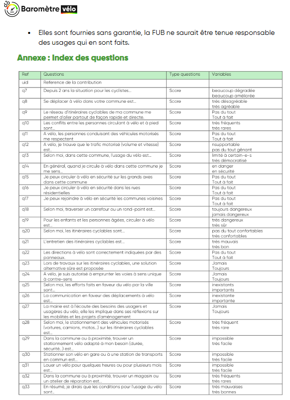
  </figure>
</div>

<hr class="page-break">

### <a id="ann3">Annexe 3</a> : Script : superposition des compteurs et clusters du baromètre FUB"

_Il s'agit ci-dessous d'extrait de script, certaines variables ayant été définie précédemment dans le code, de même que le dataframe df_geo comptenant les données des compteurs._

````python
import geopandas as gpd   # manipulation de fichier .geojson et de cooordonnées géographiques
import folium as fl  # manipulation interactive de carte
from shapely.geometry import Point   # pour l'affichage de zone sur une carte
from shapely import wkt
from shapely.wkt import loads

# on créé un champ de géométrie sur le même format que les jeux de données du baromètre
gdf_compteur = gpd.GeoDataFrame(df_geo, geometry=[Point(xy) for xy in zip(df_geo.longitude, df_geo.latitude)])
gdf_compteur.crs = "EPSG:4326"

# On va centrer la carte sur la moyenne des coordonnées des compteurs pour trouver Paris depuis la géométrie (y = lat, x = lon)
center = [gdf_compteur.geometry.y.mean(), gdf_compteur.geometry.x.mean()]

carte_compteur = fl.Map(location=center, zoom_start=12, tiles='cartodbpositron')

for idx, row in gdf_compteur.iterrows():
    # utiliser la géométrie de la ligne courante (row) et non la Series entière
    geom = row.get('geometry') if 'geometry' in row.index else None
    if geom is None:
        # on se rabat sur les colonnes latitude/longitude
        if 'latitude' in row.index and 'longitude' in row.index and pd.notnull(row['latitude']) and pd.notnull(row['longitude']):
            lat = float(row['latitude'])
            lon = float(row['longitude'])
        else:
            continue
    else:
        lon = float(geom.x)
        lat = float(geom.y)

    popup_text = row.get('nom_compteur', '') if 'nom_compteur' in row.index else ''
    # utiliser CircleMarker pour pouvoir définir la couleur et le remplissage... on choisit du gris pour ne pas gêner l'affichage avec les clusters du
    fl.CircleMarker(
        location=[lat, lon],
        radius=4,
        color='gray',
        fill=True,
        fill_color='gray',
        fill_opacity=0.7,
        popup=popup_text
    ).add_to(carte_compteur)
    
carte_compteur.save('images/carte_compteurs.html')  # crée un fichier html de la carte, restant dynamique (zoom, survol)
display(carte_compteur)  # pour l'affichage dynamique dans le notebook

carte_folium_vers_png(carte_compteur, 'carte_compteurs')
Image(filename='images/carte_compteurs.png')   # affiche la version figée en image de la carte pour l'édition en pdf

# on récupère les données des fichiers de clusters de commentaires
liste_clusters_geojson=[]
cl_verts=chemin_user+"data/raw/barometre2025fub-dept75/clusters-verts-75.geojson"
liste_clusters_geojson.append(cl_verts)
cl_rouges=chemin_user+"data/raw/barometre2025fub-dept75/clusters-rouges-75.geojson"
liste_clusters_geojson.append(cl_rouges)
cl_s=chemin_user+"data/raw/barometre2025fub-dept75/clusters-stationnements-75.geojson"
liste_clusters_geojson.append(cl_s)

for f in liste_clusters_geojson:
    fichier_sorti=f[f.find("2025fub-dept75/")+15:f.find(".geojson")]+".csv"
    filepath_sorti=chemin_user+"data/processed/"+fichier_sorti
    df=gpd.read_file(f)
    display(df.head(3))
    df.to_csv(filepath_sorti, sep=";", header=True, index=False, encoding="utf8")

gdf_cl_rouges=pd.read_csv(chemin_user+"data/processed/clusters-rouges-75.csv",sep=";")
gdf_cl_verts=pd.read_csv(chemin_user+"data/processed/clusters-verts-75.csv",sep=";")

gdf_cl_rouges['categorie'] = 'rouge'
gdf_cl_verts['categorie'] = 'vert'
gdf_barometre= pd.concat([gdf_cl_rouges, gdf_cl_verts], ignore_index=True)

# convertir la colonne geometry (WKT - coordonnées GPS) en géométrie shapely puis en GeoDataFrame
gdf_barometre_geo = gpd.GeoDataFrame(
    gdf_barometre.copy(),
    geometry=gdf_barometre['geometry'].apply(wkt.loads),
    crs="EPSG:4326"
)

# on va réutiliser la carte des compteurs pour superposer les informations

# style en fonction de la catégorie rouge ou vert (on n'a pas conservé les points bleus de stationnement)
def style_function(feature):
    cat = feature['properties'].get('categorie', '').lower()
    color = 'crimson' if cat == 'rouge' else ('green' if cat == 'vert' else 'gray')
    return {
        'fillColor': color,
        'color': color,
        'weight': 1,
        'fillOpacity': 0.4
    }

# ajouter les multipolygons avec popup/tooltip
gj = fl.GeoJson(
    gdf_barometre_geo,
    name='barometre_clusters',
    style_function=style_function,
    tooltip=fl.GeoJsonTooltip(fields=['uid','nb_points','taux_points','categorie'],
                              aliases=['uid','nb_points','taux_points','categorie'],
                              localize=True)
).add_to(carte_compteur)

fl.LayerControl().add_to(carte_compteur)

carte_compteur.save('images/carte_compteurs+clusters.html')  # crée un fichier html de la carte, restant dynamique (zoom, survol)
display(carte_compteur)  # pour l'affichage dynamique dans le notebook

carte_folium_vers_png(carte_compteur, 'carte_compteurs+clusters')
Image(filename='images/carte_compteurs+clusters.png')   # affiche la version figée en image de la carte pour l'édition en pdf

````
<hr class="page-break">

### <a id="ann4">Annexes 4</a> : Analyses textuelles

#### <a id="ann4a">Annexe 4a</a> : Normalisation et lemmatisation des avis
````python
import pandas as pd # manipulation de données
import unicodedata  
import nltk   
from nltk.corpus import stopwords
import spacy  
from spacy_lefff import LefffLemmatizer, POSTagger
from spacy.language import Language

# Chargement de chaque dataset avec gestion automatique de l'encodage
dossier = chemin_user+"data/processed"

def charger_csv(fichier):
    
    chemin = f"{dossier}/{fichier}"
    try:
        return pd.read_csv(chemin, sep=";", encoding="utf-8")
    except UnicodeDecodeError:
        return pd.read_csv(chemin, sep=";", encoding="latin-1")

# Chargement des 3 fichiers contenants des commentaires
points_rouges_75056 = charger_csv("points-rouges-75056.csv")
points_verts_75056 = charger_csv("points-verts-75056.csv")
stationnements_75056 = charger_csv("stationnements-75056.csv")

df_r=points_rouges_75056.copy()
df_r["categorie"]="rouge"

df_v=points_verts_75056.copy()
df_v["categorie"]="vert"

df_s=points_verts_75056.copy()
df_s["categorie"]="stationnement"

# on va concaténer les 3 dataframes en un seul
df_comment = pd.concat([df_r, df_v, df_s], ignore_index=True)
df_comment=df_comment.drop(columns=["commune","epci","departement","region"],axis=1)

# et supprimer toutes les lignes sans description
df_comment=df_comment.dropna()

nltk.download("stopwords",quiet=True)  # utile la 1ère fois si on a une erreur
stop_words = set(stopwords.words('french'))  # on initialise la variable de mots vide sur le français
stop_words.update(["vélo","rue","route","avenue","boulevard","cyclable","cycliste","être","avoir","c'est","à","a","vers","bd","cette","quand","vraiment"])

nlp = spacy.load('fr_core_news_md')   # on charge notre modèle morphologique fr_core_news_md

if "lefff_lemmatizer" not in Language.factories:
    @Language.factory("lefff_lemmatizer")
    def create_lefff_lemmatizer(nlp, name):
        # si melt_tagger n'est pas initialisé on peut avoir une erreur '[E046] Can't retrieve unregistered extension attribute 'melt_tagger'. Did you forget to call the set_extension method?'
        # lié à un problème de version entre spaCy et spaCy_lefff... dès lors qu'on a une version de spaCy >=3.5 (c'est mon cas) car spaCy_lefff est un peu en retard sur la mise à jour
        # on peut mettre sur False sans risque car il s'agit d'une partie "obsolète" de la fonction
        return LefffLemmatizer(after_melt=False)

# Ajouter le pipe seulement s'il n'est pas déjà présent dans le pipeline (sinon cela va générer une erreur.)
if "lefff_lemmatizer" not in nlp.pipe_names:
    nlp.add_pipe("lefff_lemmatizer", name="lefff_lemmatizer", after="parser")

def lemmatiser_texte(stop_words_fr,texte: str) -> str:
    """
    Nettoie et lemmatise un texte français avec spaCy + Lefff.
    Retourne une chaîne de caractère prête à être utilisée dans un WordCloud ou tout autre analyse.
    """
    if not isinstance(texte, str) or not texte.strip():
        return ""    # on met une condition pour le cas où on aurait une lignre dans notre dataframe qui n'aurait pas de commentaires (peu probable puisqu'on a enlevé les manquants mais plus sûr)

    doc = nlp(texte)      # doc n'est pas une chaîne de caractère, ce sont des ANNOTATIONS à ce texte. Pour récupérer le texte initial on peut ainsi faire doc.text et pour récupérer le texte lemmatisé on va faire doc.lemma_

    # Construction de la chaîne lemmatisée propre
    chaine_lemmatisee = " ".join(
        token.lemma_.lower()       # on met en minuscule les mots (ça peut gêner un peu sur les noms propre mais ça sécurise l'application des mots vides sur les débuts de phrase par ex)
        for token in doc
        if token.is_alpha               # garder uniquement les mots alphabétiques
        and len(token) >= 3                    # éviter les mots de 1 ou 2 caractères
        and token.lemma_.lower() not in stop_words_fr  # supprimer les stop words en partant de la liste mise en argument
    )

    return chaine_lemmatisee

df_comment["commentaire"] = df_comment["description"].apply(lambda x: lemmatiser_texte(stop_words, x))

````
<hr class="page-break">

#### <a id="ann4b">Annexe 4b</a> : Comparaison de 2 algorithmes de création de nuage de mot

_L'extrait de script ci-dessous se plaçant immédiatement après le précédent, il implique l'utilisation des variables, dataframe et librairie précédemment vues._
````python
corpus_vert=df_comment.loc[df_comment.categorie == "vert","commentaire"].astype(str).tolist()
corpus_rouge=df_comment.loc[df_comment.categorie == "rouge","commentaire"].astype(str).tolist()

#----premiers nuages directement sur les chaînes lemmatisées------------------------------
nuage_pos = WordCloud(background_color="white", 
               max_words=100, 
               stopwords=stop_words, 
               max_font_size=50,
               random_state=42,
               colormap="viridis") # palette de couleur accessible et adaptée à un sentiment positif
nuage_pos.generate(" ".join(corpus_vert))    # generate attendant une chaine de caractère unique, on concatène les éléments du corpus

nuage_neg = WordCloud(background_color="white", 
               max_words=100, 
               stopwords=stop_words, 
               max_font_size=50,
               random_state=42,
               colormap="inferno") # palette accessible comme viridis mais teintes plus adaptées à un sentiment négatif
nuage_neg.generate(" ".join(corpus_rouge))  # generate attendant une chaine de caractère unique, on concatène les éléments du corpus


# on va afficher côte à côte les 2 nuages
fig, axes = plt.subplots(1, 2, figsize=(20, 10))

axes[0].imshow(nuage_pos, interpolation='bilinear')
axes[0].set_title("Commentaires positifs", fontsize=18, color="green",y=1.1)
axes[0].axis("off")

axes[1].imshow(nuage_neg, interpolation='bilinear')
axes[1].set_title("Commentaires négatifs", fontsize=18, color="red",y=1.1)
axes[1].axis("off")   # parce que les axes gâchent le nuage

#fig.suptitle("Nuages de mots de l'ensemble des commentaires positifs et négatifs", fontsize=20, fontweight="bold", color="#333333", y=0.7)
plt.tight_layout()
plt.show()

#------------deuxième série de nuages avec algorithme TF_IDF
from sklearn.feature_extraction.text import TfidfVectorizer

# Pour que le vectorisateur fonctionne correctement en français, il est nécessaire d'appliquer une normalisation supplémentaire
# en supprimant les accents de notre texte afin de ne pas introduire de biais en distinguant par exemple "école" et "ecole".
def supprime_accent(texte : str ) -> str :
    texte = ''.join(
        c for c in unicodedata.normalize('NFD', texte)
        if unicodedata.category(c) != 'Mn'
    )
    return texte

def creer_tfidf_dict(corpus):
    """
    Calcule les poids TF-IDF pour un corpus (liste de textes) et renvoie un dictionnaire {mot: score}.
    Prêt à être utilisé avec WordCloud.generate_from_frequencies().

    corpus : list[str]  Liste de commentaires (déjà nettoyés ou lemmatisés).
    """
    corpus_clean = [supprime_accent(texte) for texte in corpus if isinstance(texte, str) and texte.strip()]
    
    if not corpus_clean:
        return {}  # sécurité : évite les erreurs sur corpus vide
   
    vectorizer = TfidfVectorizer(
        max_df=0.9,             # ignore les mots trop fréquents
        min_df=2,               # ignore les mots trop rares
        norm='l2',              # normalisation standard
    )   
    
    tfidf_matrix = vectorizer.fit_transform(corpus_clean)
    tfidf_scores = np.asarray(tfidf_matrix.mean(axis=0)).ravel()  # on calcule le score moyen de chaque mot
    tfidf_dict = dict(zip(vectorizer.get_feature_names_out(), tfidf_scores))  # on récupère ce score dans un dictionnaire qui va nous servir pour le nuage
    return tfidf_dict

# et on génère nos nuages côte à côte
nuage_pos = WordCloud(background_color="white", 
               max_words=100, 
               stopwords=stop_words, 
               max_font_size=50,
               random_state=42,
               colormap="viridis") # palette de couleur accessible et adaptée à un sentiment positif
nuage_pos.generate_from_frequencies(creer_tfidf_dict(corpus_vert))

nuage_neg = WordCloud(background_color="white", 
               max_words=100, 
               stopwords=stop_words, 
               max_font_size=50,
               random_state=42,
               colormap="inferno") # palette accessible comme viridis mais teintes plus adaptées à un sentiment négatif
nuage_neg.generate_from_frequencies(creer_tfidf_dict(corpus_rouge))

# on va afficher côte à côte les 2 nuages
fig, axes = plt.subplots(1, 2, figsize=(20, 10))

axes[0].imshow(nuage_pos, interpolation='bilinear')
axes[0].set_title("Commentaires positifs", fontsize=18, color="green",y=1.1)
axes[0].axis("off")

axes[1].imshow(nuage_neg, interpolation='bilinear')
axes[1].set_title("Commentaires négatifs", fontsize=18, color="red",y=1.1)
axes[1].axis("off")   # parce que les axes gâchent le nuage

#fig.suptitle("Nuages de mots de l'ensemble des commentaires positifs et négatifs", fontsize=20, fontweight="bold", color="#333333", y=0.7)
plt.tight_layout()
plt.show()

````
<hr class="page-break">

### <a id="ann5">Annexes 5</a> : Jointure géospatiale des commentaires et compteurs

#### <a id="ann5a">Annexe 5b</a> : Script de détermination du rayon seuil de proximité

```python

import numpy as np
import pandas as pd
import geopandas as gpd
import matplotlib.pyplot as plt
from shapely import wkt
from shapely.wkt import loads
import os

# --- 1. CHEMINS VERS LES FICHIERS ---
path_pts_compteurs = "../data/processed/compteurs_velo.csv"
path_points_rouges = "../data/processed/points-rouges-75056.csv"
path_points_verts  = "../data/processed/points-verts-75056.csv"

# Vérification rapide pour s'assurer que les fichiers existent
for path in [path_pts_compteurs, path_points_rouges, path_points_verts]:
    print(path, "existe ?", os.path.exists(path))

# --- 2. SYSTÈMES DE COORDONNÉES ---
CRS_GEO    = "EPSG:4326"  # WGS84 (lat/lon) pour la lecture
CRS_METRIC = "EPSG:2154"  # Lambert-93 (mètres) pour les calculs

# --- 3. CHARGEMENT ET PRÉPARATION DES DONNÉES ---

# Compteurs de vélos (avec longitude / latitude)
df_compteurs = pd.read_csv(path_pts_compteurs, sep=';', encoding='latin1')
gdf_compteurs = gpd.GeoDataFrame(
    df_compteurs, 
    geometry=gpd.points_from_xy(df_compteurs.longitude, df_compteurs.latitude),
    crs=CRS_GEO
)

# Points rouges (colonne geometry déjà présente en WKT)
df_rouges = pd.read_csv(path_points_rouges, sep=';', encoding='latin1')
df_rouges['geometry'] = df_rouges['geometry'].apply(wkt.loads)
gdf_rouges = gpd.GeoDataFrame(df_rouges, geometry='geometry', crs=CRS_GEO)

# Points verts (colonne geometry déjà présente en WKT)
df_verts = pd.read_csv(path_points_verts, sep=';', encoding='latin1')
df_verts['geometry'] = df_verts['geometry'].apply(wkt.loads)
gdf_verts = gpd.GeoDataFrame(df_verts, geometry='geometry', crs=CRS_GEO)

# S'assurer d'un point unique par id_site pour les compteurs
pts_sorted = gdf_compteurs.sort_values(['id_site', 'nom_compteur'])
pts_unique = (
    pts_sorted
    .groupby('id_site', as_index=False)
    .first()
)
pts_unique = gpd.GeoDataFrame(pts_unique, geometry='geometry', crs=CRS_GEO)

# --- 4.  Plage de rayons à tester (en mètres)
rayons_a_tester = np.arange(25, 301, 25)  # De 25m à 300m, par pas de 25m
print(f"Rayons qui seront testés : {rayons_a_tester}")

resultats_sensibilite = []

# On boucle sur chaque rayon
for rayon in rayons_a_tester:
    # On crée les buffers avec le rayon actuel
    gdf_buffers = pts_unique_metric.copy()
    gdf_buffers['geometry'] = gdf_buffers.geometry.buffer(rayon)

    # Jointure pour les points ROUGES
    jointure_r = gpd.sjoin(gdf_rouges_metric, gdf_buffers, how='inner', predicate='within')
    sites_uniques_r = jointure_r['id_site'].nunique()
    
    # Jointure pour les points VERTS
    jointure_v = gpd.sjoin(gdf_verts_metric, gdf_buffers, how='inner', predicate='within')
    sites_uniques_v = jointure_v['id_site'].nunique()
    
    # On stocke les résultats
    resultats_sensibilite.append({
        'rayon_m': rayon,
        'nb_sites_rouges': sites_uniques_r,
        'nb_sites_verts': sites_uniques_v
    })

# On convertit les résultats en DataFrame pour une analyse facile
df_resultats = pd.DataFrame(resultats_sensibilite)

print("\nTableau des résultats de sensibilité :")
print(df_resultats)


# ---5. Visualisation des résultats ---
plt.figure(figsize=(12, 7))
plt.plot(df_resultats['rayon_m'], df_resultats['nb_sites_rouges'], marker='o', linestyle='-', label='Sites associés à des Points Rouges')
plt.plot(df_resultats['rayon_m'], df_resultats['nb_sites_verts'], marker='o', linestyle='-', label='Sites associés à des Points Verts')

plt.title('Analyse de Sensibilité du Rayon de Proximité')
plt.xlabel('Rayon de recherche (mètres)')
plt.ylabel("Nombre de sites de comptage uniques avec au moins 1 correspondance")
plt.grid(True, which='both', linestyle='--', linewidth=0.5)
plt.xticks(rayons_a_tester)
plt.legend()
plt.show()
```
<hr class="page-break">

#### <a id="ann5b">Annexe 5b</a> : Script de Jointure géospatiale

```python
# 1. PARAMÈTRES ET CHEMINS

path_commentaires = '../data/processed/commentaires.csv'  # incluant la colonne de lemmes
path_compteurs = '../data/processed/compteurs_velo.csv'
path_sortie = '../data/processed/commentaires_enrichis_sites.csv'

# Définition des systèmes de coordonnées
CRS_GEO = "EPSG:4326"  # WGS84 (système GPS latitude/longitude)
CRS_METRIC = "EPSG:2154"  # Lambert-93 (mètres - France métropolitaine)
SEUIL_DISTANCE = 125      # Seuil pour retenir un commentaire

# 2. FONCTION UTILITAIRE 

def load_gdf_from_wkt_csv(path_csv: str,encodage:str) -> gpd.GeoDataFrame:
    """Charge un CSV qui a une colonne 'geometry' en format WKT."""
    df = pd.read_csv(path_csv, sep=';',encoding=encodage)
    geom = df['geometry'].apply(wkt.loads)
    gdf = gpd.GeoDataFrame(df, geometry=geom, crs=CRS_GEO)
    return gdf

# 3. CHARGEMENT ET PRÉPARATION

# Charger les commentaires
gdf_commentaires = load_gdf_from_wkt_csv(path_commentaires,'utf8')

# Charger les compteurs et créer les sites uniques (1 point par id_site)
gdf_compteurs_brut = load_gdf_from_wkt_csv(path_compteurs,'latin-1')
pts_sorted = gdf_compteurs_brut.sort_values(['id_site', 'nom_compteur'])
gdf_sites_uniques = (
    pts_sorted
    .groupby('id_site', as_index=False)
    .first()
)
gdf_sites_uniques = gpd.GeoDataFrame(gdf_sites_uniques, geometry='geometry', crs=CRS_GEO)

print(f"Chargé {len(gdf_commentaires)} commentaires.")
print(f"Chargé {len(gdf_sites_uniques)} sites de comptage uniques.")

# 4. REPROJECTION EN MÉTRIQUE
# Obligatoire pour sjoin_nearest pour calculer les distances en mètres
gdf_commentaires_metric = gdf_commentaires.to_crs(CRS_METRIC)
gdf_sites_metric = gdf_sites_uniques.to_crs(CRS_METRIC)

# 5. JOINTURE "PLUS PROCHE VOISIN" 
jointure_proximite = gpd.sjoin_nearest(
    gdf_commentaires_metric,   # Ce qu'on veut enrichir (à gauche)
    gdf_sites_metric,          # Ce qu'on cherche (à droite)
    how='left',
    distance_col='distance_au_site_m' # Crée la colonne de distance
)

# 6. NETTOYAGE ET ENRICHISSEMENT DU RÉSULTAT

# On sélectionne les colonnes d'origine + celles de la jointure
cols_origine = [col for col in gdf_commentaires.columns if col != 'geometry']
cols_ajoutees = ['id_site', 'nom_site', 'distance_au_site_m','id_compteur']
resultat_final_metric = jointure_proximite[cols_origine + cols_ajoutees + ['geometry']]

# Renommage pour plus de clarté
resultat_final_metric = resultat_final_metric.rename(columns={
    'id_site': 'site_plus_proche_id',
    'nom_site': 'site_plus_proche_nom',
    'id_compteur':'compteur_plus_proche_id'
})

# Ajout de la colonne 'statut_proximite'
resultat_final_metric['statut_proximite'] = np.where(
    resultat_final_metric['distance_au_site_m'] <= SEUIL_DISTANCE,
    'retenu',
    'non retenu'
)

# --- 7. REPROJECTION FINALE ET VÉRIFICATION ---
resultat_final_wgs84 = resultat_final_metric.to_crs(CRS_GEO)

print("\nAperçu du résultat final :")
print(resultat_final_wgs84[[
    'commentaire',
    'categorie',
    'site_plus_proche_nom',
    'distance_au_site_m',
    'statut_proximite'
]].head())

# 8. EXPORT
# Exporte le CSV enrichi (en convertissant la géométrie en WKT)
resultat_final_wgs84['geometry'] = resultat_final_wgs84.geometry.to_wkt()
resultat_final_wgs84.drop(columns=['geometry']).to_csv(
    path_sortie,
    sep=';',
    index=False,
    encoding='utf-8-sig'
)
```

<hr class="page-break">

### <a id="ann6">Annexe 6</a> : Transformation des adresses et gestion de l'encodage

```lua
let
  Url = "https://api.github.com/repos/marieberthiau/trafic_cycliste_a_Paris/contents/data/processed/compteurs_velo.csv?ref=main",
  Token = tokenGitHub,   /* mis en paramètes Power BI */
  Raw = Web.Contents(Url, [  Headers=[
            Authorization = "token " & Token,
            Accept = "application/vnd.github.v3.raw" ] ] ),
SourceFileBinary = Raw,

  // Petite fonction utilitaire pour lire + préparer en un encodage donné
ReadCsvWithEncoding = (binary as binary, enc as number) as table =>
    let
        Raw = Csv.Document(binary, [Delimiter=";", Encoding=enc, QuoteStyle=QuoteStyle.Csv]),
        Promoted = Table.PromoteHeaders(Raw, [PromoteAllScalars=true]),
        AsText = Table.TransformColumnTypes(Promoted, List.Transform(Table.ColumnNames(Promoted), each {_, type text})),
        Trimmed = Table.TransformColumns(AsText, List.Transform(Table.ColumnNames(AsText), each {_, Text.Trim})),
        Cleaned = Table.TransformColumns(Trimmed, List.Transform(Table.ColumnNames(Trimmed), each {_, Text.Clean}))
    in
        Cleaned,

  // Lire en UTF-8
T_utf8 = ReadCsvWithEncoding(SourceFileBinary, 65001),

  // Heuristique : compter les “�” (caractère de remplacement) dans toutes les colonnes texte
  CountReplacementChar = (tbl as table) as number =>
    let
      cols = Table.ColumnNames(tbl),
      lists = List.Transform(cols, each Table.Column(tbl, _)),
      countPerCol = List.Transform(lists, each List.Sum(List.Transform(_, (v) => if (v is text) and Text.Contains(v, "�") then 1 else 0))),
      total = List.Sum(countPerCol)
    in
      total,

badUtf8 = CountReplacementChar(T_utf8),

  // Si on détecte des “�”, on relit en CP1252 (Windows-1252)
T_best = if badUtf8 > 0 then ReadCsvWithEncoding(SourceFileBinary, 1252) else T_utf8,

  // --------- Reconstruction Latitude/Longitude ----------
  // Normaliser décimales éventuelles "48,85" -> "48.85"
  WithLatNorm = if List.Contains(Table.ColumnNames(T_best), "latitude")
                then Table.AddColumn(T_best, "_lat_norm", each if [latitude] <> null then Text.Replace([latitude], ",", ".") else null)
                else Table.AddColumn(T_best, "_lat_norm", each null),

  WithLonNorm = if List.Contains(Table.ColumnNames(WithLatNorm), "longitude")
                then Table.AddColumn(WithLatNorm, "_lon_norm", each if [longitude] <> null then Text.Replace([longitude], ",", ".") else null)
                else Table.AddColumn(WithLatNorm, "_lon_norm", each null),

  // Extraire depuis 'coordonnees' "lat, lon" si vide
  WithCoordParts =
      Table.AddColumn(WithLonNorm, "_coord_parts", each
        let c = try [coordonnees] otherwise null
        in  if c <> null then
              List.Transform(List.Select(Text.SplitAny(Text.Replace(c, ",", "."), " "), each _ <> ""), each _)
            else null),

  // Choisir la meilleure source pour Lat/Lon
  WithLat = Table.AddColumn(WithCoordParts, "Latitude", each
              let v = if [ _lat_norm ] <> null and [ _lat_norm ] <> "" then [ _lat_norm ]
                      else if [ _coord_parts ] <> null and List.Count([ _coord_parts ]) >= 1 then [ _coord_parts ]{0}
                      else null
              in try Number.FromText(v, "en-US") otherwise null, type number),

  WithLon = Table.AddColumn(WithLat, "Longitude", each
              let v = if [ _lon_norm ] <> null and [ _lon_norm ] <> "" then [ _lon_norm ]
                      else if [ _coord_parts ] <> null and List.Count([ _coord_parts ]) >= 2 then [ _coord_parts ]{1}
                      else null
              in try Number.FromText(v, "en-US") otherwise null, type number),

  // --------- date_installation robuste ----------
  WithDateInstall =
    Table.AddColumn(WithLon, "date_installation_dt",
      each let s = try [date_installation] otherwise null
           in  if s = null then null
               else
                 let tryZ = try DateTimeZone.From(s) otherwise null
                 in  if tryZ <> null then DateTimeZone.RemoveZone(tryZ)
                     else (try DateTime.FromText(s, "fr-FR") otherwise null),
      type datetime),

  // --------- Typage final (et garder les accents corrects) ----------
  Typed = Table.TransformColumnTypes(WithDateInstall,{ {"id_compteur", type text},{"nom_compteur", type text},{"id_site", type text},{"nom_site", type text},{"photo_site", type text},{"coordonnees", type text},{"id_technique_compteur", type text},{"ID Photos", type text}, {"test_lien_vers_photos_du_site_de_comptage_", type text},{"id_photo_1", type text},
        {"url_sites", type text},{"type_dimage", type text},{"geometry", type text}, {"date_installation_dt", type datetime},{"Latitude", type number}{"Longitude", type number} },  "fr-FR"  ),

  // Supprimer colonnes techniques temporaires ; remplacer l’ancienne date_installation si tu veux
  DropTemps = Table.RemoveColumns(Typed, {"_lat_norm","_lon_norm","_coord_parts"}),
  Result =
      if List.Contains(Table.ColumnNames(DropTemps), "date_installation") then
          Table.RenameColumns(
              Table.RemoveColumns(DropTemps, {"date_installation"}),
              {{"date_installation_dt", "date_installation"}}
          )
      else
          Table.RenameColumns(DropTemps, {{"date_installation_dt", "date_installation"}}),

  // Réordonner des colonnes clé en tête
  Final = Table.ReorderColumns(
            Result,
            List.Intersect({
              {"id_compteur","nom_compteur","id_site","nom_site","date_installation","id_technique_compteur","ID Photos","photo_site","url_sites","coordonnees","Latitude","Longitude","geometry"},
              Table.ColumnNames(Result)
            })
          ),
    #"Type modifié" = Table.TransformColumnTypes(Final,{{"date_installation", type date}}),
    #"Colonnes supprimées" = Table.RemoveColumns(#"Type modifié",{"longitude", "coordonnees", "latitude"}),
    #"Colonnes renommées" = Table.RenameColumns(#"Colonnes supprimées",{{"geometry", "coordonnées"}}),
    #"Colonnes permutées" = Table.ReorderColumns(#"Colonnes renommées",{"id_compteur", "nom_compteur", "id_site", "nom_site", "date_installation", "id_technique_compteur", "ID Photos", "photo_site", "test_lien_vers_photos_du_site_de_comptage_", "id_photo_1", "url_sites", "type_dimage", "coordonnées", "Latitude", "Longitude"}),
    #"Renamed Columns" = Table.RenameColumns(#"Colonnes permutées",{{"date_installation", "Date d'installation"}}),
    #"Replaced Value2" = Table.ReplaceValue(#"Renamed Columns","Totem","[totem]",Replacer.ReplaceText,{"nom_compteur", "nom_site"}),
    
    // on raccourcit le nom du site pour améliorer la lisibilité ds filtres (sinon on ne voit que des trucs style 106 boulevard.... au lieu du nom de la rue
    RaccourciNomDuSite = Table.AddColumn(#"Replaced Value2", "Site de comptage", 
      each let
        txt = Text.Trim([nom_site]),
        posMaj = Text.PositionOfAny(txt, {"A".."Z","É","È","Ê","Ë","À","Â","Ä","Ô","Ö","Ù","Û","Ü","Ç"}),
        Result =
            if posMaj >1 then
                let
                    gauche = Text.Start(txt, posMaj),
                    droite = Text.End(txt, Text.Length(txt) - posMaj)
                in
                    Text.Trim(Text.Combine({droite, " (", gauche, ")"}))
            else
                txt
          in
            Result),

    #"Added Custom Column" = Table.AddColumn(RaccourciNomDuSite, "Custom", each let splitNomducompteur = List.Reverse(Splitter.SplitTextByDelimiter(" ", QuoteStyle.None)([nom_compteur])) in splitNomducompteur{0}?, type text),

    #"Duplicated Column" = Table.DuplicateColumn(#"Added Custom Column", "Site de comptage", "Site de comptage - Copy"),
    #"Reordered Columns" = Table.ReorderColumns(#"Duplicated Column",{"Site de comptage - Copy", "Custom"}),
    #"Merged Columns" = Table.CombineColumns(#"Reordered Columns",{"Site de comptage - Copy", "Custom"},Combiner.CombineTextByDelimiter(" ", QuoteStyle.None),"Nom du compteur"),
    #"Replaced Value" = Table.ReplaceValue(#"Merged Columns","avenue","av",Replacer.ReplaceText,{"Site de comptage", "Nom du compteur"}),
    #"Replaced Value1" = Table.ReplaceValue(#"Replaced Value","boulevard","bd",Replacer.ReplaceText,{"Site de comptage", "Nom du compteur"}),
    #"Removed Columns" = Table.RemoveColumns(#"Replaced Value1",{"nom_compteur", "nom_site", "id_technique_compteur", "ID Photos", "test_lien_vers_photos_du_site_de_comptage_", "id_photo_1", "type_dimage"}),
    #"Filtered Rows" = Table.SelectRows(#"Removed Columns", each ([id_site] <> "100003098" and [id_site] <> "300030116"))  //compteur Denfert Rochereau ne renvoie aucun comptage et compteur 24 Jourdan s'arrête début oct 2024.
    // reste à traiter le 147 av d'Italie du 30 juillet au 4 août 2025 inclus : remplacer valeurs actuelles par les moyennes horaires (calculer sur base de juin + % de baisse de fréquentation iso 180 av d'Italie entre juin et la même période d'août)
in
    #"Filtered Rows"
```
<hr class="page-break">

### <a id="ann7">Annexe 7</a> : Colonnes calculées de score météo

```lua
let
    Url="https://api.github.com/repos/marieberthiau/trafic_cycliste_a_Paris/contents/data/processed/meteo.csv?ref=main",
    Token=tokenGitHub,
    Raw = Web.Contents(
        Url,
        [
            Headers=[Authorization = "token " & Token, Accept = "application/vnd.github.v3.raw"]
        ]
    ),
    CSVText = Text.FromBinary(Raw),
    SourceTable=Csv.Document(CSVText,[Delimiter=";", Encoding=65001, QuoteStyle=QuoteStyle.Csv]),
    EnTetes = Table.PromoteHeaders(SourceTable, [PromoteAllScalars=true]),
    #"Replaced Value1" = Table.ReplaceValue(EnTetes,"",(each _ [#"FXI force max instantanée du vent à 10m (m/s)"]),Replacer.ReplaceValue,{"FXI3S force max quotidienne sur 3sec du vent à 10m (m/s)"}),
    // Colonnes utiles
    ColonnesUtiles = Table.SelectColumns(#"Replaced Value1", {"AAAAMMJJ", "RR précipitations (mm)", "TX temp. max (°C)","TN temp. mini (°C)", "TM", "FFM force moyenne sur 10mn du vent à 10m (m/s)","DRR durée de précipitations (mn)","FXI3S force max quotidienne sur 3sec du vent à 10m (m/s)"
    }),
    // Renommage court
    RenomsCourts = Table.RenameColumns(ColonnesUtiles, { {"AAAAMMJJ", "date_raw"},{"RR précipitations (mm)", "Précipitations (mm)"}, {"TX temp. max (°C)", "Température Max (°C)"}, {"TN temp. mini (°C)", "Température Mini (°C)"}, {"TM", "Température Moyenne (°C)"},{"FFM force moyenne sur 10mn du vent à 10m (m/s)", "FFM_ms"},{"FXI3S force max quotidienne sur 3sec du vent à 10m (m/s)", "FXI3S_ms"},{"DRR durée de précipitations (mn)", "Durée Pluie (min)"}  }),

    // Nettoyage espaces & textes
    NBSP = Character.FromNumber(160),
    CleanText = (t as any) as nullable text => let s = if t=null then null else Text.From(t) in Text.Trim(Text.Replace(s, NBSP, "")),
    ToTextTrim = Table.TransformColumns(RenomsCourts, List.Transform(Table.ColumnNames(RenomsCourts), each {_, each CleanText(_), type text})),

    // Conversion date
    DateParsed = Table.AddColumn(ToTextTrim, "date", each try Date.FromText(Text.Start(Text.Select([date_raw], {"0".."9"}),8)) otherwise null, type date),

    // Conversion nombres
    ConvertNum = Table.TransformColumns(DateParsed, {
        {"Précipitations (mm)", each Number.FromText(Text.Replace(_, ",","."), "en-US"), type number},
        {"Température Max (°C)", each Number.FromText(Text.Replace(_, ",","."), "en-US"), type number},
        {"Température Mini (°C)", each Number.FromText(Text.Replace(_, ",","."), "en-US"), type number},
        {"Température Moyenne (°C)", each Number.FromText(Text.Replace(_, ",","."), "en-US"), type number},
        {"FFM_ms", each Number.FromText(Text.Replace(_, ",","."), "en-US"), type number},
        {"FXI3S_ms", each Number.FromText(Text.Replace(_, ",","."), "en-US"), type number},
        {"Durée Pluie (min)", each Number.FromText(Text.Replace(_, ",","."), "en-US"), type number}
    }),
    #"Replaced Value" = Table.ReplaceValue(ConvertNum,null,0,Replacer.ReplaceValue,{"Durée Pluie (min)"}),

    // Calculs utiles
    Add_FFM_kmh = Table.AddColumn(#"Replaced Value", "Vent Moyen (km/h)", each [FFM_ms]*3.6, type number),
    Add_FXI3S_kmh = Table.AddColumn(Add_FFM_kmh, "Rafale Max (km/h)", each [FXI3S_ms]*3.6, type number),
    Add_Amp=Table.AddColumn(Add_FXI3S_kmh, "Amplitude Thermique", each [#"Température Max (°C)"]-[#"Température Mini (°C)"], type number),
    Add_NP=Table.AddColumn(Add_Amp, "Niveau Pluie", each [#"Précipitations (mm)"]+ ([#"Durée Pluie (min)"]/60)/2, type number),

    CatPluie = Table.AddColumn(Add_NP, "Cat Pluie", each if [#"Niveau Pluie"] = null then "Autre" 
                    else if [#"Niveau Pluie"] = 0 then "temps sec" 
                    else if [#"Niveau Pluie"] <= 1 then "bruine" 
                    else if [#"Niveau Pluie"] <= 3 then "pluie faible" 
                    else if [#"Niveau Pluie"] <= 7 then "pluie modérée : équipement nécessaire" 
                    else if [#"Niveau Pluie"] <= 12 then "pluie forte : conditions difficiles" 
                    else "pluie dangereuse : cyclisme déconseillé", 
                        type text ),

    OrdreCatPluie = Table.AddColumn(CatPluie, "Ordre Cat Pluie", each if [#"Niveau Pluie"] = null then "Z" 
                    else if [#"Niveau Pluie"] = 0 then "A" 
                    else if [#"Niveau Pluie"] <= 1 then "B" 
                    else if [#"Niveau Pluie"] <= 3 then "C" 
                    else if [#"Niveau Pluie"] <= 7 then "D" 
                    else if [#"Niveau Pluie"] <= 12 then "E" 
                    else "F", 
                        type text ),

    ScorePluie = Table.AddColumn(OrdreCatPluie, "Score Pluie", each if [#"Niveau Pluie"] = 0 then 40
                    else if [#"Niveau Pluie"] >= 15 then 0
                    else Number.Round(40 - ([#"Niveau Pluie"] * 40 / 15),0),
                                                        Int64.Type),

    ScoreTemp = Table.AddColumn(ScorePluie, "Score Température", each 
            let
                TM = [#"Température Moyenne (°C)"],
                TMin = [#"Température Mini (°C)"],
                TMax = [#"Température Max (°C)"],
                Amplitude = [#"Amplitude Thermique"],
                ScoreTempMoyenne = 
                if TM < 5 then List.Max({10, TM * 2})
                  else if TM < 10 then 18 + (TM - 5) * 2
                  else if TM < 15 then 28 + (TM - 10) * 2.4
                  else if TM <= 22 then 40
                  else if TM <= 27 then 40 - (TM - 22) * 2 
                  else if TM <= 30 then 30 - (TM - 27) * 3    
                  else if TM <= 35 then 18 - (TM - 30) * 3
                  else List.Max({0, 3 - (TM - 35) * 0.6}), /*progression plus punitive sur les fortes chaleurs*/
                PenaliteFroid = 
                if TMin < -5 then 5
                  else if TMin < 0 then 3
                  else if TMin < 5 then 1
                  else 0,
                PenaliteChaud =  
                if TMax > 35 then 5
                  else if TMax > 32 then 3
                  else if TMax > 28 then 1
                  else 0,
                PenaliteAmplitude =  
                if Amplitude > 18 then 3
                  else if Amplitude > 14 then 2
                  else if Amplitude > 10 then 1
                  else 0
              in
                Number.Round(ScoreTempMoyenne - PenaliteFroid - PenaliteChaud - PenaliteAmplitude, 0),
                      Int64.Type), /*pour un trajet matin/soir, on subit potentiellement les 2 extrêmes de température*/

    CatTemp = Table.AddColumn(ScoreTemp, "Cat Température", each if ( [#"Température Mini (°C)"] < -2 or [#"Température Moyenne (°C)"] < 3 ) then "froid extrême" 
            else if ( [#"Température Mini (°C)"] < 5 or [#"Température Moyenne (°C)"] < 10 ) then "froid mais gérable" 
            else if ( [#"Température Moyenne (°C)"] >=10 and [#"Température Moyenne (°C)"] < 15 ) then "frais" 
            else if ( [#"Température Moyenne (°C)"] >=15 and [#"Température Moyenne (°C)"] <= 25 and [#"Température Max (°C)"] <= 28 )  then "doux" 
            else if (( [#"Température Moyenne (°C)"] >22 and [#"Température Moyenne (°C)"] <= 28 ) or ( [#"Température Max (°C)"] >28 and [#"Température Max (°C)"] <= 32 ) ) then "chaud" 
            else if ([#"Température Moyenne (°C)"] >28 or [#"Température Max (°C)"] > 32) then "très chaud" 
            else "Autre", 
              type text ),
    OrdreCatTemp = Table.AddColumn(CatTemp, "Ordre Cat Température", each if [#"Cat Température"] = null then "Z" 
            else if [#"Cat Température"] ="froid extrême" then "A" 
            else if [#"Cat Température"] ="froid mais gérable" then "B" 
            else if [#"Cat Température"] ="frais" then "C" 
            else if [#"Cat Température"] ="doux" then "D" 
            else if [#"Cat Température"] ="chaud" then "E" 
            else "F", 
              type text ),

    ScoreVent = Table.AddColumn(OrdreCatTemp, "Score Vent", each 
                  let
                        Vent = [#"Vent Moyen (km/h)"],
                        Rafale = [#"Rafale Max (km/h)"],
                         ScoreVent = 
                  if Vent < 10 then 15
                    else if Vent > 30 then 0
                    else 15 - (Vent-10) * 15/(30-10),  // progression linéaire entre 10 et 30 km/h 
                                                        ScoreRafale = 
                  if Rafale < 30 then 5
                    else if Rafale > 70 then 0
                    else 5 - (Rafale-30) * 5/(70-30)   // progression linéaire entre 30 et 70 km/h           
                  in
                   Number.Round(ScoreVent + ScoreRafale,0),  //le vent moyen seul ne permet pas de catégoriser les conditions de cyclabilité
                                        Int64.Type), 

    CatVent = Table.AddColumn(ScoreVent, "Cat Vent", each if ( [#"Vent Moyen (km/h)"] >= 40 or [#"Rafale Max (km/h)"] >= 75 or ( [#"Vent Moyen (km/h)"] >= 30 and [#"Rafale Max (km/h)"] >= 65 ) ) then "tempétueux cyclisme déconseillé" 
                    else if ( [#"Vent Moyen (km/h)"] >= 30 or [#"Rafale Max (km/h)"] >= 60 or ( [#"Vent Moyen (km/h)"] >= 25 and [#"Rafale Max (km/h)"] >= 55 ) ) then "très fort et dangereux" 
                    else if ( [#"Vent Moyen (km/h)"] >= 20 and [#"Rafale Max (km/h)"] >= 50 ) then "pénible mais praticable"
                    else if ( [#"Vent Moyen (km/h)"] >= 15 and [#"Rafale Max (km/h)"] >= 40 ) then "modéré mais commence à gêner"
                    else if ( [#"Vent Moyen (km/h)"] >= 10 and [#"Rafale Max (km/h)"] >= 30 ) then "léger mais acceptable"
                    else "calme idéal", type text ),

    OrdreCatVent = Table.AddColumn(CatVent, "Ordre Cat Vent", each if [#"Cat Vent"] = "calme idéal" then "A" 
                    else if [#"Cat Vent"] = "léger mais acceptable" then "B" 
                    else if [#"Cat Vent"] = "modéré mais commence à gêner" then "C" 
                    else if [#"Cat Vent"] = "pénible mais praticable" then "D"
                    else if [#"Cat Vent"] = "très fort et dangereux" then "E"  
                    else "F", type text ),

    ScoreMeteo = Table.AddColumn(OrdreCatVent, "Score Météo", each [#"Score Pluie"]+[#"Score Température"]+[#"Score Vent"],Int64.Type), 

    CatConditions = Table.AddColumn(ScoreMeteo, "Conditions Globales", each if [#"Score Météo"] = null then "inconnues" 
                    else if [#"Score Météo"] >= 80 then "excellentes" 
                    else if [#"Score Météo"] >= 60 then "bonnes" 
                    else if [#"Score Météo"] >= 40 then "acceptables" 
                    else if [#"Score Météo"] >= 20 then "difficiles" 
                    else "très difficiles", type text ), 

    OrdreCatConditions = Table.AddColumn(CatConditions, "Ordre Conditions Globales", each if [#"Score Météo"] = null then "Z"
                    else if [#"Score Météo"] >= 80 then "A" 
                    else if [#"Score Météo"] >= 60 then "B" 
                    else if [#"Score Météo"] >= 40 then "C" 
                    else if [#"Score Météo"] >= 20 then "D" 
                    else "E", type text ),

    Suppr = Table.RemoveColumns(OrdreCatConditions, {"FFM_ms","FXI3S_ms","date_raw"}),
    Sortie = Table.SelectRows(Suppr, each [date] <> null),
    Final = Table.ReorderColumns(Sortie,{"date","Précipitations (mm)","Durée Pluie (min)","Cat Pluie","Ordre Cat Pluie","Température Mini (°C)","Température Max (°C)","Amplitude Thermique","Température Moyenne (°C)","Score Température","Cat Température","Ordre Cat Température","Vent Moyen (km/h)","Rafale Max (km/h)","Score Vent","Cat Vent","Ordre Cat Vent","Score Météo","Conditions Globales","Ordre Conditions Globales"})
in
    Final
```
<hr class="page-break">

### <a id="ann8">Annexe 8</a> : Exemple de mesure DAX de calcul des sensibilités météo

#### Mesures intermédiaires pour le calcul de la sensibilité à la pluie
```dax
MEASURE 'MesuresCat'[Cat Pluie] = VAR NP = [Niveau Pluie moyen]
RETURN
SWITCH(
    TRUE(),
    ISBLANK(NP), "Donnée manquante",
    NP = 0, "temps sec",
    NP <= 1, "bruine",                                  -- 0,5 mm en 30 min OU 1 mm très brièvement
    NP <= 3, "pluie faible",                            -- 2 mm en 1h OU 3 mm brièvement
    NP <= 7, "pluie modérée : équipement nécessaire",   -- 5 mm pendant 1h = conditions humides sérieuses
    NP <= 12, "pluie forte : conditions difficiles",     -- 10 mm pendant 2h = vraiment détrempé
    "pluie dangereuse : cyclisme déconseillé"           -- 15 mm pendant 3h = conditions extrêmes
)

MEASURE 'MesuresNum'[Effet Pluie de Référence] = VAR FluxMoyenSec = 
    CALCULATE(
        [Flux moyen],
        'meteo'[Cat Pluie] = "temps sec",
        ALL('comptage-velo-donnees-compteurs-allege'), -- enelève les filtres sur la table de faits (période, compteur...)
        ALL('Calendrier')
    )
VAR FluxMoyenPluie = 
    CALCULATE(
        [Flux moyen],
        'meteo'[Cat Pluie] <> "temps sec",
        ALL('comptage-velo-donnees-compteurs-allege'), -- enelève les filtres sur la table de faits (période, compteur...)
        ALL('Calendrier')
    )
RETURN
    DIVIDE(FluxMoyenPluie - FluxMoyenSec, FluxMoyenSec, 0)

MEASURE 'MesuresNum'[Effet Pluie] = VAR FluxMoyenSec = 
    CALCULATE(
        [Flux moyen],
        'meteo'[Cat Pluie] = "temps sec",
        KEEPFILTERS( meteo[Cat Pluie] = "temps sec" ),
        'comptage-velo-donnees-compteurs-allege'[comptage_horaire] >= 0 
    )
VAR FluxMoyenPluie = 
    CALCULATE(
        [Flux moyen],
        KEEPFILTERS( meteo[Cat Pluie] <> "temps sec" ),
        'comptage-velo-donnees-compteurs-allege'[comptage_horaire] >= 0 
    )
RETURN
    IF(
        ISBLANK(FluxMoyenSec),
        BLANK(),
        DIVIDE( FluxMoyenPluie - FluxMoyenSec, FluxMoyenSec, 0)
    )

MEASURE 'MesuresNum'[Nb Jours Secs] = VAR DatesAvecComptage =
    FILTER(
        VALUES( Calendrier[Date] ),   -- on itère sur les dates réelles (=contexte calendrier)
        CALCULATE(
            COUNTROWS( 'comptage-velo-donnees-compteurs-allege' ),  -- on vérifie qu'il existe au moins une ligne de comptage pour cette date,
            REMOVEFILTERS( 'compteurs_velo' )                       -- en ignorant les filtres sur la table des compteurs (site/compteur)
        ) > 0
    )
RETURN
CALCULATE(
    DISTINCTCOUNT(Calendrier[Date]),
    KEEPFILTERS(DatesAvecComptage),       -- on limite aux dates où il y a du comptage
    meteo[Cat Pluie] = "temps sec",       -- on filtre les jours secs
    REMOVEFILTERS(meteo)                  -- on empêche le contexte des lignes d’écraser le filtre météo
)

MEASURE 'MesuresNum'[Nb Jours Pluvieux] = VAR DatesAvecComptage =
    FILTER(
        VALUES( Calendrier[Date] ),  -- on itère sur les dates réelles (=contexte calendrier)
        CALCULATE(
            COUNTROWS( 'comptage-velo-donnees-compteurs-allege' ),  -- on vérifie qu'il existe au moins une ligne de comptage pour cette date,
            REMOVEFILTERS( 'compteurs_velo' )                       -- en ignorant les filtres sur la table des compteurs (site/compteur)
        ) > 0
    )
RETURN
CALCULATE(
    DISTINCTCOUNT(Calendrier[Date]),
    KEEPFILTERS(DatesAvecComptage),
    meteo[Cat Pluie] <> "temps sec",
    REMOVEFILTERS(meteo)  --empêche le contexte des lignes d’écraser le filtre météo
)
```
#### Mesure de la sensibilité à la pluie
```dax
MEASURE 'MesuresNum'[Sensibilité à la pluie (points de %)] = VAR BaisseContextuelle = [Effet Pluie]
VAR BaisseReference = [Effet Pluie de Référence]
RETURN
    (BaisseContextuelle - BaisseReference) * 100
    MEASURE 'MesuresNum'[Nb Jours Secs] = VAR DatesAvecComptage =
    FILTER(
        VALUES( Calendrier[Date] ),   -- on itère sur les dates réelles (=contexte calendrier)
        CALCULATE(
            COUNTROWS( 'comptage-velo-donnees-compteurs-allege' ),  -- on vérifie qu'il existe au moins une ligne de comptage pour cette date,
            REMOVEFILTERS( 'compteurs_velo' )                       -- en ignorant les filtres sur la table des compteurs (site/compteur)
        ) > 0
    )
RETURN
CALCULATE(
    DISTINCTCOUNT(Calendrier[Date]),
    KEEPFILTERS(DatesAvecComptage),       -- on limite aux dates où il y a du comptage
    meteo[Cat Pluie] = "temps sec",       -- on filtre les jours secs
    REMOVEFILTERS(meteo)                  -- on empêche le contexte des lignes d’écraser le filtre météo
)
```
#### Mesures pour le choix dynamique de l'effet

```dax
MEASURE 'MesuresCat'[Axe d'analyse] = VALUES('Mesure sélectionnée'[Mesure sélectionnée Fields])

MEASURE 'MesuresNum'[Effet observé] = SWITCH(
    TRUE(),
    [Axe d'analyse]="'MesuresNum'[Sensibilité à la pluie (points de %)]",[Effet Pluie],
    [Axe d'analyse]="'MesuresNum'[Sensibilité au vent (points de %)]",[Effet Vent],
    [Axe d'analyse]="'MesuresNum'[Sensibilité à la température (points de %)]",[Effet Température],
    [Effet Météo]
)

MEASURE 'MesuresNum'[Effet de référence] = SWITCH(
    TRUE(),
    [Axe d'analyse]="'MesuresNum'[Sensibilité à la pluie (points de %)]",[Effet Pluie de Référence],
    [Axe d'analyse]="'MesuresNum'[Sensibilité au vent (points de %)]",[Effet Vent de Référence],
    [Axe d'analyse]="'MesuresNum'[Sensibilité à la température (points de %)]",[Effet Température de Référence],
    [Effet Météo de Référence]
)

MEASURE 'MesuresNum'[NbJours] = SWITCH(
    TRUE(),
    [Axe d'analyse]="'MesuresNum'[Sensibilité à la pluie (points de %)]",MIN([Nb Jours Secs], [Nb Jours Pluvieux]),
    [Axe d'analyse]="'MesuresNum'[Sensibilité au vent (points de %)]",MIN([Nb Jours Calmes], [Nb Jours Venteux]),
    [Axe d'analyse]="'MesuresNum'[Sensibilité à la température (points de %)]",MIN([Nb Jours Agréables], [Nb Jours Moins Agréables]),
    MIN([Nb Jours Excellents], [Nb Jours Non Excellents])
)
```
<hr class="page-break">

### <a id="ann9">Annexe 9</a> : Mesure DAX de calcul des jours dépassant un seuil journalier

```dax
MEASURE 'Seuil Flux Journalier'[Seuil Flux Journalier Value] = SELECTEDVALUE('Seuil Flux Journalier'[Seuil Flux Journalier], 3000)
```
```dax
MEASURE 'MesuresNum'[Nb Jours Moyen au-dessus du Seuil] = VAR SeuilUtilisateur = SELECTEDVALUE('Seuil Flux Journalier'[Seuil Flux Journalier], 3000)
VAR TableSitesJours = 
    SUMMARIZE(
        'comptage-velo-donnees-compteurs-allege',
        'comptage-velo-donnees-compteurs-allege'[id_site],  
        'Calendrier'[Date],
        "FluxJour", [Flux total]
    )
VAR TableParSite = 
    ADDCOLUMNS(
        VALUES('comptage-velo-donnees-compteurs-allege'[id_site]),
        "@NbJoursAuDessus",
            VAR SiteActuel = 'comptage-velo-donnees-compteurs-allege'[id_site]
            RETURN
                COUNTROWS(
                    FILTER(
                        FILTER(
                            TableSitesJours,
                            'comptage-velo-donnees-compteurs-allege'[id_site] = SiteActuel
                        ),
                        [FluxJour] > SeuilUtilisateur
                    )
                )
    )
VAR NbJoursMoyen = AVERAGEX(TableParSite, [@NbJoursAuDessus])
RETURN
    NbJoursMoyen
```
```dax
MEASURE 'MesuresNum'[% Jours au-dessus du Seuil] = VAR DatesAvecComptage =
    FILTER(
        VALUES( Calendrier[Date] ),   -- on itère sur les dates réelles (=contexte calendrier)
        CALCULATE(
            COUNTROWS( 'comptage-velo-donnees-compteurs-allege' ),  -- on vérifie qu'il existe au moins une ligne de comptage pour cette date,
            REMOVEFILTERS( 'compteurs_velo' )                       -- en ignorant les filtres sur la table des compteurs (site/compteur)
        ) > 0
    )
VAR NbJoursPeriode = 
CALCULATE(
    DISTINCTCOUNT(Calendrier[Date]),
    KEEPFILTERS(DatesAvecComptage))       -- on limite aux dates où il y a du comptage
VAR NbJoursMoyenAuDessus = [Nb Jours Moyen au-dessus du Seuil]
RETURN
    DIVIDE(NbJoursMoyenAuDessus, NbJoursPeriode, 0)
```
```dax
MEASURE 'MesuresNum'[Card Analyse Seuil] = VAR Seuil = SELECTEDVALUE('Seuil Flux Journalier'[Seuil Flux Journalier], 3000)
VAR NbJoursMoyen = [Nb Jours Moyen au-dessus du Seuil]
VAR DatesAvecComptage =
    FILTER(
        VALUES( Calendrier[Date] ),   -- on itère sur les dates réelles (=contexte calendrier)
        CALCULATE(
            COUNTROWS( 'comptage-velo-donnees-compteurs-allege' ),  -- on vérifie qu'il existe au moins une ligne de comptage pour cette date,
            REMOVEFILTERS( 'compteurs_velo' )                       -- en ignorant les filtres sur la table des compteurs (site/compteur)
        ) > 0
    )
VAR NbJoursPeriode = 
CALCULATE(
    DISTINCTCOUNT(Calendrier[Date]),
    KEEPFILTERS(DatesAvecComptage))       -- on limite aux dates où il y a du comptage
VAR Pct = [% Jours au-dessus du Seuil]
VAR NbSites = DISTINCTCOUNT('comptage-velo-donnees-compteurs-allege'[id_site])
RETURN
    FORMAT(NbJoursMoyen, "0") & " jours au dessus / " & NbJoursPeriode & UNICHAR(10) &
    "Soit: " & FORMAT(Pct, "0%") & " des jours" & UNICHAR(10) &
    "(moy sur " & NbSites & " sites)"
```
<hr class="page-break">

### <a id="ann10">Annexe 10</a> : Script "nuage de mot" dans Power BI

````python
# The following code to create a dataframe and remove duplicated rows is always executed and acts as a preamble for your script: 

# dataset = pandas.DataFrame(commentaire, categorie, statut_proximite, Site de comptage)
# dataset = dataset.drop_duplicates()

import numpy as np
import pandas as pd
import matplotlib.pyplot as plt
import nltk 
from nltk.corpus import stopwords

# pour éviter d'importer des données externes dans Power BI, on importe la liste stop_word directement dans le script
stop_words=['ces', 'qu', 'ayons', 's', 'vraiment', 'seras', 'ait', 'fûmes', 'eûmes', 'auront', 'lui', 'l', 'on', 'fus', 'le', 'serai', 'étant', 'son', 'et', 'sois', 'étaient', 'eue', 'cette', 'aurait', 'quand', 'qui', 'fusses', 'fut', 'ne', 'auraient', 'fût', 'aie', 'mes', 'eusses', 'eûtes', 'tes', 'aies', 'avait', 'fussiez', 'vers', 'était', 'eu', 'avoir', 'avec', 'que', 't', 'aurions', 'seront', 'soient', 'pour', 'n', 'avaient', 'même', 'étants', 'pas', 'c', 'il', 'sur', 'sera', 'au', 'étantes', 'serait', 'fusse', 'serais', 'ayante', 'étées', 'furent', 'rue', 'cycliste', 'soyez', 'fûtes', 'd', 'auras', 'a', 'sont', 'étais', 'eût', 'du', 'me', 'être', 'avez', 'mais', 'aura', 'leur', 'moi', 'été', 'se', 'ayant', 'une', 'vous', 'ayants', 'tu', 'étés', 'suis', 'bd', 'la', 'es', 'aient', 'des', 'ta', 'aux', 'auriez', 'aurais', 'boulevard', 'j', 'vélo', 'ai', 'fussions', 'en', 'nos', 'ses', 'seraient', 'ils', 'eux', 'm', 'ont', 'nous', 'sommes', 'ce', 'je', 'serez', 'te', 'fussent', 'étions', 'mon', 'à', 'avions', 'toi', 'eussent', 'seriez', 'ayantes', 'serons', "c'est", 'cyclable', 'votre', 'eues', 'aurai', 'eussiez', 'ou', 'notre', 'est', 'ayez', 'avenue', 'aurez', 'par', 'êtes', 'y', 'eus', 'de', 'sa', 'étiez', 'étante', 'avais', 'eut', 'aviez', 'route', 'elle', 'étée', 'un', 'ton', 'les', 'vos', 'eurent', 'eusse', 'eussions', 'as', 'dans', 'aurons', 'avons', 'soyons', 'serions', 'soit', 'ma','piste']

corpus=dataset.loc[dataset.statut_proximite == "retenu","commentaire"].astype(str).tolist()

from sklearn.feature_extraction.text import TfidfVectorizer # pour application d'un algorithme TF_IDF

def creer_tfidf_dict(corpus):
    """
    Calcule les poids TF-IDF pour un corpus (liste de textes) et renvoie un dictionnaire {mot: score}.
    Prêt à être utilisé avec WordCloud.generate_from_frequencies().

    corpus : list[str]  Liste de commentaires (déjà nettoyés / lemmatisés / sans accent).
    """
    corpus_clean = [
        " ".join([mot for mot in texte.split() if mot.lower() not in stop_words])
        for texte in corpus
        if isinstance(texte, str) and texte.strip()
    ]
    if not corpus_clean:
        return {}  # sécurité : évite les erreurs sur corpus vide
    
    # Adapter min_df et max_df dans les cas de petits corpus
    n_docs = len(corpus_clean)
    min_df_value = 2 if n_docs >= 2 else 1  # si moins de 2 documents, mettre min_df=1
    max_df_value = 0.9 if n_docs > 1 else 1.0

    vectorizer = TfidfVectorizer(
        max_df=max_df_value,             # ignore les mots trop fréquents
        min_df=min_df_value,    # ignore les mots trop rares... sauf si petit corpus
        norm='l2',              # normalisation standard
    )   
    
    tfidf_matrix = vectorizer.fit_transform(corpus_clean)
    tfidf_scores = np.asarray(tfidf_matrix.mean(axis=0)).ravel()  # on calcule le score moyen de chaque mot
    tfidf_dict = dict(zip(vectorizer.get_feature_names_out(), tfidf_scores))  # on récupère ce score dans un dictionnaire qui va nous servir pour le nuage
    return tfidf_dict

# Compter les occurrences de chaque catégorie
nb_rouge = dataset.loc[dataset.categorie == "rouge"].shape[0]
nb_vert = dataset.loc[dataset.categorie == "vert"].shape[0]

# Choisir la colormap selon la condition
colormap_choice = "inferno" if nb_rouge > nb_vert else "viridis"

from wordcloud import WordCloud  # pour les nuages de mots
tfidf_dict = creer_tfidf_dict(corpus)

plt.figure(figsize=(5,5))

if tfidf_dict:  # si le corpus contient des mots valides
    nuage = WordCloud(
        background_color="white",
        max_words=100,
        stopwords=stop_words,
        max_font_size=80,
        random_state=42,
        colormap=colormap_choice  # mettre inferno viridis sur du positif et inferno sur du négatif, les 2 sont accessibles
    ).generate_from_frequencies(tfidf_dict)
    
    plt.imshow(nuage, interpolation='bilinear')
else:  # corpus vide → affichage d'un message
    plt.text(
        0.5, 0.5,
        "Corpus de commentaire insuffisant\npour générer un nuage",
        fontsize=12,
        ha='center',
        va='center',
        wrap=True
    )    

# Récupérer le site unique correspondant au filtre
sites = dataset.loc[dataset.statut_proximite == "retenu", "Site de comptage"].unique()

# Si plusieurs sites sont retenus, on peut afficher "Plusieurs sites" ou concaténer
if len(sites) == 0:
    titre_site = "Aucun site"
elif len(sites) == 1:
    titre_site = sites[0]
else:
    titre_site = "Plusieurs sites"

plt.figure(figsize= (5,5)) 
plt.imshow(nuage, interpolation='bilinear')
plt.tight_layout(pad=0)  # supprime toute marge autour du graphique
plt.margins(0,0)         # pas d’espace autour du contenu
plt.subplots_adjust(left=0, right=1, top=0.95, bottom=0)
plt.title(titre_site, fontsize=14, fontweight='bold')
plt.axis("off")
plt.show()

````
